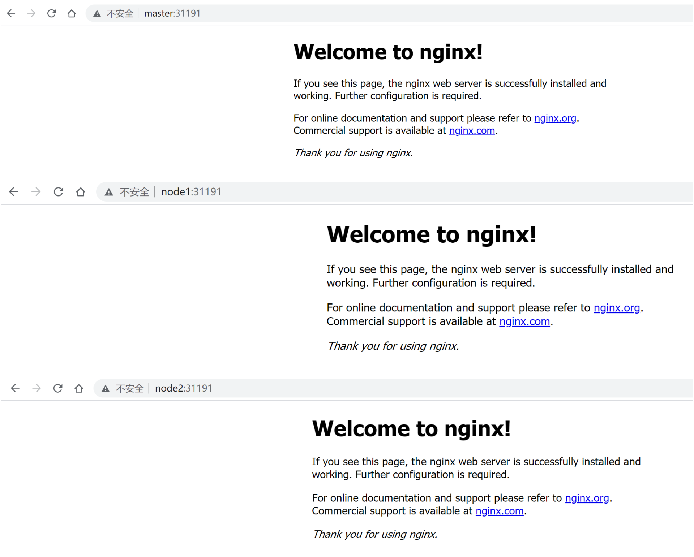
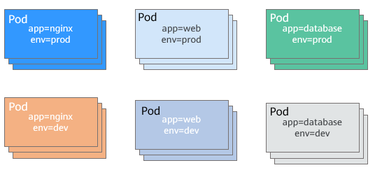
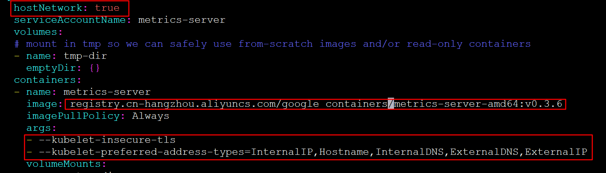

git仓库设置

## 简易的命令行入门教程:

Git 全局设置:

```shell
git config --global user.name "奔放的菜头"
git config --global user.email "lk.buffoon@hotmail.com"
```

创建 git 仓库:

```shell
mkdir books
cd books
git init 
touch README.md
git add README.md
git commit -m "first commit"
git remote add origin https://gitee.com/Madmin/books.git
git push -u origin "master"
```

已有仓库?

```shell
cd existing_git_repo
git remote add origin https://gitee.com/Madmin/books.git
git push -u origin "master"
```

如果出现以下报错

```shell
$ git push -u origin "master"
error: src refspec master does not match any
error: failed to push some refs to 'https://gitee.com/Madmin/books.git'
```

进行以下步骤的第四步。

## **Git如何更换主分支master**

1. 备份原master

```undefined
给master分支打一个tag
```

2. 设置Github、Gitlab的主分支属性

```php
1.settings->repository->Default Branch: 修改defult分支为其他分支
2.设置Protected Branches为非保护
```

3. 删除主分支、推送到远端仓库

```css
git branch -D master
git push origin :master
```

4. 在自己的开发分支拉一个新分支master，推送远端仓库

```undefined
git checkout -b master
git push -u origin master
```


# 第一部分：kubernetes入门

## 一：kubernetes架构

**官方参考文档：**https://kubernetes.io/zh/docs/concepts/

### 1.1 Kubernetes基础概念

```shell
将Docker应用于具体的业务实现，是存在困难的——编排、管理和调度等各个方面，都不容易。于是，人们迫切需要一套管理系统，对Docker及容器进行更高级更灵活的管理。

K8S，就是基于容器的集群管理平台，它的全称，是kubernetes。

一个K8S系统，通常称为一个K8S集群（Cluster）。

这个集群主要包括两个部分：

    一个Master节点（主节点）

    一群Node节点（计算节点）

Master节点主要还是负责管理和控制。Node节点是工作负载节点，里面是具体的容器。

Master节点包括API Server、Scheduler、Controller manager、etcd。

API Server是整个系统的对外接口，供客户端和其它组件调用，相当于“营业厅”。

Scheduler负责对集群内部的资源进行调度，相当于“调度室”。

Controller manager负责管理控制器，相当于“大总管”。
Node节点包括Docker、kubelet、kube-proxy、Fluentd、kube-dns（可选），还有就是Pod。

Pod是Kubernetes最基本的操作单元。一个Pod代表着集群中运行的一个进程，它内部封装了一个或多个紧密相关的容器。
除了Pod之外，K8S还有一个Service的概念，一个Service可以看作一组提供相同服务的Pod的对外访问接口。

Kubelet，主要负责监视指派到它所在Node上的Pod，包括创建、修改、监控、删除等。

	Kube-proxy，主要负责为Pod对象提供代理。

Fluentd，主要负责日志收集、存储与查询。
1.ETCD[主节点安装]
etcd服务是数据中心。用于持久化存储信息。要求高可用和数据一致性。即多部署几个master节点
存储哪些信息：k8s有本身的节点信息、组件信息、运行的pod、service都需要做持久化

2.kube-api-server[主节点安装]
api-server提供集群管理的API接口，包括认证授权、数据校验、集群状态变更、其他模块之间的数据交互和通信
其他模块，都是通过api-server查询操作数据，也就是说只有api-server才能直接操作etcd

3.controllerManager[主节点安装]
controllerManager是kubernetes的大脑，它通过api-service监控整个集群的状态，并确保集群处于预期的工作状态
组成：controller-manager是由 kube-controller-manager 和 cloud-controller-manager组成
      kube-controller-manager是由 一系列控制器组成，Replication Controller控制副本、Node Controller节点控制、Deployment Controller管理deployment等等
      cloud-controller-manager是在k8s启用Cloud provider的时候，需要用来配合云服务提供商的控制

4.Scheduler[主节点安装]
kube-scheduler负责实现调度策略，分配调度Pod到集群内的节点上，它监听api-server,查询还未分配的Node的Pod,然后根据调度策略为这些Pod分配节点

5.Calico[所有节点安装]
Calico实现了CNI接口，是kubernetes网络方案的一种选择。
Calico在每一个计算节点利用Linux Kernel实现了一个高效的vRouter来负责数据转发，
而每个vRouter通过BGP协议负责把自己上运行的workload的路由信息像整个Calico网络内传播——小规模部署可以直接互联，大规模下可通过指定的BGP route reflector来完成。 这样保证最终所有的workload之间的数据流量都是通过IP路由的方式完成互联的。

5.flannel[所有节点安装]
kubernetes网络方案的另一种选择

6.kube-ctl[任意节点安装]
kubectl是Kubernetes的命令行工具，是Kubernetes用户和管理员必备的管理工具。
kubectl提供了大量的子命令，方便管理Kubernetes集群中的各种功能。

7.kube-let[工作节点安装]
kube-let就是会在每个工作节点上都运行一个kubelet服务进程，默认监听10250端口。
kube-let负责接收并执行master发来的指令，管理Pod以及Pod中的容器。
每个kubelet进程会在API Server上注册节点自身信息，定期向master节点汇报节点的资源使用情况，并通过cAdvisor监控节点和容器的资源。

8.kube-proxy[工作节点安装][对外]
kube-proxy保证集群内的服务，可以被集群外访问到。
每台工作节点上都应该运行一个kube-proxy服务，它监听API server中service和endpoint的变化情况，并通过iptables等来为服务配置负载均衡，是让我们的服务在集群外可以被访问到的重要方式。

9.kube-dns[独立服务][对内]
kube-dns保证集群内的服务，可以被集群内的pod互相访问到。
kube-dns为Kubernetes集群提供命名服务，主要用来解析集群服务名和Pod的hostname。目的是让pod可以通过名字访问到集群内服务。它通过添加A记录的方式实现名字和service的解析。普通的service会解析到service-ip。headless service会解析到pod列表。
```

### 1.2 Kubernetes架构图

#### 1.2.1：Master：节点

1.service

3.kube-api-server

4.controllerManager

5.kube-Scheduler

6.ETCD

7.CNI网络插件

#### 1.2.2：Node：节点

1.pod

2.kubelet

3.Kube-proxy

4.Fluentd


### 1.3 Kubernetes工作流程

## 二： Kubernetes介绍

#### 2.1 应用部署方式演变

在部署应用程序的方式上，主要经历了三个时代：

- **传统部署**：互联网早期，会直接将应用程序部署在物理机上

  > 优点：简单，不需要其它技术的参与
  >
  > 缺点：不能为应用程序定义资源使用边界，很难合理地分配计算资源，而且程序之间容易产生影响

- **虚拟化部署**：可以在一台物理机上运行多个虚拟机，每个虚拟机都是独立的一个环境

  > 优点：程序环境不会相互产生影响，提供了一定程度的安全性
  >
  > 缺点：增加了操作系统，浪费了部分资源

- **容器化部署**：与虚拟化类似，但是共享了操作系统

  > 优点：
  >
  > 可以保证每个容器拥有自己的文件系统、CPU、内存、进程空间等
  >
  > 运行应用程序所需要的资源都被容器包装，并和底层基础架构解耦
  >
  > 容器化的应用程序可以跨云服务商、跨Linux操作系统发行版进行部署


容器化部署方式给带来很多的便利，但是也会出现一些问题，比如说：

- 一个容器故障停机了，怎么样让另外一个容器立刻启动去替补停机的容器
- 当并发访问量变大的时候，怎么样做到横向扩展容器数量

这些容器管理的问题统称为**容器编排**问题，为了解决这些容器编排问题，就产生了一些容器编排的软件：

- **Swarm**：Docker自己的容器编排工具
- **Mesos**：Apache的一个资源统一管控的工具，需要和Marathon结合使用
- **Kubernetes**：Google开源的的容器编排工具


#### 2.2 kubernetes简介


kubernetes，是一个全新的基于容器技术的分布式架构领先方案，是谷歌严格保密十几年的秘密武器----Borg系统的一个开源版本，于2014年9月发布第一个版本，2015年7月发布第一个正式版本。

kubernetes的本质是**一组服务器集群**，它可以在集群的每个节点上运行特定的程序，来对节点中的容器进行管理。目的是实现资源管理的自动化，主要提供了如下的主要功能：

- **自我修复**：一旦某一个容器崩溃，能够在1秒中左右迅速启动新的容器
- **弹性伸缩**：可以根据需要，自动对集群中正在运行的容器数量进行调整
- **服务发现**：服务可以通过自动发现的形式找到它所依赖的服务
- **负载均衡**：如果一个服务起动了多个容器，能够自动实现请求的负载均衡
- **版本回退**：如果发现新发布的程序版本有问题，可以立即回退到原来的版本
- **存储编排**：可以根据容器自身的需求自动创建存储卷

#### 2.3 kubernetes核心组件

一个kubernetes集群主要是由**控制节点(master)**、**工作节点(node)**构成，每个节点上都会安装不同的组件。

**master：集群的控制平面，负责集群的决策 ( 管理 )**

> **ApiServer** : 资源操作的唯一入口，接收用户输入的命令，提供认证、授权、API注册和发现等机制
>
> **Scheduler** : 负责集群资源调度，按照预定的调度策略将Pod调度到相应的node节点上
>
> **ControllerManager** : 负责维护集群的状态，比如程序部署安排、故障检测、自动扩展、滚动更新等
>
> **Etcd** ：负责存储集群中各种资源对象的信息

**node：集群的数据平面，负责为容器提供运行环境 ( 干活 )**

> **Kubelet** : 负责维护容器的生命周期，即通过控制docker，来创建、更新、销毁容器**（kubelet 是基于 PodSpec 来工作的。）**
>
> **KubeProxy** : 负责提供集群内部的服务发现和负载均衡
>
> **Docker** : 负责节点上容器的各种操作


下面，以部署一个nginx服务来说明kubernetes系统各个组件调用关系：

1. 首先要明确，一旦kubernetes环境启动之后，master和node都会将自身的信息存储到etcd数据库中

2. 一个nginx服务的安装请求会首先被发送到master节点的apiServer组件

3. apiServer组件会调用scheduler组件来决定到底应该把这个服务安装到哪个node节点上

   在此时，它会从etcd中读取各个node节点的信息，然后按照一定的算法进行选择，并将结果告知apiServer

4. apiServer调用controller-manager去调度Node节点安装nginx服务

5. kubelet接收到指令后，会通知docker，然后由docker来启动一个nginx的pod

   pod是kubernetes的最小操作单元，容器必须跑在pod中至此，

6. 一个nginx服务就运行了，如果需要访问nginx，就需要通过kube-proxy来对pod产生访问的代理

这样，外界用户就可以访问集群中的nginx服务了

##### 1）API Server 原理解析


#### 2.4 kubernetes概念

**Master**：集群控制节点，每个集群需要至少一个master节点负责集群的管控

**Node**：工作负载节点，由master分配容器到这些node工作节点上，然后node节点上的docker负责容器的运行

**Pod**：kubernetes的最小控制单元，容器都是运行在pod中的，一个pod中可以有1个或者多个容器

**Controller**：控制器，通过它来实现对pod的管理，比如启动pod、停止pod、伸缩pod的数量等等

**Service**：pod对外服务的统一入口，下面可以维护者同一类的多个pod

**Label**：标签，用于对pod进行分类，同一类pod会拥有相同的标签

**NameSpace**：命名空间，用来隔离pod的运行环境


#### 2.5 容器镜像


## 三：kubernetes集群环境搭建

#### 3.1 前置知识点

目前生产部署Kubernetes 集群主要有两种方式：

**kubeadm**

Kubeadm 是一个K8s 部署工具，提供kubeadm init 和kubeadm join，用于快速部署Kubernetes 集群。

官方地址：https://kubernetes.io/docs/reference/setup-tools/kubeadm/kubeadm/

**二进制包**

从github 下载发行版的二进制包，手动部署每个组件，组成Kubernetes 集群。

Kubeadm 降低部署门槛，但屏蔽了很多细节，遇到问题很难排查。如果想更容易可控，推荐使用二进制包部署Kubernetes 集群，虽然手动部署麻烦点，期间可以学习很多工作原理，也利于后期维护。


#### 3.2 kubeadm 部署方式介绍

kubeadm 是官方社区推出的一个用于快速部署kubernetes 集群的工具，这个工具能通过两条指令完成一个kubernetes 集群的部署：

- 创建一个Master 节点kubeadm init
- 将Node 节点加入到当前集群中$ kubeadm join <Master 节点的IP 和端口>

#### 3.3 安装要求

在开始之前，部署Kubernetes 集群机器需要满足以下几个条件：

- 一台或多台机器，操作系统CentOS7.x-86_x64
- 硬件配置：2GB 或更多RAM，2 个CPU 或更多CPU，硬盘30GB 或更多
- 集群中所有机器之间网络互通
- 可以访问外网，需要拉取镜像
- 禁止swap 分区

#### 3.4 最终目标

- 在所有节点上安装Docker 和kubeadm
- 部署Kubernetes Master
- 部署容器网络插件
- 部署Kubernetes Node，将节点加入Kubernetes 集群中
- 部署Dashboard Web 页面，可视化查看Kubernetes 资源

#### 3.5 准备环境

 


| 角色    | IP地址         | 组件                              |
| :------ | :------------- | :-------------------------------- |
| master1 | 192.168.10.130 | docker，kubectl，kubeadm，kubelet |
| node01  | 192.168.10.131 | docker，kubectl，kubeadm，kubelet |
| node02  | 192.168.10.132 | docker，kubectl，kubeadm，kubelet |

#### 3.6 环境初始化

##### 3.6.1 检查操作系统的版本

```powershell
# 此方式下安装kubernetes集群系统版本为：CentOS Stream release 8 版本号：4.18.0-408.el8.x86_64
[root@CentOS-K8S-Master ~]# cat /etc/redhat-release 
CentOS Stream release 8
[root@CentOS-K8S-Master ~]# uname -a
Linux CentOS-K8S-Master 4.18.0-408.el8.x86_64 #1 SMP Mon Jul 18 17:42:52 UTC 2022 x86_64 x86_64 x86_64 GNU/Linux

```

##### 3.6.2 主机名解析

为了方便集群节点间的直接调用，在这个配置一下主机名解析，企业中推荐使用内部DNS服务器

```powershell
修改主机名使用：hostnamectl set-hostname 主机名 

# 主机名成解析 编辑三台服务器的/etc/hosts文件，添加下面内容
192.168.10.141 master
192.168.10.151 node01
192.168.10.152 node02
```

##### 3.6.3 时间同步

kubernetes要求集群中的节点时间必须精确一直，这里使用chronyd服务从网络同步时间

企业中建议配置内部的会见同步服务器

```powershell
# 启动chronyd服务
[root@master ~]# systemctl start chronyd
[root@master ~]# systemctl enable chronyd
[root@master ~]# date
```

##### 3.6.4  禁用iptable和firewalld服务

kubernetes和docker 在运行的中会产生大量的iptables规则，为了不让系统规则跟它们混淆，直接关闭系统的规则

```powershell
# 1 关闭firewalld服务
[root@master ~]# systemctl stop firewalld
[root@master ~]# systemctl disable firewalld
# 2 关闭iptables服务
[root@master ~]# systemctl stop iptables
[root@master ~]# systemctl disable iptables
```

##### 3.6.5 禁用selinux

selinux是linux系统下的一个安全服务，如果不关闭它，在安装集群中会产生各种各样的奇葩问题

```powershell
# 编辑 /etc/selinux/config 文件，修改SELINUX的值为disable
# 注意修改完毕之后需要重启linux服务
SELINUX=disabled

# 将 SELinux 设置为 permissive 模式（相当于将其禁用）
sudo setenforce 0
sudo sed -i 's/^SELINUX=enforcing$/SELINUX=permissive/' /etc/selinux/config
```

##### 3.6.6 禁用swap分区

swap分区指的是虚拟内存分区，它的作用是物理内存使用完，之后将磁盘空间虚拟成内存来使用，启用swap设备会对系统的性能产生非常负面的影响，因此kubernetes要求每个节点都要禁用swap设备，但是如果因为某些原因确实不能关闭swap分区，就需要在集群安装过程中通过明确的参数进行配置说明

```powershell
方式一：重新启动电脑，永久禁用Swap
# 编辑分区配置文件/etc/fstab，注释掉swap分区一行
# 注意修改完毕之后需要重启linux服务
vim /etc/fstab
注释掉 /dev/mapper/centos-swap swap
# /dev/mapper/centos-swap swap

方式二：不重启电脑，禁用启用swap，立刻生效
swapoff -a 禁用命令
swapon -a  启用命令
free -mh   查看交换分区的状态:
```


##### 3.6.7 修改linux的内核参数

管理员可以通过 sysctl 接口修改内核运行时的参数,在 `/proc/sys/` 虚拟文件系统下存放许多内核参数。这些参数涉及了多个内核子系统，如：

- 内核子系统（通常前缀为: `kernel.`）
- 网络子系统（通常前缀为: `net.`）
- 虚拟内存子系统（通常前缀为: `vm.`）

若要获取完整的参数列表，请执行以下命令：

```shell
sudo sysctl -a
```

* net.bridge.bridge-nf-call-iptables：开启桥设备内核监控（ipv4）
* net.ipv4.ip_forward：开启路由转发
* net.bridge.bridge-nf-call-ip6tables：开启桥设备内核监控（ipv6）

以上3项为必须参数，其他参数可根据需要添加

```powershell
# 修改linux的内核采纳数，添加网桥过滤和地址转发功能
# 编辑/etc/sysctl.d/kubernetes.conf文件，添加如下配置：

net.bridge.bridge-nf-call-ip6tables = 1
net.bridge.bridge-nf-call-iptables = 1
net.ipv4.ip_forward = 1

# 重新加载配置
[root@master ~]# sysctl -p
# 加载网桥过滤模块
[root@master ~]# modprobe overlay
[root@master ~]# modprobe br_netfilter
```

通过运行以下指令确认 `br_netfilter` 和 `overlay` 模块被加载：

```bash
[root@master ~]# lsmod | grep br_netfilter
[root@master ~]# lsmod | grep overlay
```

##### 3.6.8 配置ipvs功能

在Kubernetes中Service有两种带来模型，一种是基于iptables的，一种是基于ipvs的两者比较的话，ipvs的性能明显要高一些，但是如果要使用它，需要手动载入ipvs模块

```powershell
# 1.安装ipset和ipvsadm
[root@master ~]# yum install ipset ipvsadm -y
# 2.添加需要加载的模块写入脚本文件
[root@master ~]# cat <<EOF> /etc/sysconfig/modules/ipvs.modules
#!/bin/bash
modprobe -- ip_vs
modprobe -- ip_vs_rr
modprobe -- ip_vs_wrr
modprobe -- ip_vs_sh
modprobe -- nf_conntrack_ipv4
EOF

# 注意：
centos高版本内核需要将modprobe -- nf_conntrack_ipv4更改为modprobe -- nf_conntrack

# 3.为脚本添加执行权限
[root@master ~]# chmod +x /etc/sysconfig/modules/ipvs.modules
# 4.执行脚本文件
[root@master ~]# /bin/bash /etc/sysconfig/modules/ipvs.modules
# 5.查看对应的模块是否加载成功
[root@master ~]# lsmod | grep -e ip_vs -e nf_conntrack

低版本运行
[root@master ~]# lsmod | grep -e ip_vs -e nf_conntrack_ipv4
```

##### 3.6.9 安装docker

```powershell
# 1、卸载旧版本
sudo yum remove docker \
                  docker-client \
                  docker-client-latest \
                  docker-common \
                  docker-latest \
                  docker-latest-logrotate \
                  docker-logrotate \
                  docker-engine

# 2、查看当前镜像源中支持的docker版本
[root@master ~]# yum list docker-ce --showduplicates | sort -r

# 3、设置存储库

sudo yum install -y yum-utils      
sudo yum-config-manager \
    --add-repo \
    https://download.docker.com/linux/centos/docker-ce.repo
    
# 4、安装docker-ce
方式一：安装特定版本的docker-ce
# 必须制定--setopt=obsoletes=0，否则yum会自动安装更高版本
[root@master ~]#  yum install --setopt=obsoletes=0 docker-ce-18.06.3.ce-3.el7 -y

方式二：安装最新版本docker-ce
[root@master ~]# sudo yum install docker-ce docker-ce-cli containerd.io docker-buildx-plugin docker-compose-plugin

# 5、添加一个配置文件
#Docker 在默认情况下使用Vgroup Driver为cgroupfs，而Kubernetes推荐使用systemd来替代cgroupfs
[root@master ~]# mkdir -p /etc/docker
[root@master ~]# cat <<EOF> /etc/docker/daemon.json
{
	"exec-opts": ["native.cgroupdriver=systemd"]      
}
EOF

# 6、启动dokcer
[root@master ~]# systemctl start docker
[root@master ~]# systemctl enable docker
```

##### 3.6.10 删除docker

1. 删除Docker Engine, CLI, containerd, 和 Docker Compose packages

```shell
sudo yum remove docker-ce docker-ce-cli containerd.io docker-buildx-plugin docker-compose-plugin docker-ce-rootless-extras
```

2. 删除docker相关文件夹

   ```shell
   sudo rm -rf /var/lib/docker
   sudo rm -rf /var/lib/containerd
   ```

   

##### 3.6.11 cri-dockerd安装

kubernetes1.26.3版本需要安装cri-dockerd作为网络接口

**参考文档：**https://github.com/mirantis/cri-dockerd#build-and-install

[cri-dockerd下载地址](https://github.com/Mirantis/cri-dockerd/releases)

###### 3.6.11.1 rpm方式安装cri-dockerd

下载rpm包

```shell
yum install -y wget
wget https://github.com/Mirantis/cri-dockerd/releases/download/v0.3.1/cri-dockerd-0.3.1-3.el7.x86_64.rpm
```

安装cri-dockerd

```shell
yum install -y cri-dockerd-0.3.1-3.el7.x86_64.rpm

systemctl daemon-reload
systemctl start cri-docker
systemctl enable cri-docker.service
systemctl enable --now cri-docker.socket

systemctl status cri-docker
```

###### 3.6.11.2 go编译安装cri-dockerd

**安装go环境**

```shell
wget https://storage.googleapis.com/golang/getgo/installer_linux
chmod +x ./installer_linux
./installer_linux
source ~/.bash_profile
```

**克隆cri-dockerd文件**

```shell
git clone https://github.com/Mirantis/cri-dockerd.git
```

**编译安装cri-dockerd**

```shell
cd cri-dockerd
mkdir bin
go build -o bin/cri-dockerd
mkdir -p /usr/local/bin
install -o root -g root -m 0755 bin/cri-dockerd /usr/local/bin/cri-dockerd
cp -a packaging/systemd/* /etc/systemd/system
sed -i -e 's,/usr/bin/cri-dockerd,/usr/local/bin/cri-dockerd,' /etc/systemd/system/cri-docker.service
systemctl daemon-reload
systemctl enable cri-docker.service
systemctl enable --now cri-docker.socket
```

**Kubernetes使用**（安装组件后配置）

1. Kubernetes网络插件默认是cni，需要追加**`--network-plugin=cni`**，通过该配置告诉容器，使用kubernetes的网络接口。
2. pause镜像是一切的 Pod 的基础

```shell
# go编译安装路径
vim /etc/systemd/system/cri-docker.service
# rpm安装路径
vim /usr/lib/systemd/system/cri-docker.service

[root@master ~]# cat /etc/systemd/system/cri-docker.service 
[Unit]
Description=CRI Interface for Docker Application Container Engine
Documentation=https://docs.mirantis.com
After=network-online.target firewalld.service docker.service
Wants=network-online.target
Requires=cri-docker.socket

[Service]
Type=notify
ExecStart=/usr/local/bin/cri-dockerd --container-runtime-endpoint fd:// # 此处添加一下内容
ExecReload=/bin/kill -s HUP $MAINPID
TimeoutSec=0
RestartSec=2
Restart=always

# Note that StartLimit* options were moved from "Service" to "Unit" in systemd 229.
# Both the old, and new location are accepted by systemd 229 and up, so using the old location
# to make them work for either version of systemd.
StartLimitBurst=3

# Note that StartLimitInterval was renamed to StartLimitIntervalSec in systemd 230.
# Both the old, and new name are accepted by systemd 230 and up, so using the old name to make
# this option work for either version of systemd.
StartLimitInterval=60s

# Having non-zero Limit*s causes performance problems due to accounting overhead
# in the kernel. We recommend using cgroups to do container-local accounting.
LimitNOFILE=infinity
LimitNPROC=infinity
LimitCORE=infinity

# Comment TasksMax if your systemd version does not support it.
# Only systemd 226 and above support this option.
TasksMax=infinity
Delegate=yes
KillMode=process

[Install]
WantedBy=multi-user.target

```

需要将以上两条1，2的参数追加在ExecStart后面

```shell
ExecStart=/usr/local/bin/cri-dockerd --container-runtime-endpoint fd:// --network-plugin=cni --pod-infra-container-image=registry.aliyuncs.com/google_containers/pause:3.9
```

**启动cri-dockerd**

```shell
systemctl daemon-reload
systemctl enable cri-docker.service
systemctl enable --now cri-docker.socket
systemctl start cri-docker
```

验证cri-dockerd

```shell
[root@master ~]# systemctl status cri-docker
● cri-docker.service - CRI Interface for Docker Application Container Engine
     Loaded: loaded (/etc/systemd/system/cri-docker.service; enabled; vendor preset: disabled)
     Active: active (running) since Tue 2022-12-06 23:31:18 CST; 1min 34s ago
TriggeredBy: ● cri-docker.socket
       Docs: https://docs.mirantis.com
   Main PID: 6861 (cri-dockerd)
      Tasks: 6
     Memory: 50.3M
        CPU: 84ms
     CGroup: /system.slice/cri-docker.service
             └─6861 /usr/local/bin/cri-dockerd --container-runtime-endpoint fd:// --network-plugin=cni --pod-infra-container-image=registry.aliyuncs.com/google_containers/pause:3.9

Dec 06 23:31:18 master cri-dockerd[6861]: time="2022-12-06T23:31:18+08:00" level=info msg="Start docker client with request timeout 0s"
Dec 06 23:31:18 master cri-dockerd[6861]: time="2022-12-06T23:31:18+08:00" level=info msg="Hairpin mode is set to none"
Dec 06 23:31:18 master cri-dockerd[6861]: time="2022-12-06T23:31:18+08:00" level=info msg="Loaded network plugin cni"
Dec 06 23:31:18 master cri-dockerd[6861]: time="2022-12-06T23:31:18+08:00" level=info msg="Docker cri networking managed by network plugin cni"
Dec 06 23:31:18 master cri-dockerd[6861]: time="2022-12-06T23:31:18+08:00" level=info msg="Docker Info: &{ID:37LI:R2SF:5ZQM:SFBX:6KGE:KFLT:CWY5:ZF4D:LK2C:GSBR:DBJH:K5SA Contain>
Dec 06 23:31:18 master cri-dockerd[6861]: time="2022-12-06T23:31:18+08:00" level=info msg="Setting cgroupDriver systemd"
Dec 06 23:31:18 master cri-dockerd[6861]: time="2022-12-06T23:31:18+08:00" level=info msg="Docker cri received runtime config &RuntimeConfig{NetworkConfig:&NetworkConfig{PodCid>
Dec 06 23:31:18 master cri-dockerd[6861]: time="2022-12-06T23:31:18+08:00" level=info msg="Starting the GRPC backend for the Docker CRI interface."
Dec 06 23:31:18 master cri-dockerd[6861]: time="2022-12-06T23:31:18+08:00" level=info msg="Start cri-dockerd grpc backend"
Dec 06 23:31:18 master systemd[1]: Started CRI Interface for Docker Application Container Engine.
lines 1-22/22 (END)

```

表示安装完成。


##### 3.6.12 安装Kubernetes组件

```powershell
# 1、由于kubernetes的镜像在国外，速度比较慢，这里切换成国内的镜像源
# 2、编辑/etc/yum.repos.d/kubernetes.repo,添加下面的配置

cat <<EOF | sudo tee /etc/yum.repos.d/kubernetes.repo
[kubernetes]
name=Kubernetes
baseurl=http://mirrors.aliyun.com/kubernetes/yum/repos/kubernetes-el7-x86_64
enabled=1
gpgchech=0
repo_gpgcheck=0
gpgkey=https://mirrors.aliyun.com/kubernetes/yum/doc/yum-key.gpg
	   http://mirrors.aliyun.com/kubernetes/yum/doc/rpm-package-key.gpg
EOF

官方源

cat <<EOF | sudo tee /etc/yum.repos.d/kubernetes.repo
[kubernetes]
name=Kubernetes
baseurl=https://packages.cloud.google.com/yum/repos/kubernetes-el7-\$basearch
enabled=1
gpgcheck=1
gpgkey=https://packages.cloud.google.com/yum/doc/rpm-package-key.gpg
exclude=kubelet kubeadm kubectl
EOF

# 3、安装kubeadm、kubelet和kubectl
指定版本
[root@master ~]# yum install --setopt=obsoletes=0 kubeadm-1.17.4-0 kubelet-1.17.4-0 kubectl-1.17.4-0 -y

下载最新版本：
[root@master ~]# yum install -y kubelet kubeadm kubectl --disableexcludes=kubernetes

# 4、配置kubelet的cgroup
#编辑/etc/sysconfig/kubelet, 添加下面的配置

cat <<EOF | sudo tee /etc/sysconfig/kubelet
KUBELET_CGROUP_ARGS="--cgroup-driver=systemd"
KUBE_PROXY_MODE="ipvs"
EOF

# 5、设置kubelet开机自启
[root@master ~]# systemctl enable kubelet

kubelet 现在每隔几秒就会重启，因为它陷入了一个等待 kubeadm 指令的死循环。
```

##### 3.6.13 集群初始化一

###### 准备集群镜像

```powershell
# 在安装kubernetes集群之前，必须要提前准备好集群需要的镜像，所需镜像可以通过下面命令查看
[root@master01~]# kubeadm config images list
registry.k8s.io/kube-apiserver:v1.26.3
registry.k8s.io/kube-controller-manager:v1.26.3
registry.k8s.io/kube-scheduler:v1.26.3
registry.k8s.io/kube-proxy:v1.26.3
registry.k8s.io/pause:3.9
registry.k8s.io/etcd:3.5.6-0
registry.k8s.io/coredns/coredns:v1.9.3

# 也可以查看具体版本所需镜像
[root@master01~]# kubeadm config images list --kubernetes-version v1.26.3


推荐使用以下方式（此处是kubenetes v1.26.3版本为例）
docker pull registry.aliyuncs.com/google_containers/kube-apiserver:v1.26.3
docker tag registry.aliyuncs.com/google_containers/kube-apiserver:v1.26.3  registry.k8s.io/kube-apiserver:v1.26.3
docker rmi registry.aliyuncs.com/google_containers/kube-apiserver:v1.26.3

docker pull registry.aliyuncs.com/google_containers/kube-controller-manager:v1.26.3
docker tag registry.aliyuncs.com/google_containers/kube-controller-manager:v1.26.3  registry.k8s.io/kube-controller-manager:v1.26.3
docker rmi registry.aliyuncs.com/google_containers/kube-controller-manager:v1.26.3

docker pull registry.aliyuncs.com/google_containers/kube-scheduler:v1.26.3
docker tag registry.aliyuncs.com/google_containers/kube-scheduler:v1.26.3 registry.k8s.io/kube-scheduler:v1.26.3
docker rmi registry.aliyuncs.com/google_containers/kube-scheduler:v1.26.3

docker pull registry.aliyuncs.com/google_containers/kube-proxy:v1.26.3
docker tag registry.aliyuncs.com/google_containers/kube-proxy:v1.26.3 registry.k8s.io/kube-proxy:v1.26.3
docker rmi registry.aliyuncs.com/google_containers/kube-proxy:v1.26.3

docker pull registry.aliyuncs.com/google_containers/pause:3.9
docker tag registry.aliyuncs.com/google_containers/pause:3.9 registry.k8s.io/pause:3.9
docker rmi registry.aliyuncs.com/google_containers/pause:3.9

docker pull registry.aliyuncs.com/google_containers/etcd:3.5.6-0
docker tag registry.aliyuncs.com/google_containers/etcd:3.5.6-0 registry.k8s.io/etcd:3.5.6-0
docker rmi registry.aliyuncs.com/google_containers/etcd:3.5.6-0

docker pull registry.aliyuncs.com/google_containers/coredns:v1.9.3
docker tag registry.aliyuncs.com/google_containers/coredns:v1.9.3 registry.k8s.io/coredns/coredns:v1.9.3
docker rmi registry.aliyuncs.com/google_containers/coredns:v1.9.3

```

###### 集群初始化

>下面的操作只需要在master节点上执行即可

```powershell
# 创建集群
[root@master ~]# kubeadm init \
	--apiserver-advertise-address=192.168.10.140 \
	--image-repository registry.aliyuncs.com/google_containers \
	--kubernetes-version=v1.28.1 \
	--service-cidr=10.96.0.0/12 \
	--pod-network-cidr=10.244.0.0/16 \
	--cri-socket unix:///var/run/cri-dockerd.sock \
	--ignore-preflight-errors=Numcpu

```

##### 3.6.14 集群初始化二

###### 生成kubeadm初始化配置文件

```shell
[root@master ~]# kubeadm config print init-defaults
apiVersion: kubeadm.k8s.io/v1beta3
bootstrapTokens:
- groups:
  - system:bootstrappers:kubeadm:default-node-token
  token: abcdef.0123456789abcdef
  ttl: 24h0m0s
  usages:
  - signing
  - authentication
kind: InitConfiguration
localAPIEndpoint:
  advertiseAddress: 1.2.3.4           # 此处修改为master节点的IP地址
  bindPort: 6443
nodeRegistration:
  criSocket: unix:///var/run/containerd/containerd.sock   # 此处指定使用的container runtime的sock路径
  imagePullPolicy: IfNotPresent
  name: node
  taints: null
---
apiServer:
  timeoutForControlPlane: 4m0s
apiVersion: kubeadm.k8s.io/v1beta3
certificatesDir: /etc/kubernetes/pki
clusterName: kubernetes
controllerManager: {}
dns: {}
etcd:
  local:
    dataDir: /var/lib/etcd
imageRepository: registry.k8s.io      # 此处为下载镜像的仓库地址
kind: ClusterConfiguration
kubernetesVersion: 1.26.0       # 修改为所需要的K8S版本号
networking:
  dnsDomain: cluster.local
  serviceSubnet: 10.96.0.0/12
scheduler: {}

# 或者生成配置文件存储在文件：kubeadm.yaml中
[root@master ~]#  kubeadm config print init-defaults > kubeadm.yaml
```

###### 下载集群所需组件镜像

```shell
# 查看所需要的镜像
[root@master ~]# kubeadm config images list
registry.k8s.io/kube-apiserver:v1.26.3
registry.k8s.io/kube-controller-manager:v1.26.3
registry.k8s.io/kube-scheduler:v1.26.3
registry.k8s.io/kube-proxy:v1.26.3
registry.k8s.io/pause:3.9
registry.k8s.io/etcd:3.5.6-0
registry.k8s.io/coredns/coredns:v1.9.3


[root@master ~]# kubeadm config images pull --config /root/kubeadm.yaml
```

###### 初始化集群

```shell
[root@master ~]# kubeadm init --config /root/kubeadm.yaml  --upload-certs
```


显示以下内容为安装完成

```shell
Your Kubernetes control-plane has initialized successfully!

To start using your cluster, you need to run the following as a regular user:
#  master节点创建必要文件
  mkdir -p $HOME/.kube
  sudo cp -i /etc/kubernetes/admin.conf $HOME/.kube/config
  sudo chown $(id -u):$(id -g) $HOME/.kube/config

Alternatively, if you are the root user, you can run:
#  master节点运行
  export KUBECONFIG=/etc/kubernetes/admin.conf

You should now deploy a pod network to the cluster.
Run "kubectl apply -f [podnetwork].yaml" with one of the options listed at:
  https://kubernetes.io/docs/concepts/cluster-administration/addons/

Then you can join any number of worker nodes by running the following on each as root:
#  node节点运行
kubeadm join 192.168.10.130:6443 --token oat3ii.jimyx3sob5cpi15v \
	--discovery-token-ca-cert-hash sha256:fa442bdfc24302c2e355a2e2462a5972db5492f73312c77169d11805941b88df 

```

重置再初始化

```shell
kubeadm reset --cri-socket unix:///var/run/cri-dockerd.sock

rm -fr ~/.kube/  /etc/kubernetes/* var/lib/etcd/*

[root@master ~]# kubeadm init \
	--apiserver-advertise-address=192.168.10.130 \
	--image-repository registry.aliyuncs.com/google_containers \
	--kubernetes-version=v1.25.4 \
	--service-cidr=10.96.0.0/12 \
	--pod-network-cidr=10.244.0.0/16 \
	--cri-socket unix://var/run/cri-dockerd.sock \
	--ignore-preflight-errors=Numcpu
```


> 下面的操作只需要在node节点上执行即可（node节点加入集群）

```powershell
# 根据提示把worker节点加进master节点，复制你们各自在日志里的提示，然后分别粘贴在2个worker节点上，最后回车即可（注意要在后面加上--cri-socket unix:///var/run/cri-dockerd.sock这一参数，不然可能会失败）

以node01节点为例：
[root@node01 ~]# kubeadm join 192.168.10.130:6443 --token oat3ii.jimyx3sob5cpi15v --discovery-token-ca-cert-hash sha256:fa442bdfc24302c2e355a2e2462a5972db5492f73312c77169d11805941b88df --cri-socket unix:///var/run/cri-dockerd.sock
[preflight] Running pre-flight checks
	[WARNING FileExisting-tc]: tc not found in system path
[preflight] Reading configuration from the cluster...
[preflight] FYI: You can look at this config file with 'kubectl -n kube-system get cm kubeadm-config -o yaml'
[kubelet-start] Writing kubelet configuration to file "/var/lib/kubelet/config.yaml"
[kubelet-start] Writing kubelet environment file with flags to file "/var/lib/kubelet/kubeadm-flags.env"
[kubelet-start] Starting the kubelet
[kubelet-start] Waiting for the kubelet to perform the TLS Bootstrap...

This node has joined the cluster:
* Certificate signing request was sent to apiserver and a response was received.
* The Kubelet was informed of the new secure connection details.

Run 'kubectl get nodes' on the control-plane to see this node join the cluster.

```

在master上查看节点信息

```powershell
[root@master ~]# kubectl get nodes
NAME    STATUS   ROLES     AGE   VERSION
master  NotReady  master   6m    v1.17.4
node1   NotReady   <none>  22s   v1.17.4
node2   NotReady   <none>  19s   v1.17.4
```

##### 3.6.15 安装网络插件，只在master节点操作即可

```shell
kubectl apply -f https://raw.githubusercontent.com/flannel-io/flannel/master/Documentation/kube-flannel.yml
```

等待它安装完毕稍等片刻， 发现集群的状态已经是Ready


##### 3.6.16 kubeadm中的命令

```powershell
# 生成 新的token
[root@master ~]# kubeadm token create --print-join-command
```

##### 3.6.17 k8s-service代理模式IPVS

kubeadm方式修改ipvs模式：

```shell
[root@master ~]# kubectl edit configmap kube-proxy -n kube-system

    kind: KubeProxyConfiguration
    metricsBindAddress: ""
    mode: ""             #  此处修改为 mode: “ipvs“
    nodePortAddresses: null

# 删除已经在运行的kube-pory代理，系统会自动生成新的代理

[root@master ~]# kubectl get pods -n kube-system -o wide
NAME                             READY   STATUS    RESTARTS   AGE   IP             NODE     NOMINATED NODE   READINESS GATES
coredns-c676cc86f-b8cqv          1/1     Running   0          20h   10.244.0.2     master   <none>           <none>
coredns-c676cc86f-lwhs4          1/1     Running   0          20h   10.244.0.3     master   <none>           <none>
etcd-master                      1/1     Running   0          20h   172.31.0.35    master   <none>           <none>
kube-apiserver-master            1/1     Running   0          20h   172.31.0.35    master   <none>           <none>
kube-controller-manager-master   1/1     Running   0          20h   172.31.0.35    master   <none>           <none>
kube-proxy-4glqf                 1/1     Running   0          20h   172.31.0.245   node02   <none>           <none>
kube-proxy-qbz5b                 1/1     Running   0          20h   172.31.0.94    node01   <none>           <none>
kube-proxy-vlxpl                 1/1     Running   0          20h   172.31.0.35    master   <none>           <none>
kube-scheduler-master            1/1     Running   0          20h   172.31.0.35    master   <none>           <none>

[root@master ~]# kubectl delete pod kube-proxy-4glqf -n kube-system
[root@master ~]# kubectl delete pod kube-proxy-qbz5b -n kube-system
[root@master ~]# kubectl delete pod kube-proxy-vlxpl -n kube-system

# 再次查看发现有新的kube-pory代理生成
[root@master ~]# kubectl get pods -n kube-system -o wide
NAME                             READY   STATUS    RESTARTS   AGE   IP             NODE     NOMINATED NODE   READINESS GATES
coredns-c676cc86f-b8cqv          1/1     Running   0          20h   10.244.0.2     master   <none>           <none>
coredns-c676cc86f-lwhs4          1/1     Running   0          20h   10.244.0.3     master   <none>           <none>
etcd-master                      1/1     Running   0          20h   172.31.0.35    master   <none>           <none>
kube-apiserver-master            1/1     Running   0          20h   172.31.0.35    master   <none>           <none>
kube-controller-manager-master   1/1     Running   0          20h   172.31.0.35    master   <none>           <none>
kube-proxy-2pnw9                 1/1     Running   0          11s   172.31.0.94    node01   <none>           <none>
kube-proxy-8jff8                 1/1     Running   0          3s    172.31.0.35    master   <none>           <none>
kube-proxy-xhzfh                 1/1     Running   0          18s   172.31.0.245   node02   <none>           <none>
kube-scheduler-master            1/1     Running   0          20h   172.31.0.35    master   <none>           <none>

```

在master节点和node节点验证IPVS模式是否生效

```shell
[root@master ~]# ipvsadm -Ln
IP Virtual Server version 1.2.1 (size=4096)
Prot LocalAddress:Port Scheduler Flags
  -> RemoteAddress:Port           Forward Weight ActiveConn InActConn
TCP  10.96.0.1:443 rr
  -> 172.31.0.35:6443             Masq    1      0          0         
TCP  10.96.0.10:53 rr
  -> 10.244.0.2:53                Masq    1      0          0         
  -> 10.244.0.3:53                Masq    1      0          0         
TCP  10.96.0.10:9153 rr
  -> 10.244.0.2:9153              Masq    1      0          0         
  -> 10.244.0.3:9153              Masq    1      0          0         
UDP  10.96.0.10:53 rr
  -> 10.244.0.2:53                Masq    1      0          0         
  -> 10.244.0.3:53                Masq    1      0          0         
[root@master ~]# 

[root@node01 ~]# ipvsadm -L -n
IP Virtual Server version 1.2.1 (size=4096)
Prot LocalAddress:Port Scheduler Flags
  -> RemoteAddress:Port           Forward Weight ActiveConn InActConn
TCP  10.96.0.1:443 rr
  -> 172.31.0.35:6443             Masq    1      0          0         
TCP  10.96.0.10:53 rr
  -> 10.244.0.2:53                Masq    1      0          0         
  -> 10.244.0.3:53                Masq    1      0          0         
TCP  10.96.0.10:9153 rr
  -> 10.244.0.2:9153              Masq    1      0          0         
  -> 10.244.0.3:9153              Masq    1      0          0         
UDP  10.96.0.10:53 rr
  -> 10.244.0.2:53                Masq    1      0          0         
  -> 10.244.0.3:53                Masq    1      0          0         
[root@node01 ~]# 

```


#### 3.7 集群测试

##### 3.7.1 创建一个nginx服务

```shell
# 部署一个名字叫做nginx的应用，使用的镜像是nginx:1.14-alpine
kubectl create deployment nginx  --image=nginx:1.14-alpine

```

**制定部署数量--replicas=3的简写是-r 3**

```shell 
kubectl create deployment my-nginx01 --replicas=3 --image=nginx   
```

**或者**

```shell
kubectl create deployment my-nginx01 -r 3 --image=nginx  
```

**设置所部署应用的数量**

```shell
# 将部署（deploy）的my-nginx 的部署数量扩充到3份
kubectl scale --replicas=3 deploy my-nginx   
```

##### 3.7.2 暴露端口

```shell
kubectl expose deploy nginx  --port=80 --target-port=80  --type=NodePort
参数说明：
--port=8181       # 暴漏的是service的端口

--target-port=80  # 暴漏的是所部署的应用的端口

--type=ClusterIP  # 分配给service一个IP（kubectl init 时制定的-service-cidr=IP/12 IP范围）
                  
```

**端口暴漏类型有四种：**

> 1. ClusterIP：默认类型
>
> 2. NodePort：
>
> 3. LoadBalancer：
>
> 4. ExternalName：

##### 3.7.3 查看服务

```powershell
kubectl get pod,svc
```

##### 3.7.4 查看pod


浏览器测试结果：




#### 3.8 滚动升级

（**联合jenkins实现持续集成部署**）

- **`kubectl set image`**

  **kubectl set image** (-f FILENAME | TYPE NAME) CONTAINER_NAME_1=CONTAINER_IMAGE_1 ... CONTAINER_NAME_N=CONTAINER_IMAGE_N

  **格式：**kubectl set image 部署应用的名称 容器名字=需要升级使用的镜像

- **``kubectl set image deployment/nginx nginx=nginx:1.9.1``**#将容器nginx的镜像设置为**nginx:1.9.1**

  ```shell
  # 将部署的nginx版本设置为nginx:1.9.1
  kubectl set image deployment my-nginx nginx=nginx:1.9.1
  
  # 查看部署情况（看部署的应用的标签的变化）
  [root@K8S-Master ~]# kubectl get pod,deployment
  NAME                           READY   STATUS              RESTARTS   AGE
  pod/my-nginx-9cd7fb6dc-8srrv   1/1     Running             0          97s
  pod/my-nginx-9cd7fb6dc-d7zxk   1/1     Running             0          59s
  pod/my-nginx-9cd7fb6dc-xcjn7   0/1     ContainerCreating   0          13s
  pod/my-nginx-f96d7cb66-skkjf   1/1     Running             0          11h
  
  NAME                       READY   UP-TO-DATE   AVAILABLE   AGE
  deployment.apps/my-nginx   3/3     3            3           11h
  
  # 版本更换完成
  [root@K8S-Master ~]# kubectl get pod,deployment
  NAME                           READY   STATUS    RESTARTS   AGE
  pod/my-nginx-9cd7fb6dc-8srrv   1/1     Running   0          2m43s
  pod/my-nginx-9cd7fb6dc-d7zxk   1/1     Running   0          2m5s
  pod/my-nginx-9cd7fb6dc-xcjn7   1/1     Running   0          79s
  
  NAME                       READY   UP-TO-DATE   AVAILABLE   AGE
  deployment.apps/my-nginx   3/3     3            3           11h
  ```

##### 3.8.1 升级回档

**查看所部署的应用：deployment/abc的部署历史**

- **`kubectl rollout history deployment/abc`**

  ```shell
  # 查看部署的my-nginx的历史信息
  [root@K8S-Master ~]# kubectl rollout history deployment my-nginx
  deployment.apps/my-nginx 
  REVISION  CHANGE-CAUSE
  1         <none>
  2         <none>
  ```

- kubectl rollout undo deployment/abc  **-to-revision=1** 将deployment/abc的部署历史恢复到第1次操作

  ```shell
  # 将部署的my-nginx回滚到第一次部署
  
  [root@K8S-Master ~]# kubectl rollout undo deployment my-nginx --to-revision=1
  
  # 查看部署的应用的变化（看部署的应用的标签的变化）
  [root@K8S-Master ~]# kubectl get pod,deployment
  NAME                           READY   STATUS              RESTARTS   AGE
  pod/my-nginx-9cd7fb6dc-8srrv   1/1     Running             0          7m51s
  pod/my-nginx-9cd7fb6dc-d7zxk   1/1     Running             0          7m13s
  pod/my-nginx-9cd7fb6dc-xcjn7   1/1     Running             0          6m27s
  pod/my-nginx-f96d7cb66-rn6dm   0/1     ContainerCreating   0          7s
  
  NAME                       READY   UP-TO-DATE   AVAILABLE   AGE
  deployment.apps/my-nginx   3/3     1            3           11h
  
  # 最终部署结果
  
  [root@K8S-Master ~]# kubectl get pod,deployment
  NAME                           READY   STATUS    RESTARTS   AGE
  pod/my-nginx-f96d7cb66-7554k   1/1     Running   0          103s
  pod/my-nginx-f96d7cb66-rn6dm   1/1     Running   0          2m3s
  pod/my-nginx-f96d7cb66-tnmg2   1/1     Running   0          82s
  
  NAME                       READY   UP-TO-DATE   AVAILABLE   AGE
  deployment.apps/my-nginx   3/3     3            3           11h
  ```

  

## 三：基于containerd

containerd已包含Kubernetes CRI 功能，和docker不同的是无需下载`cri-containerd-....`档案即可使用 CRI。

### 3.1） 二进制安装containerd

二进制安装containerd需要**`runc`**和**`CNI`**插件的支持。

#### 3.1.1 第 1 步：安装容器

所有设备安装（`master`和`node`节点）

containerd 的官方二次制作版本可用于`amd64`（也称为`x86_64`）和`arm64`（也称为`aarch64`）结构。

[从https://github.com/containerd/containerd/releases](https://github.com/containerd/containerd/releases)下载`containerd-<VERSION>-<OS>-<ARCH>.tar.gz`存档，验证其sha256sum，并将其解压到：`/usr/local`

```shell
[root@master ~]# wget https://github.com/containerd/containerd/releases/download/v1.6.12/containerd-1.6.12-linux-amd64.tar.gz

[root@master ~]# tar Cxzvf /usr/local containerd-1.6.12-linux-amd64.tar.gz
bin/
bin/containerd-shim-runc-v2
bin/containerd-shim
bin/ctr
bin/containerd-shim-runc-v1
bin/containerd
bin/containerd-stress

# 文件说明
containerd 的安装包中一共有五个文件，通过上面的命令它们被安装到了 usr/local/bin 目录中：

1. containerd：即容器的运行时，以 gRPC 协议的形式提供满足 OCI 标准的 API

2. containerd-release：containerd 项目的发行版发布工具

3. containerd-stress：containerd压力测试工具

4. containerd-shim：这是每一个容器的运行时载体，我们在 docker 宿主机上看到的 shim 也正是代表着一个个通过调用 containerd 启动的 docker 容器。

5. ctr：它是一个简单的 CLI 接口，用作 containerd 本身的一些调试用途，投入生产使用时还是应该配合docker 或者 cri-containerd 部署。
```

##### 1）修改containerd配置

配置Containerd所需的模块（所有节点）

```shell
cat <<EOF> /etc/modules-load.d/containerd.conf
overlay
br_netfilter
EOF

# 所有节点加载模块：
modprobe -- overlay
modprobe -- br_netfilter
```


创建初始配置文件

Containerd 的默认配置文件为 `/etc/containerd/config.toml`

```shell
$ mkdir -p /etc/containerd/
$ containerd config default > /etc/containerd/config.toml    #创建默认的配置文件
```


##### 2）配置 `systemd` cgroup 驱动

结合 `runc` 使用 `systemd` cgroup 驱动，在 `/etc/containerd/config.toml` 中设置：

```shell
vim /etc/containerd/config.toml

# 找到containerd.runtimes.runc.options，添加SystemdCgroup = true

[plugins."io.containerd.grpc.v1.cri".containerd.runtimes]

        [plugins."io.containerd.grpc.v1.cri".containerd.runtimes.runc]
          base_runtime_spec = ""
          cni_conf_dir = ""
          cni_max_conf_num = 0
          container_annotations = []
          pod_annotations = []
          privileged_without_host_devices = false
          runtime_engine = ""
          runtime_path = ""
          runtime_root = ""
          runtime_type = "io.containerd.runc.v2"

          [plugins."io.containerd.grpc.v1.cri".containerd.runtimes.runc.options]
            BinaryName = ""
            CriuImagePath = ""
            CriuPath = ""
            CriuWorkPath = ""
            IoGid = 0
            IoUid = 0
            NoNewKeyring = false
            NoPivotRoot = false
            Root = ""
            ShimCgroup = "true"    # 此处修改为true
            SystemdCgroup = false
```

或者运行以下命令

```shell
sed -i 's#SystemdCgroup = false#SystemdCgroup = true#g' /etc/containerd/config.toml
```


**替换镜像源**

```shell
# 所有节点将sandbox_image的Pause镜像改成符合自己版本的地址：registry.aliyuncs.com/google_containers/pause:3.9
$ vim /etc/containerd/config.toml

  [plugins."io.containerd.grpc.v1.cri"]
    device_ownership_from_security_context = false
    disable_apparmor = false
    disable_cgroup = false
    disable_hugetlb_controller = true
    disable_proc_mount = false
    disable_tcp_service = true
    enable_selinux = false
    enable_tls_streaming = false
    enable_unprivileged_icmp = false
    enable_unprivileged_ports = false
    ignore_image_defined_volumes = false
    max_concurrent_downloads = 3
    max_container_log_line_size = 16384
    netns_mounts_under_state_dir = false
    restrict_oom_score_adj = false
    sandbox_image = "registry.aliyuncs.com/google_containers/pause:3.9" # 此处更换
    
#等同于：
$ sed -i "s#k8s.gcr.io/pause#registry.aliyuncs.com/google_containers/pause#g"  /etc/containerd/config.toml
```


**配置镜像加速**

```shell
$ vim /etc/containerd/config.toml
  [plugins."io.containerd.grpc.v1.cri".registry.mirrors]
    [plugins."io.containerd.grpc.v1.cri".registry.mirrors."docker.io"]
      endpoint = ["https://cekcu3pt.mirror.aliyuncs.com"]
```


##### 3）通过 systemd 启动 containerd

还应该从https://raw.githubusercontent.com/containerd/containerd/main/containerd.service下载 `containerd.service`文件到目录`/usr/local/lib/systemd/system/containerd.service`中，并运行以下命令：

```shell
wget https://raw.githubusercontent.com/containerd/containerd/main/containerd.service
mkdir -p /usr/local/lib/systemd/system/
cp containerd.service /usr/local/lib/systemd/system/

$ systemctl daemon-reload
$ systemctl enable --now containerd
$ systemctl status containerd.service
$ containerd  --version    #查看版本
```

#### 3.1.2 第 2 步：安装 runc

[从https://github.com/opencontainers/runc/releases](https://github.com/opencontainers/runc/releases)下载`runc.<ARCH>`二进制文件，验证其 sha256sum，

并将其安装到目录.`/usr/local/sbin/runc`

此处安装版本为：`v1.1.4/runc.amd64`

```shell
[root@master ~]# wget https://github.com/opencontainers/runc/releases/download/v1.1.4/runc.amd64


[root@master ~]# install -m 755 runc.amd64 /usr/local/sbin/runc
#出现以下说明安装没有问题
[root@master ~]# runc -version
runc version 1.1.4
commit: v1.1.4-0-g5fd4c4d1
spec: 1.0.2-dev
go: go1.17.10
libseccomp: 2.5.4

```

该二进制文件是静态构建的，应该适用于任何 Linux 发行版。

#### 3.1.3 第 3 步：安装CNI插件

[从https://github.com/containernetworking/plugins/releases](https://github.com/containernetworking/plugins/releases)下载`cni-plugins-<OS>-<ARCH>-<VERSION>.tgz`存档，验证其 sha256sum，并将其解压到：`/opt/cni/bin`

```shell
[root@master ~]# wget https://github.com/containernetworking/plugins/releases/download/v1.1.1/cni-plugins-linux-amd64-v1.1.1.tgz
[root@master ~]# mkdir -p /opt/cni/bin
[root@master ~]# tar Cxzvf /opt/cni/bin cni-plugins-linux-amd64-v1.1.1.tgz
./
./macvlan
./static
./vlan
./portmap
./host-local
./vrf
./bridge
./tuning
./firewall
./host-device
./sbr
./loopback
./dhcp
./ptp
./ipvlan
./bandwidth
```


### 3.2）`apt-get`或`dnf`安装

DEB 和 RPM 格式的`containerd.io`需要从docker仓库进行安装，`containerd.io`软件包也包含 **runc**，但不包含**CNI **插件。

#### 3.2.1）设置存储库

```shell
# 1、卸载旧版本
sudo yum remove docker \
                  docker-client \
                  docker-client-latest \
                  docker-common \
                  docker-latest \
                  docker-latest-logrotate \
                  docker-logrotate \
                  docker-engine

# 2、查看当前镜像源中支持的docker版本
[root@master ~]# yum list docker-ce --showduplicates | sort -r

# 3、设置存储库

sudo yum install -y yum-utils      
sudo yum-config-manager \
    --add-repo \
    https://download.docker.com/linux/centos/docker-ce.repo
    
# 4、安装containerd

[root@master ~]# sudo yum install containerd.io
```

#### 3.2.2）准备kubernetes集群镜像

```shell
ctr image pull registry.aliyuncs.com/google_containers/kube-apiserver:v1.26.0
ctr image tag registry.aliyuncs.com/google_containers/kube-apiserver:v1.26.0  registry.k8s.io/kube-apiserver:v1.26.0
ctr image rm registry.aliyuncs.com/google_containers/kube-apiserver:v1.26.0

ctr image pull registry.aliyuncs.com/google_containers/kube-controller-manager:v1.26.0
ctr image tag registry.aliyuncs.com/google_containers/kube-controller-manager:v1.26.0  registry.k8s.io/kube-controller-manager:v1.26.0
ctr image rm registry.aliyuncs.com/google_containers/kube-controller-manager:v1.26.0

ctr image pull registry.aliyuncs.com/google_containers/kube-scheduler:v1.26.0
ctr image tag registry.aliyuncs.com/google_containers/kube-scheduler:v1.26.0 registry.k8s.io/kube-scheduler:v1.26.0
ctr image rm registry.aliyuncs.com/google_containers/kube-scheduler:v1.26.0

ctr image pull registry.aliyuncs.com/google_containers/kube-proxy:v1.26.0
ctr image tag registry.aliyuncs.com/google_containers/kube-proxy:v1.26.0 registry.k8s.io/kube-proxy:v1.26.0
ctr image rm registry.aliyuncs.com/google_containers/kube-proxy:v1.26.0

ctr image pull registry.aliyuncs.com/google_containers/pause:3.9
ctr image tag registry.aliyuncs.com/google_containers/pause:3.9 registry.k8s.io/pause:3.9
ctr image rm registry.aliyuncs.com/google_containers/pause:3.9

ctr image pull registry.aliyuncs.com/google_containers/etcd:3.5.6-0
ctr image tag registry.aliyuncs.com/google_containers/etcd:3.5.6-0 registry.k8s.io/etcd:3.5.6-0
ctr image rm registry.aliyuncs.com/google_containers/etcd:3.5.6-0

ctr image pull registry.aliyuncs.com/google_containers/coredns:v1.9.3
ctr image tag registry.aliyuncs.com/google_containers/coredns:v1.9.3 registry.k8s.io/coredns/coredns:v1.9.3
ctr image rm registry.aliyuncs.com/google_containers/coredns:v1.9.3

# 查看镜像

[root@master ~]# ctr image ls -q
registry.k8s.io/coredns/coredns:v1.9.3
registry.k8s.io/etcd:3.5.6-0
registry.k8s.io/kube-apiserver:v1.26.0
registry.k8s.io/kube-controller-manager:v1.26.0
registry.k8s.io/kube-proxy:v1.26.0
registry.k8s.io/kube-scheduler:v1.26.0
registry.k8s.io/pause:3.9
```


接着修改 kubelet 配置文件，修改 /var/lib/kubelet/kubeadm-flags.env 中的 kubelet 参数

- 添加 `--container-runtime=remote --container-runtime-endpoint=unix:///run/containerd/containerd.sock`
- 删除 `--network-plugin=cni`
- 将 `pause:3.1` 改为 `pause:3.6`

```bash
KUBELET_KUBEADM_ARGS="--cgroup-driver=systemd --pod-infra-container-image=registry.aliyuncs.com/google_containers/pause:3.9 --resolv-conf=/run/systemd/resolve/resolv.conf --container-runtime=remote --container-runtime-endpoint=unix:///run/containerd/containerd.sock"
```

运行下面的命令使修改的配置生效

```bash
systemctl daemon-reload && systemctl restart containerd  && systemctl restart kubelet
```

### 3.3）初始化集群（未成功）

**检测安装环境**

检测主机环境是否达到集群的要求，可根据结果提示进行逐一排除故障

```shell
kubeadm init --dry-run
```

可能出现的问题

```shell
[root@master ~]# kubeadm init --dry-run
[init] Using Kubernetes version: v1.25.4
[preflight] Running pre-flight checks
	[WARNING FileExisting-tc]: tc not found in system path
error execution phase preflight: [preflight] Some fatal errors occurred:
	[ERROR FileContent--proc-sys-net-ipv4-ip_forward]: /proc/sys/net/ipv4/ip_forward contents are not set to 1
[preflight] If you know what you are doing, you can make a check non-fatal with `--ignore-preflight-errors=...`
To see the stack trace of this error execute with --v=5 or higher

# 解决方法
出现这个问题的原因是我想kubernetes node节点想加入主节点，然后说是 /proc/sys/net/ipv4/ip_forward 文件没有设置成1
[root@node01 ~]# sysctl -w net.ipv4.ip_forward=1
输入 : sysctl -w net.ipv4.ip_forward=1 就可以解决这个问题了

# 错误
[WARNING FileExisting-tc]: tc not found in system path
[root@master ~]# yum install tc -y

# 错误

[root@master ~]# modprobe br_netfilter
```

**创建集群**

```shell
kubeadm init \
	--apiserver-advertise-address=192.168.10.130 \
	--image-repository registry.aliyuncs.com/google_containers \
	--kubernetes-version=v1.26.0 \
	--service-cidr=10.96.0.0/12 \
	--pod-network-cidr=10.244.0.0/16
```


## 四：资源管理

### 4.1 资源管理介绍

在kubernetes中，所有的内容都抽象为资源，用户需要通过操作资源来管理kubernetes。

> kubernetes的本质上就是一个集群系统，用户可以在集群中部署各种服务，所谓的部署服务，其实就是在kubernetes集群中运行一个个的容器，并将指定的程序跑在容器中。
>
> kubernetes的最小管理单元是pod而不是容器，所以只能将容器放在`Pod`中，而kubernetes一般也不会直接管理Pod，而是通过`Pod控制器`来管理Pod的。
>
> Pod可以提供服务之后，就要考虑如何访问Pod中服务，kubernetes提供了`Service`资源实现这个功能。
>
> 当然，如果Pod中程序的数据需要持久化，kubernetes还提供了各种`存储`系统。


> 学习kubernetes的核心，就是学习如何对集群上的`Pod、Pod控制器、Service、存储`等各种资源进行操作

### 4.2 YAML语言介绍

YAML是一个类似 XML、JSON 的标记性语言。它强调以**数据**为中心，并不是以标识语言为重点。因而YAML本身的定义比较简单，号称"一种人性化的数据格式语言"。

```
<heima>
    <age>15</age>
    <address>Beijing</address>
</heima>
```

```
heima:
  age: 15
  address: Beijing
```

YAML的语法比较简单，主要有下面几个：

- 大小写敏感
- 使用缩进表示层级关系
- 缩进不允许使用tab，只允许空格( 低版本限制 )
- 缩进的空格数不重要，只要相同层级的元素左对齐即可
- '#'表示注释

YAML支持以下几种数据类型：

- 纯量：单个的、不可再分的值
- 对象：键值对的集合，又称为映射（mapping）/ 哈希（hash） / 字典（dictionary）
- 数组：一组按次序排列的值，又称为序列（sequence） / 列表（list）

```shell
# 纯量, 就是指的一个简单的值，字符串、布尔值、整数、浮点数、Null、时间、日期
# 1 布尔类型
c1: true (或者True)
# 2 整型
c2: 234
# 3 浮点型
c3: 3.14
# 4 null类型 
c4: ~  # 使用~表示null
# 5 日期类型
c5: 2018-02-17    # 日期必须使用ISO 8601格式，即yyyy-MM-dd
# 6 时间类型
c6: 2018-02-17T15:02:31+08:00  # 时间使用ISO 8601格式，时间和日期之间使用T连接，最后使用+代表时区
# 7 字符串类型
c7: heima     # 简单写法，直接写值 , 如果字符串中间有特殊字符，必须使用双引号或者单引号包裹 
c8: line1
    line2     # 字符串过多的情况可以拆成多行，每一行会被转化成一个空格
```

```shell
# 对象
# 形式一(推荐):
heima:
  age: 15
  address: Beijing
# 形式二(了解):
heima: {age: 15,address: Beijing}
```

```shell
# 数组
# 形式一(推荐):
address:
  - 顺义
  - 昌平  
# 形式二(了解):
address: [顺义,昌平]
```

> 小提示：
>
> 1 书写yaml切记`:` 后面要加一个空格
>
> 2 如果需要将多段yaml配置放在一个文件中，中间要使用`---`分隔
>
> 3 下面是一个yaml转json的网站，可以通过它验证yaml是否书写正确
>
> https://www.json2yaml.com/convert-yaml-to-json

### 4.3 资源管理方式

- 命令式对象管理：直接使用命令去操作kubernetes资源

  `kubectl run nginx-pod --image=nginx:1.17.1 --port=80`

- 命令式对象配置：通过命令配置和配置文件去操作kubernetes资源

  `kubectl create/patch -f nginx-pod.yaml`

- 声明式对象配置：通过apply命令和配置文件去操作kubernetes资源

  `kubectl apply -f nginx-pod.yaml` 
  
  命令**`apply`**起到一个创建和更新的功能，如果**`nginx-pod.yaml`**没有就进行创建，如果有就进行更新。

| 类型           | 操作对象 | 适用环境 | 优点           | 缺点                                 |
| :------------- | :------- | :------- | :------------- | :----------------------------------- |
| 命令式对象管理 | 对象     | 测试     | 简单           | 只能操作活动对象，**无法审计、跟踪** |
| 命令式对象配置 | 文件     | 开发     | 可以审计、跟踪 | 项目大时，配置文件多，操作麻烦       |
| 声明式对象配置 | 目录     | 开发     | 支持目录操作   | 意外情况下难以调试                   |

#### 4.3.1 命令式对象管理

**kubectl命令**

kubectl是kubernetes集群的命令行工具，通过它能够对集群本身进行管理，并能够在集群上进行容器化应用的安装部署。kubectl命令的语法如下：

```shell
kubectl [command] [type] [name] [flags]
```

**comand**：指定要对资源执行的操作，例如create、get、delete

**type**：指定资源类型，比如deployment、pod、service

**name**：指定资源的名称，名称大小写敏感

**flags**：指定额外的可选参数

```shell
# 查看所有pod
kubectl get pod 

# 查看某个pod
kubectl get pod pod_name

# 查看某个pod,以yaml格式展示结果
kubectl get pod pod_name -o yaml
```

**资源类型**

kubernetes中所有的内容都抽象为资源，可以通过下面的命令进行查看:

```shell
kubectl api-resources
```

经常使用的资源有下面这些：

| 资源分类      | 资源名称                 | 缩写   | 资源作用        |
| :------------ | :----------------------- | :----- | :-------------- |
| 集群级别资源  | nodes                    | no     | 集群组成部分    |
|               | namespaces               | ns     | 隔离Pod         |
| pod资源       | pods                     | po     | 装载容器        |
| pod资源控制器 | replicationcontrollers   | rc     | 控制pod资源     |
|               | replicasets              | rs     | 控制pod资源     |
|               | deployments              | deploy | 控制pod资源     |
|               | daemonsets               | ds     | 控制pod资源     |
|               | jobs                     |        | 控制pod资源     |
|               | cronjobs                 | cj     | 控制pod资源     |
|               | horizontalpodautoscalers | hpa    | 控制pod资源     |
|               | statefulsets             | sts    | 控制pod资源     |
| 服务发现资源  | services                 | svc    | 统一pod对外接口 |
|               | ingress                  | ing    | 统一pod对外接口 |
| 存储资源      | volumeattachments        |        | 存储            |
|               | persistentvolumes        | pv     | 存储            |
|               | persistentvolumeclaims   | pvc    | 存储            |
| 配置资源      | configmaps               | cm     | 配置            |
|               | secrets                  |        | 配置            |

**操作**

kubernetes允许对资源进行多种操作，可以通过--help查看详细的操作命令

```shell
kubectl --help
```

经常使用的操作有下面这些：

| 命令分类   | 命令         | 翻译                        | 命令作用                     |
| :--------- | :----------- | :-------------------------- | :--------------------------- |
| 基本命令   | create       | 创建                        | 创建一个资源                 |
|            | edit         | 编辑                        | 编辑一个资源                 |
|            | get          | 获取                        | 获取一个资源                 |
|            | patch        | 更新                        | 更新一个资源                 |
|            | delete       | 删除                        | 删除一个资源                 |
|            | explain      | 解释                        | 展示资源文档                 |
| 运行和调试 | run          | 运行                        | 在集群中运行一个指定的镜像   |
|            | expose       | 暴露                        | 暴露资源为Service            |
|            | describe     | 描述                        | 显示资源内部信息             |
|            | logs         | 日志输出容器在 pod 中的日志 | 输出容器在 pod 中的日志      |
|            | attach       | 缠绕进入运行中的容器        | 进入运行中的容器             |
|            | exec         | 执行容器中的一个命令        | 执行容器中的一个命令         |
|            | cp           | 复制                        | 在Pod内外复制文件            |
|            | rollout      | 首次展示                    | 管理资源的发布               |
|            | scale        | 规模                        | 扩(缩)容Pod的数量            |
|            | autoscale    | 自动调整                    | 自动调整Pod的数量            |
| 高级命令   | apply        | rc                          | 通过文件对资源进行配置       |
|            | label        | 标签                        | 更新资源上的标签             |
| 其他命令   | cluster-info | 集群信息                    | 显示集群信息                 |
|            | version      | 版本                        | 显示当前Server和Client的版本 |

下面以一个namespace / pod的创建和删除简单演示下命令的使用：

```shell
# 创建一个namespace
[root@master ~]# kubectl create namespace dev
namespace/dev created

# 获取namespace
[root@master ~]# kubectl get ns
NAME              STATUS   AGE
default           Active   21h
dev               Active   21s
kube-node-lease   Active   21h
kube-public       Active   21h
kube-system       Active   21h

# 在此namespace下创建并运行一个nginx的Pod
# -n表示指定namespace，如果不指定会默认创建到default内

[root@master ~]# kubectl run pod --image=nginx:latest -n dev   
kubectl run --generator=deployment/apps.v1 is DEPRECATED and will be removed in a future version. Use kubectl run --generator=run-pod/v1 or kubectl create instead.
deployment.apps/pod created

# 查看新创建的pod
[root@master ~]# kubectl get pod -n dev
NAME  READY   STATUS    RESTARTS   AGE
pod   1/1     Running   0          21s

# 删除指定的pod
[root@master ~]# kubectl delete pod pod-864f9875b9-pcw7x
pod "pod" deleted

# 删除指定的namespace
[root@master ~]# kubectl delete ns dev
namespace "dev" deleted
```

#### 4.3.2 命令式对象配置

命令式对象配置就是使用命令配合配置文件一起来操作kubernetes资源。

1） 创建一个nginxpod.yaml，内容如下：

```yaml
apiVersion: v1
kind: Namespace
metadata:
  name: dev

---

apiVersion: v1
kind: Pod
metadata:
  name: nginxpod
  namespace: dev
spec:
  containers:
  - name: nginx-containers
    image: nginx:latest
```

2）执行create命令，创建资源：

```shell
[root@master ~]# kubectl create -f nginxpod.yaml
namespace/dev created
pod/nginxpod created
```

此时发现创建了两个资源对象，分别是namespace和pod

3）执行get命令，查看资源：

```shell
[root@master ~]#  kubectl get -f nginxpod.yaml
NAME            STATUS   AGE
namespace/dev   Active   18s

NAME            READY   STATUS    RESTARTS   AGE
pod/nginxpod    1/1     Running   0          17s
```

这样就显示了两个资源对象的信息

4）执行delete命令，删除资源：

```shell
[root@master ~]# kubectl delete -f nginxpod.yaml
namespace "dev" deleted
pod "nginxpod" deleted
```

此时发现两个资源对象被删除了

```shell
总结:
    命令式对象配置的方式操作资源，可以简单的认为：命令  +  yaml配置文件（里面是命令需要的各种参数）
```

#### 4.3.3 声明式对象配置

声明式对象配置跟命令式对象配置很相似，但是它只有一个命令apply。

```shell
# 首先执行一次kubectl apply -f yaml文件，发现创建了资源
[root@master ~]#  kubectl apply -f nginxpod.yaml
namespace/dev created
pod/nginxpod created

# 再次执行一次kubectl apply -f yaml文件，发现说资源没有变动
[root@master ~]#  kubectl apply -f nginxpod.yaml
namespace/dev unchanged
pod/nginxpod unchanged
```

```shell
总结:
    其实声明式对象配置就是使用apply描述一个资源最终的状态（在yaml中定义状态）
    使用apply操作资源：
        如果资源不存在，就创建，相当于 kubectl create
        如果资源已存在，就更新，相当于 kubectl patch
```

> 扩展：kubectl可以在node节点上运行吗 ?

kubectl的运行是需要进行配置的，它的配置文件是$HOME/.kube，如果想要在node节点运行此命令，需要将master上的.kube文件复制到node节点上，即在master节点上执行下面操作：

```shell
scp  -r  HOME/.kube   node1: HOME/
```

> 使用推荐: 三种方式应该怎么用 ?

创建/更新资源 使用声明式对象配置 kubectl apply -f XXX.yaml

删除资源 使用命令式对象配置 kubectl delete -f XXX.yaml

查询资源 使用命令式对象管理 kubectl get(describe) 资源名称

## 五. 实战入门

本章节将介绍如何在kubernetes集群中部署一个nginx服务，并且能够对其进行访问。

**华为云参考文档：**https://support.huaweicloud.com/basics-cce/kubernetes.html

### 5.1 Namespace

**华为云参考文档：**https://support.huaweicloud.com/basics-cce/kubernetes_0012.html

Namespace是kubernetes系统中的一种非常重要资源，它的主要作用是用来实现**多套环境的资源隔离**或者**多租户的资源隔离**。

默认情况下，kubernetes集群中的所有的Pod都是可以相互访问的。但是在实际中，可能不想让两个Pod之间进行互相的访问，那此时就可以将两个Pod划分到不同的namespace下。kubernetes通过将集群内部的资源分配到不同的Namespace中，可以形成逻辑上的"组"，以方便不同的组的资源进行隔离使用和管理。

可以通过kubernetes的授权机制，将不同的namespace交给不同租户进行管理，这样就实现了多租户的资源隔离。此时还能结合kubernetes的资源配额机制，限定不同租户能占用的资源，例如CPU使用量、内存使用量等等，来实现租户可用资源的管理。

不同的Namespace下面可以有相同的名字，Kubernetes中大部分资源可以用Namespace划分，不过有些资源不行，它们属于全局资源，不属于某一个Namespace，后面会逐步接触到。


kubernetes在集群启动之后，会默认创建几个namespace

```shell
[root@master ~]# kubectl  get namespace
NAME              STATUS   AGE
default           Active   45h     #  所有未指定Namespace的对象都会被分配在default命名空间
kube-node-lease   Active   45h     #  集群节点之间的心跳维护，v1.13开始引入
kube-public       Active   45h     #  此命名空间下的资源可以被所有人访问（包括未认证用户）
kube-system       Active   45h     #  所有由Kubernetes系统创建的资源都处于这个命名空间
```

下面来看namespace资源的具体操作：

**查看**

```shell
# 1 查看所有的ns  命令：kubectl get ns
[root@master ~]# kubectl get ns
NAME              STATUS   AGE
default           Active   45h
kube-node-lease   Active   45h
kube-public       Active   45h     
kube-system       Active   45h     

# 2 查看指定的ns   命令：kubectl get ns ns名称
[root@master ~]# kubectl get ns default
NAME      STATUS   AGE
default   Active   45h

# 3 指定输出格式  命令：kubectl get ns ns名称  -o 格式参数
# kubernetes支持的格式有很多，比较常见的是wide、json、yaml
[root@master ~]# kubectl get ns default -o yaml
apiVersion: v1
kind: Namespace
metadata:
  creationTimestamp: "2021-05-08T04:44:16Z"
  name: default
  resourceVersion: "151"
  selfLink: /api/v1/namespaces/default
  uid: 7405f73a-e486-43d4-9db6-145f1409f090
spec:
  finalizers:
  - kubernetes
status:
  phase: Active
  
# 4 查看ns详情  命令：kubectl describe ns ns名称
[root@master ~]# kubectl describe ns default
Name:         default
Labels:       <none>
Annotations:  <none>
Status:       Active  # Active 命名空间正在使用中  Terminating 正在删除命名空间

# ResourceQuota 针对namespace做的资源限制
# LimitRange针对namespace中的每个组件做的资源限制
No resource quota.
No LimitRange resource.
```

**创建Namespace**

YAML定义Namespace文件：custom-namespace.yaml

```shell
apiVersion: v1 
kind: Namespace 
metadata: 
  name: custom-namespace 
```

使用kubectl命令创建Namespace

```shell
$ kubectl create -f custom-namespace.yaml
namespace/custom-namespace created 

# 还可以使用kubectl create namespace命令创建
$ kubectl create namespace custom-namespace 
namespace/custom-namespace created 

# 在指定Namespace下创建资源
$ kubectl create -f nginx.yaml -n custom-namespace 
pod/nginx created 

这样在custom-namespace下，就创建了一个名为nginx的Pod。
```

**删除Namespace**

```shell
# 删除namespace
[root@master ~]# kubectl delete -f custom-namespace.yaml
namespace "custom-namespace" deleted

# 还可以使用kubectl delete namespace删除
$ kubectl delete namespace custom-namespace

```

**Namespace的隔离说明**

**Namespace只能做到组织上划分，对运行的对象来说，它不能做到真正的隔离。**

举例来说，如果两个Namespace下的Pod知道对方的IP，而Kubernetes依赖的底层网络没有提供Namespace之间的网络隔离的话，那这两个Pod就可以互相访问。


### 5.2 Pod

Pod是Kubernetes创建或部署的最小单位。一个Pod封装一个或多个容器（container）、存储资源（volume）、一个独立的网络IP以及管理控制容器运行方式的策略选项。

**Pod可以认为是容器的封装**，一个Pod中可以存在一个或者多个容器。


**Pod使用主要分为两种方式：**

- Pod中运行一个容器。这是Kubernetes最常见的用法，您可以将Pod视为单个封装的容器，但是Kubernetes是直接管理Pod而不是容器。

- Pod中运行多个需要耦合在一起工作、需要共享资源的容器。通常这种场景下应用包含一个主容器和几个辅助容器（SideCar Container），如[图1](https://support.huaweicloud.com/basics-cce/kubernetes_0006.html#kubernetes_0006__fig347141918551)所示，例如主容器为一个web服务器，从一个固定目录下对外提供文件服务，而辅助容器周期性的从外部下载文件存到这个固定目录下。

  

实际使用中很少直接创建Pod，而是使用Kubernetes中称为Controller的抽象层来管理Pod实例，例如Deployment和Job。Controller可以创建和管理多个Pod，提供副本管理、滚动升级和自愈能力。通常，Controller会使用Pod Template来创建相应的Pod。


kubernetes在集群启动之后，集群中的各个组件也都是以Pod方式运行的。可以通过下面命令查看：

```shell
[root@master ~]# kubectl get pod -n kube-system
NAMESPACE     NAME                             READY   STATUS    RESTARTS   AGE
kube-system   coredns-6955765f44-68g6v         1/1     Running   0          2d1h
kube-system   coredns-6955765f44-cs5r8         1/1     Running   0          2d1h
kube-system   etcd-master                      1/1     Running   0          2d1h
kube-system   kube-apiserver-master            1/1     Running   0          2d1h
kube-system   kube-controller-manager-master   1/1     Running   0          2d1h
kube-system   kube-flannel-ds-amd64-47r25      1/1     Running   0          2d1h
kube-system   kube-flannel-ds-amd64-ls5lh      1/1     Running   0          2d1h
kube-system   kube-proxy-685tk                 1/1     Running   0          2d1h
kube-system   kube-proxy-87spt                 1/1     Running   0          2d1h
kube-system   kube-scheduler-master            1/1     Running   0          2d1h
```

**创建并运行**

kubernetes没有提供单独运行Pod的命令，都是通过Pod控制器来实现的

**命令格式：**kubectl run (pod控制器名称) [参数] 

**注意：**

>  **``kubectl run ``**创建的pod，删除后无法自愈，删除就没了，而通过**`kubectl create deployment`**部署的应用pod删除后可以实现自愈。

```shell
# 参数
 --image  指定Pod的镜像
 --port   指定端口
 --namespace  指定namespace
# 例如
[root@master ~]# kubectl run nginx --image=nginx:latest --port=80 --namespace dev 
deployment.apps/nginx created
```

**YAML方式创建Pod**

如下示例描述了一个名为nginx的Pod，这个Pod中包含一个名为container-0的容器，使用nginx:alpine镜像，使用的资源为100m core CPU、200Mi内存。

```shell
apiVersion: v1                      # Kubernetes的API Version
kind: Pod                           # Kubernetes的资源类型
metadata:
  name: nginx                       # Pod的名称
spec:                               # Pod的具体规格（specification）
  containers:
  - image: nginx:alpine             # 使用的镜像为 nginx:alpine
    name: container-0               # 容器的名称
    resources:                      # 申请容器所需的资源
      limits:
        cpu: 100m
        memory: 200Mi
      requests:
        cpu: 100m
        memory: 200Mi
  imagePullSecrets:                 # 拉取镜像使用的证书，在CCE上必须为default-secret
  - name: default-secret

```

如上面YAML的注释，YAML描述文件主要为如下部分：

- **metadata**：一些名称/标签/namespace等信息。
- **spec**：Pod实际的配置信息，包括使用什么镜像，volume等。

如果去查询Kubernetes的资源，您会看到还有一个**status**字段，status描述kubernetes资源的实际状态，创建时不需要配置。这个示例是一个最小集，其他参数定义后面会逐步介绍。

Pod定义好后就可以使用kubectl创建，如果上面YAML文件名称为nginx.yaml，则创建命令如下所示，-f表示使用文件方式创建。

```shell
$ kubectl create -f nginx.yaml
pod/nginx created
```

Pod创建完成后，可以使用kubectl get pods命令查询Pod的状态，如下所示。

```shell
$ kubectl get pods
NAME           READY   STATUS    RESTARTS   AGE
nginx          1/1     Running   0          40s
```

可以看到此处nginx这个Pod的状态为Running，表示正在运行；READY为1/1，表示这个Pod中有1个容器，其中1个容器的状态为Ready。

可以使用kubectl get命令查询具体Pod的配置信息，如下所示，-o yaml表示以YAML格式返回，还可以使用-o json，以JSON格式返回。

```shell
$ kubectl get pod nginx -o yaml
```


**通过命令``kubectl describe``查看pod详细信息**（排查故障使用）

```shell
# 查看Pod基本信息
[root@master ~]# kubectl get pods -n dev
NAME    READY   STATUS    RESTARTS   AGE
nginx   1/1     Running   0          43s

# 查看Pod的详细信息
[root@master ~]# kubectl describe pod nginx -n dev
Name:         nginx
Namespace:    dev
Priority:     0
Node:         node1/192.168.5.4
Start Time:   Wed, 08 May 2021 09:29:24 +0800
Labels:       pod-template-hash=5ff7956ff6
              run=nginx
Annotations:  <none>
Status:       Running
IP:           10.244.1.23
IPs:
  IP:           10.244.1.23
Controlled By:  ReplicaSet/nginx
Containers:
  nginx:
    Container ID:   docker://4c62b8c0648d2512380f4ffa5da2c99d16e05634979973449c98e9b829f6253c
    Image:          nginx:latest
    Image ID:       docker-pullable://nginx@sha256:485b610fefec7ff6c463ced9623314a04ed67e3945b9c08d7e53a47f6d108dc7
    Port:           80/TCP
    Host Port:      0/TCP
    State:          Running
      Started:      Wed, 08 May 2021 09:30:01 +0800
    Ready:          True
    Restart Count:  0
    Environment:    <none>
    Mounts:
      /var/run/secrets/kubernetes.io/serviceaccount from default-token-hwvvw (ro)
Conditions:
  Type              Status
  Initialized       True
  Ready             True
  ContainersReady   True
  PodScheduled      True
Volumes:
  default-token-hwvvw:
    Type:        Secret (a volume populated by a Secret)
    SecretName:  default-token-hwvvw
    Optional:    false
QoS Class:       BestEffort
Node-Selectors:  <none>
Tolerations:     node.kubernetes.io/not-ready:NoExecute for 300s
                 node.kubernetes.io/unreachable:NoExecute for 300s
Events:
  Type    Reason     Age        From               Message
  ----    ------     ----       ----               -------
  Normal  Scheduled  <unknown>  default-scheduler  Successfully assigned dev/nginx-5ff7956ff6-fg2db to node1
  Normal  Pulling    4m11s      kubelet, node1     Pulling image "nginx:latest"
  Normal  Pulled     3m36s      kubelet, node1     Successfully pulled image "nginx:latest"
  Normal  Created    3m36s      kubelet, node1     Created container nginx
  Normal  Started    3m36s      kubelet, node1     Started container nginx
```

**访问Pod**

```shell
# 获取podIP
[root@master ~]# kubectl get pods -n dev -o wide
NAME    READY   STATUS    RESTARTS   AGE    IP             NODE    ... 
nginx   1/1     Running   0          190s   10.244.1.23   node1   ...

#访问POD
[root@master ~]# curl http://10.244.1.23:80
<!DOCTYPE html>
<html>
<head>
	<title>Welcome to nginx!</title>
</head>
<body>
	<p><em>Thank you for using nginx.</em></p>
</body>
</html>
```

**删除指定Pod**（如果pod不在默认namespace内，需要指定namespace）

删除pod时，Kubernetes终止Pod中所有容器。 Kubernetes向进程发送SIGTERM信号并等待一定的秒数（默认为30）让容器正常关闭。如果它没有在这个时间内关闭，Kubernetes会发送一个SIGKILL信号杀死该进程。

**删除pod的方式：**

```shell
格式：kubectl delete 资源类型 资源名称 -n 名称空间

注意：
如果不指定名称空间删除的是default的名称空间内的资源

# 删除指定的pod
$ kubectl delete po nginx
pod "nginx" deleted

# 删除多个指定pod
$ kubectl delete po pod1 pod2

# 删除所有pod

$ kubectl delete po --all
pod "nginx" deleted

# 根据Label删除Pod

$ kubectl delete po -l app=nginx
pod "nginx" deleted
```


```shell
# 删除指定Pod
[root@master ~]# kubectl delete pod nginx -n dev
pod "nginx" deleted

# 此时，显示删除Pod成功，但是再查询，发现又新产生了一个 
[root@master ~]# kubectl get pods -n dev
NAME    READY   STATUS    RESTARTS   AGE
nginx   1/1     Running   0          21s

# 这是因为当前Pod是由Pod控制器创建的，控制器会监控Pod状况，一旦发现Pod死亡，会立即重建
# 此时要想删除Pod，必须删除Pod控制器

# 先来查询一下当前namespace下的Pod控制器
[root@master ~]# kubectl get deploy -n  dev
NAME    READY   UP-TO-DATE   AVAILABLE   AGE
nginx   1/1     1            1           9m7s

# 接下来，删除此PodPod控制器
[root@master ~]# kubectl delete deploy nginx -n dev
deployment.apps "nginx" deleted

# 稍等片刻，再查询Pod，发现Pod被删除了
[root@master ~]# kubectl get pods -n dev
No resources found in dev namespace.
```

**配置操作**

创建一个pod-nginx.yaml，内容如下：

```yaml
apiVersion: v1
kind: Pod
metadata:
  name: nginx
  namespace: dev
spec:
  containers:
  - image: nginx:latest
    name: pod
    ports:
    - name: nginx-port
      containerPort: 80
      protocol: TCP
```

然后就可以执行对应的创建和删除命令了：

创建：kubectl create -f pod-nginx.yaml

删除：kubectl delete -f pod-nginx.yaml

### 5.3 Label

#### 5.3.1 Label：组织Pod的利器

Label是kubernetes系统中的一个重要概念。它的作用就是**在资源上添加Label（标签），用来对它们进行区分和选择**。

**Label的具体形式是key-value的标记对，可以在创建资源的时候设置，也可以在后期添加和修改。**

以Pod为例，当Pod变得多起来后，就显得杂乱且难以管理，如下图所示。

- **没有分类组织的Pod：**

  

- **使用Label组织的Pod**

  

**Label的特点：**

- 一个Label会以key/value键值对的形式附加到各种对象上，如Node、Pod、Service等等
- 一个资源对象可以定义任意数量的Label ，同一个Label也可以被添加到任意数量的资源对象上去
- Label通常在资源对象定义时确定，当然也可以在对象创建后动态添加或者删除

可以通过Label实现资源的多维度分组，以便灵活、方便地进行资源分配、调度、配置、部署等管理工作。

> 一些常用的Label 示例如下：
>
> - 版本标签："version":"release", "version":"stable"......
> - 环境标签："environment":"dev"，"environment":"test"，"environment":"pro"
> - 架构标签："tier":"frontend"，"tier":"backend"

标签定义完毕之后，还要考虑到标签的选择，这就要使用到Label Selector，即：

Label用于给某个资源对象定义标识

Label Selector用于查询和筛选拥有某些标签的资源对象

当前有两种Label Selector：

- 基于等式的Label Selector

  name = slave: 选择所有包含Label中key="name"且value="slave"的对象

  env != production: 选择所有包括Label中的key="env"且value不等于"production"的对象

- 基于集合的Label Selector

  name in (master, slave): 选择所有包含Label中的key="name"且value="master"或"slave"的对象

  name not in (frontend): 选择所有包含Label中的key="name"且value不等于"frontend"的对象

标签的选择条件可以使用多个，此时将多个Label Selector进行组合，使用逗号","进行分隔即可。例如：

name=slave，env!=production

name not in (frontend)，env!=production

#### 5.3.2 **添加Label**

- **通过命令添加Label**

  ```shell
  # 为pod资源打标签
  [root@master ~]# kubectl label pod nginx-pod version=1.0 -n dev
  pod/nginx-pod labeled
  
  # 为pod资源更新标签
  [root@master ~]# kubectl label pod nginx-pod version=2.0 -n dev --overwrite (overwrite:意思是重写)
  pod/nginx-pod labeled
  
  # 查看标签
  [root@master ~]# kubectl get pod nginx-pod  -n dev --show-labels
  NAME        READY   STATUS    RESTARTS   AGE   LABELS
  nginx-pod   1/1     Running   0          10m   version=2.0
  
  # 筛选标签
  [root@master ~]# kubectl get pod -n dev -l version=2.0  --show-labels
  NAME        READY   STATUS    RESTARTS   AGE   LABELS
  nginx-pod   1/1     Running   0          17m   version=2.0
  [root@master ~]# kubectl get pod -n dev -l version!=2.0 --show-labels
  No resources found in dev namespace.
  
  #删除标签
  [root@master ~]# kubectl label pod nginx-pod version- -n dev
  pod/nginx-pod labeled
  ```

- **通过YAML定义Label**

  Label的形式为key-value形式，使用非常简单，如下，为Pod设置了app=nginx和env=prod两个Label。

  ```yaml
  apiVersion: v1
  kind: Pod
  metadata:
    name: nginx
    labels:                     # 为Pod设置两个Label    
      app: nginx    
      env: prod
  spec:
    containers:
    - image: nginx:alpine
      name: container-0
      resources:
        limits:
          cpu: 100m
          memory: 200Mi
        requests:
          cpu: 100m
          memory: 200Mi
    imagePullSecrets:
    - name: default-secret
  
  ```

Pod有了Label后，在查询Pod的时候带上--show-labels就可以看到Pod的Label。

```shell
$ kubectl get pod --show-labels
NAME              READY   STATUS    RESTARTS   AGE   LABELS
nginx             1/1     Running   0          50s   app=nginx,env=prod

```

还可以使用-L只查询某些固定的Label

```shell
$ kubectl get pod -L app,env 
NAME              READY   STATUS    RESTARTS   AGE   APP     ENV
nginx             1/1     Running   0          1m    nginx   prod

```

对已存在的Pod，可以直接使用kubectl label命令直接添加Label

```shell
$ kubectl label pod nginx creation_method=manual
pod/nginx labeled

$ kubectl get pod --show-labels
NAME              READY   STATUS    RESTARTS   AGE   LABELS
nginx             1/1     Running   0          50s   app=nginx, creation_method=manual,env=prod

```

#### 5.3.3 修改Label

对于已存在的Label，如果要修改的话，需要在命令中带上--overwrite，如下所示

```shell
$ kubectl label pod nginx env=debug --overwrite
pod/nginx labeled

$ kubectl get pod --show-labels
NAME              READY   STATUS    RESTARTS   AGE   LABELS
nginx             1/1     Running   0          50s   app=nginx,creation_method=manual,env=debug

```


### 5.4 Deployment

在kubernetes中，Pod是最小的控制单元，但是kubernetes很少直接控制Pod，一般都是通过Pod控制器来完成的。Pod控制器用于pod的管理，确保pod资源符合预期的状态，当pod的资源出现故障时，会尝试进行重启或重建pod。

在kubernetes中Pod控制器的种类有很多，本章节只介绍一种：Deployment。


**命令操作**

```shell
# 命令格式: kubectl create deployment 名称  [参数] 
# --image  指定pod的镜像
# --port   指定端口
# --replicas  指定创建pod数量
# --namespace  指定namespace
[root@master ~]# kubectl create deploy nginx --image=nginx:latest --port=80 --replicas=3 -n dev
deployment.apps/nginx created

# 查看创建的Pod
[root@master ~]# kubectl get pods -n dev
NAME                     READY   STATUS    RESTARTS   AGE
nginx-5ff7956ff6-6k8cb   1/1     Running   0          19s
nginx-5ff7956ff6-jxfjt   1/1     Running   0          19s
nginx-5ff7956ff6-v6jqw   1/1     Running   0          19s

# 查看deployment的信息
[root@master ~]# kubectl get deploy -n dev
NAME    READY   UP-TO-DATE   AVAILABLE   AGE
nginx   3/3     3            3           2m42s

# UP-TO-DATE：成功升级的副本数量
# AVAILABLE：可用副本的数量
[root@master ~]# kubectl get deploy -n dev -o wide
NAME    READY UP-TO-DATE  AVAILABLE   AGE     CONTAINERS   IMAGES              SELECTOR
nginx   3/3     3         3           2m51s   nginx        nginx:latest        run=nginx

# 查看deployment的详细信息
[root@master ~]# kubectl describe deploy nginx -n dev
Name:                   nginx
Namespace:              dev
CreationTimestamp:      Wed, 08 May 2021 11:14:14 +0800
Labels:                 run=nginx
Annotations:            deployment.kubernetes.io/revision: 1
Selector:               run=nginx
Replicas:               3 desired | 3 updated | 3 total | 3 available | 0 unavailable
StrategyType:           RollingUpdate
MinReadySeconds:        0
RollingUpdateStrategy:  25% max unavailable, 25% max surge
Pod Template:
  Labels:  run=nginx
  Containers:
   nginx:
    Image:        nginx:latest
    Port:         80/TCP
    Host Port:    0/TCP
    Environment:  <none>
    Mounts:       <none>
  Volumes:        <none>
Conditions:
  Type           Status  Reason
  ----           ------  ------
  Available      True    MinimumReplicasAvailable
  Progressing    True    NewReplicaSetAvailable
OldReplicaSets:  <none>
NewReplicaSet:   nginx-5ff7956ff6 (3/3 replicas created)
Events:
  Type    Reason             Age    From                   Message
  ----    ------             ----   ----                   -------
  Normal  ScalingReplicaSet  5m43s  deployment-controller  Scaled up replicaset nginx-5ff7956ff6 to 3
  
# 删除 
[root@master ~]# kubectl delete deploy nginx -n dev
deployment.apps "nginx" deleted
```

**配置操作**

创建一个deploy-nginx.yaml，内容如下：

```yaml
apiVersion: apps/v1
kind: Deployment
metadata:
  name: nginx
  namespace: dev
spec:
  replicas: 3
  selector:
    matchLabels:
      run: nginx
  template:
    metadata:
      labels:
        run: nginx
    spec:
      containers:
      - image: nginx:latest
        name: nginx
        ports:
        - containerPort: 80
          protocol: TCP
```

然后就可以执行对应的创建和删除命令了：

创建：kubectl create -f deploy-nginx.yaml

删除：kubectl delete -f deploy-nginx.yaml

### 5.5 Service

**华为云参考文档：**https://support.huaweicloud.com/basics-cce/kubernetes_0024.html

#### 5.5.1 直接访问Pod存在的问题

通过上节课的学习，已经能够利用Deployment来创建一组Pod来提供具有高可用性的服务。

虽然每个Pod都会分配一个单独的Pod IP，然而却存在如下两问题：

- Pod IP 会随着Pod被Deployment这样的控制器删除重建产生变化;
- Pod IP 是在Pod启动后才被分配，在启动前并不知道Pod的IP地址;
- Pod IP 仅仅是集群内可见的虚拟IP，外部无法访问;
- 应用往往都是由多个运行相同镜像的一组Pod组成，逐个访问Pod也变得不现实。

这样对于访问这个服务带来了难度。因此，kubernetes设计了Service来解决这个问题。

**举个例子：**

假设有这样一个应用程序，使用Deployment创建了前台和后台，前台会调用后台做一些计算处理，如下图所示。后台运行了3个Pod，这些Pod是相互独立且可被替换的，当Pod出现状况被重建时，新建的Pod的IP地址是新IP，前台的Pod无法直接感知。


#### 5.5.2 使用Service解决Pod的访问问题

Kubernetes中的Service对象就是用来解决上述Pod访问问题的。**Service有一个固定IP地址（在创建集群时有一个服务网段的设置，这个网段专门用于给Service分配IP地址）**，Service将访问它的流量转发给Pod，具体转发给哪些Pod通过Label来选择，而且Service可以给这些Pod做负载均衡。


那么对于上面的例子，为后台添加一个Service，通过Service来访问Pod，这样前台Pod就无需感知后台Pod的变化

**通过Service访问Pod，如图所示：**


Service 是应用服务的抽象，**通过 labels 为应用提供负载均衡和服务发现**。匹配 labels 的 Pod IP 和端口列表组成 endpoints，**由 kube-proxy 负责将服务 IP 负载均衡到这些 endpoints** 上。

Service可以看作是一组同类Pod**对外的访问接口**。借助Service，应用可以方便地实现服务发现和负载均衡。


#### 5.5.3 创建Service

##### **命令方式创建Service**

**操作一：创建集群内部可访问的Service**

```shell
# 暴露Service
[root@master ~]# kubectl expose deploy nginx --name=svc-nginx1 --type=ClusterIP --port=80 --target-port=80 -n dev
service/svc-nginx1 exposed

# 查看service
[root@master ~]# kubectl get svc svc-nginx1 -n dev -o wide
NAME         TYPE        CLUSTER-IP       EXTERNAL-IP   PORT(S)   AGE     SELECTOR
svc-nginx1   ClusterIP   10.109.179.231   <none>        80/TCP    3m51s   run=nginx

# 这里产生了一个CLUSTER-IP，这就是service的IP，在Service的生命周期中，这个地址是不会变动的
# 可以通过这个IP访问当前service对应的POD
[root@master ~]# curl 10.109.179.231:80
<!DOCTYPE html>
<html>
<head>
<title>Welcome to nginx!</title>
</head>
<body>
<h1>Welcome to nginx!</h1>
.......
</body>
</html>
```

**操作二：创建集群外部也可访问的Service**

```shell
# 上面创建的Service的type类型为ClusterIP，这个ip地址只用集群内部可访问
# 如果需要创建外部也可以访问的Service，需要修改type为NodePort
[root@master ~]# kubectl expose deploy nginx --name=svc-nginx2 --type=NodePort --port=80 --target-port=80 -n dev
service/svc-nginx2 exposed

# 此时查看，会发现出现了NodePort类型的Service，而且有一对Port（80:31928/TC）
[root@master ~]# kubectl get svc  svc-nginx2  -n dev -o wide
NAME          TYPE        CLUSTER-IP       EXTERNAL-IP   PORT(S)        AGE    SELECTOR
svc-nginx2    NodePort    10.100.94.0      <none>        80:31928/TCP   9s     run=nginx

# 接下来就可以通过集群外的主机访问 节点IP:31928访问服务了
# 例如在的电脑主机上通过浏览器访问下面的地址
http://192.168.5.4:31928/
```

**删除Service**

```shell
[root@master ~]# kubectl delete svc svc-nginx-1 -n dev service "svc-nginx-1" deleted
```

##### YAML方式定义Service

下面示例创建一个名为“nginx”的Service，通过selector选择到标签“app:nginx”的Pod，目标Pod的端口为80，Service对外暴露的端口为8080。

访问服务只需要通过“服务名称:对外暴露的端口”接口，对应本例即“nginx:8080”。这样，在其他Pod中，只需要通过“nginx:8080”就可以访问到“nginx”关联的Pod。

```yaml
apiVersion: v1
kind: Service
metadata:
  name: nginx        # Service的名称
spec:
  clusterIP: 10.247.124.252 #固定svc的内网ip
  selector:          # Label Selector，选择包含app=nginx标签的Pod
    app: nginx
  ports:
  - name: service0
    targetPort: 80   # Pod的端口
    port: 8080       # Service对外暴露的端口
    protocol: TCP    # 转发协议类型，支持TCP和UDP
  type: ClusterIP    # Service的类型
```

将上面Service的定义保存到nginx-svc.yaml文件中，使用kubectl创建这个Service。

```shell
$ kubectl create -f nginx-svc.yaml
service/nginx created

$ kubectl get svc
NAME         TYPE        CLUSTER-IP       EXTERNAL-IP   PORT(S)    AGE
kubernetes   ClusterIP   10.247.0.1       <none>        443/TCP    7h19m
nginx        ClusterIP   10.247.124.252   <none>        8080/TCP   5h48m

```

您可以看到Service有个Cluster IP，这个IP是固定不变的，除非Service被删除，所以您也可以使用ClusterIP在集群内部访问Service。

下面创建一个Pod并进入容器，使用ClusterIP访问Pod，可以看到能直接返回内容。

```shell
$ kubectl run -i --tty --image nginx:alpine test --rm /bin/sh
If you don't see a command prompt, try pressing enter.
/ # curl 10.247.124.252:8080
<!DOCTYPE html>
<html>
<head>
<title>Welcome to nginx!</title>
...

```


然后就可以执行对应的创建和删除命令了：

创建：kubectl create -f svc-nginx.yaml

删除：kubectl delete -f svc-nginx.yaml

> **小结**
>
> 至此，已经掌握了Namespace、Pod、Deployment、Service资源的基本操作，有了这些操作，就可以在kubernetes集群中实现一个服务的简单部署和访问了，但是如果想要更好的使用kubernetes，就需要深入学习这几种资源的细节和原理。


# 第二部分：kubernetes详解

## 六.深入了解pod

### 6.1 Pod介绍

**官方参考文档：**https://kubernetes.io/zh/docs/concepts/workloads/pods/

#### 6.1.1 Pod结构

kubelet每启动一个pod，都会**首先生成一个Pause容器，再生成应用容器**

Pause容器为当前pod内的应用容器设置网络空间。


每个Pod中都可以包含一个或者多个容器，kubernetes为每个pod分配一个唯一的IP地址，称为pod ip，一个**pod里面的多个容器共享pod ip地址**。

这些容器可以分为两类：

- 用户程序所在的容器（业务容器），数量可多可少

- Pause容器，这是每个Pod都会有的一个**根容器**，它的作用有两个：

  - 可以以它为依据，**评估整个Pod的健康状态**

  - 可以在根容器上设置Ip地址，其它容器都此Ip（Pod IP），以实现Pod内部的网路通信；且可以共享Pause容器挂接的Volume，实现文件共享

    ```
    这里是Pod内部的通讯，Pod的之间的通讯采用虚拟二层网络技术来实现，我们当前环境用的是Flannel
    ```

#### 6.1.2 Pause容器详解


#### 6.1.3 Pod定义

**kubernetes的工作负载**

工作负载能够让pod拥有自恢复能力（当pod被删除，K8S集群会再次启动这个pod），工作负载就是通过控制pod的自恢复来体现的。


**Pod**（就像在鲸鱼荚或者豌豆荚中）是一组（一个或多个）运行着**相同或不同应用**的 [容器](https://kubernetes.io/zh-cn/docs/concepts/overview/what-is-kubernetes/#why-containers)，封装由多个紧密耦合且需要共享资源的共处容器组成的应用程序； 这些容器**共享存储、网络、以及怎样运行这些容器的声明**。 

 Kubernetes 直接管理 Pod，而不是容器，且Pod之间彼此隔离。


**Pod的特点**

> 1. pod对容器有自恢复能力（当把容器杀死，pod会重新启动容器）；
> 2. pod无法恢复自己，当pod被删除，那么此pod就不存在了（可以通过k8s集群的方式让K8S在其他地方再启动这个pod）；
> 3. 单容器pod
> 4. 多容器协同工作pod：一个任务由应用容器和他的SideCar**（SideCar为应用赋能）**容器协同完成。
> 5. pod为其成员容器提供了两种资源：**网络和存储**

下面是Pod的资源清单：

```shell
apiVersion: v1     #必选，版本号，例如v1
kind: Pod       　 #必选，资源类型，例如 Pod
metadata:       　 #必选，元数据
  name: string     #必选，Pod名称
  namespace: string  #Pod所属的命名空间,默认为"default"
  labels:       　　  #自定义标签列表
    name: string      　          
spec:  #必选，Pod中容器的详细定义
  containers:  #必选，Pod中容器列表
  - name: string   #必选，容器名称
    image: string  #必选，容器的镜像名称
    imagePullPolicy: [ Always|Never|IfNotPresent ]  #获取镜像的策略 
    command: [string]   #容器的启动命令列表，如不指定，使用打包时使用的启动命令
    args: [string]      #容器的启动命令参数列表
    workingDir: string  #容器的工作目录
    volumeMounts:       #挂载到容器内部的存储卷配置
    - name: string      #引用pod定义的共享存储卷的名称，需用volumes[]部分定义的的卷名
      mountPath: string #存储卷在容器内mount的绝对路径，应少于512字符
      readOnly: boolean #是否为只读模式
    ports: #需要暴露的端口库号列表
    - name: string        #端口的名称
      containerPort: int  #容器需要监听的端口号
      hostPort: int       #容器所在主机需要监听的端口号，默认与Container相同
      protocol: string    #端口协议，支持TCP和UDP，默认TCP
    env:   #容器运行前需设置的环境变量列表
    - name: string  #环境变量名称
      value: string #环境变量的值
    resources: #资源限制和请求的设置
      limits:  #资源限制的设置
        cpu: string     #Cpu的限制，单位为core数，将用于docker run --cpu-shares参数
        memory: string  #内存限制，单位可以为Mib/Gib，将用于docker run --memory参数
      requests: #资源请求的设置
        cpu: string    #Cpu请求，容器启动的初始可用数量
        memory: string #内存请求,容器启动的初始可用数量
    lifecycle: #生命周期钩子
        postStart: #容器启动后立即执行此钩子,如果执行失败,会根据重启策略进行重启
        preStop: #容器终止前执行此钩子,无论结果如何,容器都会终止
    livenessProbe:  #对Pod内各容器健康检查的设置，当探测无响应几次后将自动重启该容器
      exec:       　 #对Pod容器内检查方式设置为exec方式
        command: [string]  #exec方式需要制定的命令或脚本
      httpGet:       #对Pod内个容器健康检查方法设置为HttpGet，需要制定Path、port
        path: string
        port: number
        host: string
        scheme: string
        HttpHeaders:
        - name: string
          value: string
      tcpSocket:     #对Pod内个容器健康检查方式设置为tcpSocket方式
         port: number
       initialDelaySeconds: 0       #容器启动完成后首次探测的时间，单位为秒
       timeoutSeconds: 0    　　    #对容器健康检查探测等待响应的超时时间，单位秒，默认1秒
       periodSeconds: 0     　　    #对容器监控检查的定期探测时间设置，单位秒，默认10秒一次
       successThreshold: 0
       failureThreshold: 0
       securityContext:
         privileged: false
  restartPolicy: [Always | Never | OnFailure]  #Pod的重启策略
  nodeName: <string> #设置NodeName表示将该Pod调度到指定到名称的node节点上
  nodeSelector: obeject #设置NodeSelector表示将该Pod调度到包含这个label的node上
  imagePullSecrets: #Pull镜像时使用的secret名称，以key：secretkey格式指定
  - name: string
  hostNetwork: false   #是否使用主机网络模式，默认为false，如果设置为true，表示使用宿主机网络
  volumes:   #在该pod上定义共享存储卷列表
  - name: string    #共享存储卷名称 （volumes类型有很多种）
    emptyDir: {}       #类型为emtyDir的存储卷，与Pod同生命周期的一个临时目录。为空值
    hostPath: string   #类型为hostPath的存储卷，表示挂载Pod所在宿主机的目录
      path: string      　　        #Pod所在宿主机的目录，将被用于同期中mount的目录
    secret:       　　　#类型为secret的存储卷，挂载集群与定义的secret对象到容器内部
      scretname: string  
      items:     
      - key: string
        path: string
    configMap:         #类型为configMap的存储卷，挂载预定义的configMap对象到容器内部
      name: string
      items:
      - key: string
        path: string
```

```shell
#小提示：
#   在这里，可通过一个命令来查看每种资源的可配置项
#   kubectl explain 资源类型         查看某种资源可以配置的一级属性
#   kubectl explain 资源类型.属性     查看属性的子属性
[root@k8s-master01 ~]# kubectl explain pod
KIND:     Pod
VERSION:  v1
FIELDS:
   apiVersion   <string>
   kind <string>
   metadata     <Object>
   spec <Object>
   status       <Object>

[root@k8s-master01 ~]# kubectl explain pod.metadata
KIND:     Pod
VERSION:  v1
RESOURCE: metadata <Object>
FIELDS:
   annotations  <map[string]string>
   clusterName  <string>
   creationTimestamp    <string>
   deletionGracePeriodSeconds   <integer>
   deletionTimestamp    <string>
   finalizers   <[]string>
   generateName <string>
   generation   <integer>
   labels       <map[string]string>
   managedFields        <[]Object>
   name <string>
   namespace    <string>
   ownerReferences      <[]Object>
   resourceVersion      <string>
   selfLink     <string>
   uid  <string>
```

在kubernetes中基本所有资源的一级属性都是一样的，主要包含5部分：

- apiVersion <string> 版本，由kubernetes内部定义，版本号必须可以用 kubectl api-versions 查询到
- kind <string> 类型，由kubernetes内部定义，版本号必须可以用 kubectl api-resources 查询到
- metadata <Object> 元数据，主要是资源标识和说明，常用的有name、namespace、labels等
- spec <Object> 描述，这是配置中最重要的一部分，里面是对各种资源配置的详细描述
- status <Object> 状态信息，里面的内容不需要定义，由kubernetes自动生成

在上面的属性中，spec是接下来研究的重点，继续看下它的常见子属性:

- containers <[]Object> 容器列表，用于定义容器的详细信息
- nodeName <String> 根据nodeName的值将pod调度到指定的Node节点上
- nodeSelector <map[]> 根据NodeSelector中定义的信息选择将该Pod调度到包含这些label的Node 上
- hostNetwork <boolean> 是否使用主机网络模式，默认为false，如果设置为true，表示使用宿主机网络
- volumes <[]Object> 存储卷，用于定义Pod上面挂在的存储信息
- restartPolicy <string> 重启策略，表示Pod在遇到故障的时候的处理策略

#### 6.1.4 静态Pod

### 6.2 Pod配置

本小节主要来研究`pod.spec.containers`属性，这也是pod配置中最为关键的一项配置。


```shell
[root@k8s-master01 ~]# kubectl explain pod.spec.containers
KIND:     Pod
VERSION:  v1
RESOURCE: containers <[]Object>   # 数组，代表可以有多个容器
FIELDS:
   name  <string>     # 容器名称
   image <string>     # 容器需要的镜像地址
   imagePullPolicy  <string> # 镜像拉取策略 
   command  <[]string> # 容器的启动命令列表，如不指定，使用打包时使用的启动命令
   args     <[]string> # 容器的启动命令需要的参数列表
   env      <[]Object> # 容器环境变量的配置
   ports    <[]Object>     # 容器需要暴露的端口号列表
   resources <Object>      # 资源限制和资源请求的设置
```

#### 6.2.1 基本配置

创建pod-base.yaml文件，内容如下：


```yaml
apiVersion: v1
kind: Pod
metadata:
  name: pod-base
  namespace: dev
  labels:
    user: heima
spec:
  containers:
  - name: nginx
    image: nginx:1.17.1
  - name: busybox
    image: busybox:1.30
```


上面定义了一个比较简单Pod的配置，里面有两个容器：

- nginx：用1.17.1版本的nginx镜像创建，（nginx是一个轻量级web容器）
- busybox：用1.30版本的busybox镜像创建，（busybox是一个小巧的linux命令集合）


```shell
# 创建Pod
[root@k8s-master01 pod]# kubectl apply -f pod-base.yaml
pod/pod-base created

# 查看Pod状况
# READY 1/2 : 表示当前Pod中有2个容器，其中1个准备就绪，1个未就绪
# RESTARTS  : 重启次数，因为有1个容器故障了，Pod一直在重启试图恢复它
[root@k8s-master01 pod]# kubectl get pod -n dev
NAME       READY   STATUS    RESTARTS   AGE
pod-base   1/2     Running   4          95s

# 可以通过describe查看内部的详情
# 此时已经运行起来了一个基本的Pod，虽然它暂时有问题
[root@k8s-master01 pod]# kubectl describe pod pod-base -n dev
```

#### 6.2.2 镜像拉取

官方参考文档：https://kubernetes.io/zh/docs/concepts/containers/images/

创建pod-imagepullpolicy.yaml文件，内容如下：

```yaml
apiVersion: v1
kind: Pod
metadata:
  name: pod-imagepullpolicy
  namespace: dev
spec:
  containers:
  - name: nginx
    image: nginx:1.17.1
    imagePullPolicy: Never # 用于设置镜像拉取策略
  - name: busybox
    image: busybox:1.30
```


**imagePullPolicy**，用于设置镜像拉取策略，kubernetes支持配置三种拉取策略：

- **Always：**总是从远程仓库拉取镜像（一直远程下载）

- **IfNotPresent：**本地有则使用本地镜像，本地没有则从远程仓库拉取镜像（本地有就本地 本地没远程下载）

- **Never：**只使用本地镜像，从不去远程仓库拉取，本地没有就报错 （一直使用本地）

  

**默认镜像拉取策略 **

1. 未配置**`imagePullPolicy`** 字段

   - 容器镜像的标签是 **`:latest`**，或未配置标签，的情况下，**`imagePullPolicy`** 会自动设置为** `Always`**。
   - 容器镜像指定了非 **`:latest`** 的标签， **`imagePullPolicy` **就会自动设置为 **`IfNotPresent`**。

2. 配置**`imagePullPolicy`** 字段

   **说明：**

   容器的 **`imagePullPolicy`** 的值总是在对象**初次 创建** 时设置的，如果后来镜像的标签发生变化，则不会更新。

   ```markdown
   例如，如果你用一个非 :latest 的镜像标签创建一个 Deployment， 并在随后更新该 Deployment 的镜像标签为 :latest，则 imagePullPolicy 字段不会变成Always。你必须手动更改已经创建的资源的拉取策略。
   ```

3. **`ImagePullBackOff`**

   - 当 kubelet 使用容器运行时创建 Pod 时，容器可能因为 `ImagePullBackOff` 导致状态为 [Waiting](https://kubernetes.io/zh/docs/concepts/workloads/pods/pod-lifecycle/#container-state-waiting)。

   - `ImagePullBackOff` 状态意味着容器无法启动， 因为 Kubernetes 无法拉取容器镜像（原因包括无效的镜像名称，或从私有仓库拉取而没有 `imagePullSecret`）。 `BackOff` 部分表示 Kubernetes 将继续尝试拉取镜像，并增加回退延迟。

   - Kubernetes 会增加每次尝试之间的延迟，直到达到编译限制，即 **300 秒**（5 分钟）。

**示例**

```shell
# 创建Pod
[root@k8s-master01 pod]# kubectl create -f pod-imagepullpolicy.yaml
pod/pod-imagepullpolicy created

# 查看Pod详情
# 此时明显可以看到nginx镜像有一步Pulling image "nginx:1.17.1"的过程
[root@k8s-master01 pod]# kubectl describe pod pod-imagepullpolicy -n dev
......
Events:
  Type     Reason     Age               From               Message
  ----     ------     ----              ----               -------
  Normal   Scheduled  <unknown>         default-scheduler  Successfully assigned dev/pod-imagePullPolicy to node1
  Normal   Pulling    32s               kubelet, node1     Pulling image "nginx:1.17.1"
  Normal   Pulled     26s               kubelet, node1     Successfully pulled image "nginx:1.17.1"
  Normal   Created    26s               kubelet, node1     Created container nginx
  Normal   Started    25s               kubelet, node1     Started container nginx
  Normal   Pulled     7s (x3 over 25s)  kubelet, node1     Container image "busybox:1.30" already present on machine
  Normal   Created    7s (x3 over 25s)  kubelet, node1     Created container busybox
  Normal   Started    7s (x3 over 25s)  kubelet, node1     Started container busybox
```

#### 6.2.3 启动命令

在前面的案例中，一直有一个问题没有解决，就是的busybox容器一直没有成功运行，那么到底是什么原因导致这个容器的故障呢？

原来busybox并不是一个程序，而是类似于一个工具类的集合，kubernetes集群启动管理后，它会自动关闭。解决方法就是让其一直在运行，这就用到了command配置。

创建pod-command.yaml文件，内容如下：


```yaml
apiVersion: v1
kind: Pod
metadata:
  name: pod-command
  namespace: dev
spec:
  containers:
  - name: nginx
    image: nginx:1.17.1
  - name: busybox
    image: busybox:1.30
    command: ["/bin/sh","-c","touch /tmp/hello.txt;while true;do /bin/echo $(date +%T) >> /tmp/hello.txt; sleep 3; done;"]
```


command，用于在pod中的容器初始化完毕之后运行一个命令。

> 稍微解释下上面命令的意思：
>
> "/bin/sh","-c", 使用sh执行命令
>
> touch /tmp/hello.txt; 创建一个/tmp/hello.txt 文件
>
> while true;do /bin/echo $(date +%T) >> /tmp/hello.txt; sleep 3; done; 每隔3秒向文件中写入当前时间


```shell
# 创建Pod
[root@k8s-master01 pod]# kubectl create  -f pod-command.yaml
pod/pod-command created

# 查看Pod状态
# 此时发现两个pod都正常运行了
[root@k8s-master01 pod]# kubectl get pods pod-command -n dev
NAME          READY   STATUS   RESTARTS   AGE
pod-command   2/2     Runing   0          2s

# 进入pod中的busybox容器，查看文件内容
# 补充一个命令: kubectl exec  pod名称 -n 命名空间 -it -c 容器名称 /bin/sh  在容器内部执行命令
# 使用这个命令就可以进入某个容器的内部，然后进行相关操作了
# 比如，可以查看txt文件的内容
[root@k8s-master01 pod]# kubectl exec pod-command -n dev -it -c busybox /bin/sh
/ # tail -f /tmp/hello.txt
14:44:19
14:44:22
14:44:25
```

```
特别说明：
    通过上面发现command已经可以完成启动命令和传递参数的功能，为什么这里还要提供一个args选项，用于传递参数呢?这其实跟docker有点关系，kubernetes中的command、args两项其实是实现覆盖Dockerfile中ENTRYPOINT的功能。
 1 如果command和args均没有写，那么用Dockerfile的配置。
 2 如果command写了，但args没有写，那么Dockerfile默认的配置会被忽略，执行输入的command
 3 如果command没写，但args写了，那么Dockerfile中配置的ENTRYPOINT的命令会被执行，使用当前args的参数
 4 如果command和args都写了，那么Dockerfile的配置被忽略，执行command并追加上args参数
```

#### 6.2.4 环境变量（重点）

kubernetes内的变量有两个选项，如下

```shell
[root@K8S-Master ~]# kubectl explain pod.spec.containers
---
   env	<[]Object>   
     List of environment variables to set in the container. Cannot be updated.

   envFrom	<[]Object>
     List of sources to populate environment variables in the container. The
     keys defined within a source must be a C_IDENTIFIER. All invalid keys will
     be reported as an event when the container is starting. When a key exists
     in multiple sources, the value associated with the last source will take
     precedence. Values defined by an Env with a duplicate key will take
     precedence. Cannot be updated.

---
```

##### 1）env变量

```shell
[root@K8S-Master ~]# kubectl explain pod.spec.containers.env
KIND:     Pod
VERSION:  v1

RESOURCE: env <[]Object>

DESCRIPTION:
     List of environment variables to set in the container. Cannot be updated.

     EnvVar represents an environment variable present in a Container.

FIELDS:
   name	<string> -required-
     Name of the environment variable. Must be a C_IDENTIFIER.

   value	<string>
     Variable references $(VAR_NAME) are expanded using the previously defined
     environment variables in the container and any service environment
     variables. If a variable cannot be resolved, the reference in the input
     string will be unchanged. Double $$ are reduced to a single $, which allows
     for escaping the $(VAR_NAME) syntax: i.e. "$$(VAR_NAME)" will produce the
     string literal "$(VAR_NAME)". Escaped references will never be expanded,
     regardless of whether the variable exists or not. Defaults to "".

   valueFrom	<Object>
     Source for the environment variable's value. Cannot be used if value is not
     empty.

```


创建pod-env.yaml文件，内容如下：

```yaml
apiVersion: v1
kind: Pod
metadata:
  name: pod-env
  namespace: dev
spec:
  containers:
  - name: busybox
    image: busybox:1.30
    command: ["/bin/sh","-c","while true;do /bin/echo $(date +%T);sleep 60; done;"]
    env: # 设置环境变量列表
    - name: "username"
      value: "admin"
    - name: "password"
      value: "123456"
```

env，环境变量，用于在pod中的容器设置环境变量。

```shell
# 创建Pod
[root@k8s-master01 ~]# kubectl create -f pod-env.yaml
pod/pod-env created

# 进入容器，输出环境变量
[root@k8s-master01 ~]# kubectl exec pod-env -n dev -c busybox -it /bin/sh   （-c ：指定pod中的容器）
/ # echo $username
admin
/ # echo $password
123456
```

这种方式不是很推荐，推荐将这些配置单独存储在配置文件中，这种方式将在后面介绍。

##### 2）envFrom变量

envFrom参数是对元数据内的信息的引用

```shell
[root@K8S-Master ~]# kubectl explain pod.spec.containers.envFrom
KIND:     Pod
VERSION:  v1

RESOURCE: envFrom <[]Object>

DESCRIPTION:
     List of sources to populate environment variables in the container. The
     keys defined within a source must be a C_IDENTIFIER. All invalid keys will
     be reported as an event when the container is starting. When a key exists
     in multiple sources, the value associated with the last source will take
     precedence. Values defined by an Env with a duplicate key will take
     precedence. Cannot be updated.

     EnvFromSource represents the source of a set of ConfigMaps

FIELDS:
   configMapRef	<Object>
     The ConfigMap to select from

   prefix	<string>
     An optional identifier to prepend to each key in the ConfigMap. Must be a
     C_IDENTIFIER.

   secretRef	<Object>
     The Secret to select from
```


#### 6.2.5 端口设置

**命令方式设置**

```shell
[root@K8S-Master ~]# kubectl expose deployment nginx --port=8090 --target-port=80 --type=NodePort
 
  --port： #集群内访问service的端口 8090
  --target-port： #pod内nginx应用容器的端口 80
  --type： ## 此选项参数在service内容里会详细介绍，这里只做了解
           #1.  ClusterIP(默认值),只能集群内设备访问，公网无法访问
           #2.  NodePort，集群内设备均开放端口32156，通过公网IP和暴漏的端口通过web进行访问
           #3.  LoadBalancer 
           #4.  ExternalName
           
[root@K8S-Master ~]# kubectl get all
NAME                         READY   STATUS    RESTARTS   AGE
pod/nginx-85b98978db-2gk6c   1/1     Running   0          11h

NAME                 TYPE        CLUSTER-IP      EXTERNAL-IP   PORT(S)          AGE
service/kubernetes   ClusterIP   10.96.0.1       <none>        443/TCP          11h
service/nginx        NodePort    10.97.229.124   <none>        8090:32156/TCP   6s

```

**YAML方式设置**

本小节来介绍容器的端口设置，也就是containers的ports选项。

首先看下ports支持的子选项：

```shell
[root@k8s-master01 ~]# kubectl explain pod.spec.containers.ports
KIND:     Pod
VERSION:  v1
RESOURCE: ports <[]Object>
FIELDS:
   name         <string>  # 端口名称，如果指定，必须保证name在pod中是唯一的		
   containerPort<integer> # 容器要监听的端口(0<x<65536)
   hostPort     <integer> # 容器要在主机上公开的端口，如果设置，主机上只能运行容器的一个副本(一般省略) 
   hostIP       <string>  # 要将外部端口绑定到的主机IP(一般省略)
   protocol     <string>  # 端口协议。必须是UDP、TCP或SCTP。默认为“TCP”。
```

接下来，编写一个测试案例，创建pod-ports.yaml

```yaml
apiVersion: v1
kind: Pod
metadata:
  name: pod-ports
  namespace: dev
spec:
  containers:
  - name: nginx
    image: nginx:1.17.1
    ports: # 设置容器暴露的端口列表
    - name: nginx-port
      containerPort: 80
      protocol: TCP
```

```shell
# 创建Pod
[root@k8s-master01 ~]# kubectl create -f pod-ports.yaml
pod/pod-ports created

# 查看pod
# 在下面可以明显看到配置信息
[root@k8s-master01 ~]# kubectl get pod pod-ports -n dev -o yaml
......
spec:
  containers:
  - image: nginx:1.17.1
    imagePullPolicy: IfNotPresent
    name: nginx
    ports:
    - containerPort: 80
      name: nginx-port
      protocol: TCP
......
```

访问容器中的程序需要使用的是`Podip:containerPort`

#### 6.2.6 资源配额

**官方参考文档：**https://kubernetes.io/zh/docs/concepts/configuration/manage-resources-containers/

容器中的程序要运行，肯定是要占用一定资源的，比如cpu和内存等，如果不对某个容器的资源做限制，那么它就可能吃掉大量资源，导致其它容器无法运行。针对这种情况，kubernetes提供了对内存和cpu的资源进行配额的机制，这种机制主要通过**resources**选项实现，他有两个子选项：

- **limits：**用于限制运行时容器的**最大占用资源**，当容器占用资源超过limits时会被终止，并进行重启
- **requests ：**用于设置容器需要的**最小资源**，如果环境资源不够，容器将无法启动

针对每个容器，你都可以指定其资源约束和请求，包括如下选项：

- `spec.containers[].resources.limits.cpu`
- `spec.containers[].resources.limits.memory`
- `spec.containers[].resources.limits.hugepages-<size>`
- `spec.containers[].resources.requests.cpu`
- `spec.containers[].resources.requests.memory`
- `spec.containers[].resources.requests.hugepages-<size>`

**容器资源示例**

```yaml
apiVersion: v1
kind: Pod
metadata:
  name: frontend
spec:
  containers:
  - name: app
    image: images.my-company.example/app:v4
    resources:
      requests:
        memory: "64Mi"
        cpu: "250m"
      limits:
        memory: "128Mi"
        cpu: "500m"
  - name: log-aggregator
    image: images.my-company.example/log-aggregator:v6
    resources:
      requests:
        memory: "64Mi"
        cpu: "250m"
      limits:
        memory: "128Mi"
        cpu: "500m"
```


可以通过上面两个选项设置资源的上下限。

接下来，编写一个测试案例，创建pod-resources.yaml

```yaml
apiVersion: v1
kind: Pod
metadata:
  name: pod-resources
  namespace: dev
spec:
  containers:
  - name: nginx
    image: nginx:1.17.1
    resources: # 资源配额
      limits:  # 限制资源（上限）
        cpu: "2" # CPU限制，单位是core数
        memory: "10Gi" # 内存限制
      requests: # 请求资源（下限）
        cpu: "1"  # CPU限制，单位是core数
        memory: "10Mi"  # 内存限制
```

在这对cpu和memory的单位做一个说明：

- cpu：core数，可以为整数或小数
- memory： 内存大小，可以使用Gi、Mi、G、M等形式

```shell
# 运行Pod
[root@k8s-master01 ~]# kubectl create  -f pod-resources.yaml
pod/pod-resources created

# 查看发现pod运行正常
[root@k8s-master01 ~]# kubectl get pod pod-resources -n dev
NAME            READY   STATUS    RESTARTS   AGE  
pod-resources   1/1     Running   0          39s   

# 接下来，停止Pod
[root@k8s-master01 ~]# kubectl delete  -f pod-resources.yaml
pod "pod-resources" deleted

# 编辑pod，修改resources.requests.memory的值为10Gi
[root@k8s-master01 ~]# vim pod-resources.yaml

# 再次启动pod
[root@k8s-master01 ~]# kubectl create  -f pod-resources.yaml
pod/pod-resources created

# 查看Pod状态，发现Pod启动失败
[root@k8s-master01 ~]# kubectl get pod pod-resources -n dev -o wide
NAME            READY   STATUS    RESTARTS   AGE          
pod-resources   0/1     Pending   0          20s    

# 查看pod详情会发现，如下提示
[root@k8s-master01 ~]# kubectl describe pod pod-resources -n dev
......
Warning  FailedScheduling  35s   default-scheduler  0/3 nodes are available: 1 node(s) had taint {node-role.kubernetes.io/master: }, that the pod didn't tolerate, 2 Insufficient memory.(内存不足)
```


### 6.3 Pod生命周期（重点）

我们一般将pod对象从创建至终的这段时间范围称为pod的生命周期，它主要包含下面的过程：

- pod创建过程
- 运行初始化容器（init container）过程
- 运行主容器（main container）
  - 容器启动后钩子（post start）、容器终止前钩子（pre stop）
  - 容器的存活性探测（liveness probe）、就绪性探测（readiness probe）
- pod终止过程


在整个生命周期中，Pod会出现5种**状态**（**相位**），分别如下：

- 挂起（Pending）：apiserver已经创建了pod资源对象，但它尚未被调度完成或者仍处于下载镜像的过程中
- 运行中（Running）：pod已经被调度至某节点，并且所有容器都已经被kubelet创建完成
- 成功（Succeeded）：pod中的所有容器都已经成功终止并且不会被重启
- 失败（Failed）：所有容器都已经终止，但至少有一个容器终止失败，即容器返回了非0值的退出状态
- 未知（Unknown）：apiserver无法正常获取到pod对象的状态信息，通常由网络通信失败所导致

#### 6.3.1 创建和终止

**pod的创建过程**

1. 用户通过kubectl或其他api客户端提交需要创建的pod信息给apiServer

2. apiServer开始生成pod对象的信息，并将信息存入etcd，然后返回确认信息至客户端

3. apiServer开始反映etcd中的pod对象的变化，其它组件使用watch机制来跟踪检查apiServer上的变动

4. scheduler发现有新的pod对象要创建，开始为Pod分配主机并将结果信息更新至apiServer

5. node节点上的kubelet发现有pod调度过来，尝试调用docker启动容器，并将结果回送至apiServer

6. apiServer将接收到的pod状态信息存入etcd中

   

**pod的终止过程**

1. 用户向apiServer发送删除pod对象的命令
2. apiServcer中的pod对象信息会随着时间的推移而更新，在宽限期内（默认30s），pod被视为dead
3. 将pod标记为terminating状态
4. kubelet在监控到pod对象转为terminating状态的同时启动pod关闭过程
5. 端点控制器监控到pod对象的关闭行为时将其从所有匹配到此端点的service资源的端点列表中移除
6. 如果当前pod对象定义了preStop钩子处理器，则在其标记为terminating后即会以同步的方式启动执行
7. pod对象中的容器进程收到停止信号
8. 宽限期结束后，若pod中还存在仍在运行的进程，那么pod对象会收到立即终止的信号
9. kubelet请求apiServer将此pod资源的宽限期设置为0从而完成删除操作，此时pod对于用户已不可见

#### 6.3.2 初始化容器

初始化容器是在pod的主容器启动之前要运行的容器，主要是做一些主容器的前置工作，它具有两大特征：

1. **初始化容器必须运行完成直至结束**，若某初始化容器运行失败，那么kubernetes需要重启它直到成功完成
2. **初始化容器必须按照定义的顺序执行，当且仅当前一个成功之后，后面的一个才能运行**

初始化容器有很多的应用场景，下面列出的是最常见的几个：

- 提供主容器镜像中不具备的工具程序或自定义代码
- 初始化容器要先于应用容器串行启动并运行完成，因此可用于延后应用容器的启动直至其依赖的条件得到满足

接下来做一个案例，模拟下面这个需求：

假设要以主容器来运行nginx，但是要求在运行nginx之前先要能够连接上mysql和redis所在服务器

为了简化测试，事先规定好mysql`(192.168.90.14)`和redis`(192.168.90.15)`服务器的地址

创建pod-initcontainer.yaml，内容如下：

```yaml
apiVersion: v1
kind: Pod
metadata:
  name: pod-initcontainer
  namespace: dev
spec:
  containers:
  - name: main-container
    image: nginx:1.17.1
    ports: 
    - name: nginx-port
      containerPort: 80
  initContainers:
  - name: test-mysql
    image: busybox:1.30
    command: ['sh', '-c', 'until ping 192.168.90.14 -c 1 ; do echo waiting for mysql...; sleep 2; done;']
  - name: test-redis
    image: busybox:1.30
    command: ['sh', '-c', 'until ping 192.168.90.15 -c 1 ; do echo waiting for reids...; sleep 2; done;']
```

```shell
# 创建pod
[root@k8s-master01 ~]# kubectl create -f pod-initcontainer.yaml
pod/pod-initcontainer created

# 查看pod状态
# 发现pod卡在启动第一个初始化容器过程中，后面的容器不会运行
root@k8s-master01 ~]# kubectl describe pod  pod-initcontainer -n dev
........
Events:
  Type    Reason     Age   From               Message
  ----    ------     ----  ----               -------
  Normal  Scheduled  49s   default-scheduler  Successfully assigned dev/pod-initcontainer to node1
  Normal  Pulled     48s   kubelet, node1     Container image "busybox:1.30" already present on machine
  Normal  Created    48s   kubelet, node1     Created container test-mysql
  Normal  Started    48s   kubelet, node1     Started container test-mysql

# 动态查看pod
[root@k8s-master01 ~]# kubectl get pods pod-initcontainer -n dev -w
NAME                             READY   STATUS     RESTARTS   AGE
pod-initcontainer                0/1     Init:0/2   0          15s
pod-initcontainer                0/1     Init:1/2   0          52s
pod-initcontainer                0/1     Init:1/2   0          53s
pod-initcontainer                0/1     PodInitializing   0          89s
pod-initcontainer                1/1     Running           0          90s

# 接下来新开一个shell，为当前服务器新增两个ip，观察pod的变化
[root@k8s-master01 ~]# ifconfig ens33:1 192.168.90.14 netmask 255.255.255.0 up
[root@k8s-master01 ~]# ifconfig ens33:2 192.168.90.15 netmask 255.255.255.0 up
```

#### 6.3.3 钩子函数

钩子函数能够感知自身生命周期中的事件，并在相应的时刻到来时运行用户指定的程序代码。

kubernetes在主容器的启动之后和停止之前提供了两个钩子函数：

- **post start：**容器创建之后执行，**如果失败了会重启容器**
- **pre stop ：**容器终止之前执行，执行完成之后容器将成功终止，**在其完成之前会阻塞删除容器的操作**。

钩子处理器支持使用下面三种方式定义动作：

- Exec命令：在容器内执行一次命令

  ```yaml
  ……
    lifecycle:
      postStart: 
        exec:
          command:
          - cat
          - /tmp/healthy
  ……
  ```

- TCPSocket：在当前容器尝试访问指定的socket

  ```yaml
  ……      
    lifecycle:
      postStart:
        tcpSocket:
          port: 8080
  ……
  ```

- HTTPGet：在当前容器中向某url发起http请求

  ```yaml
  ……
    lifecycle:
      postStart:
        httpGet:
          path: / #URI地址
          port: 80 #端口号
          host: 192.168.5.3 #主机地址
          scheme: HTTP #支持的协议，http或者https
  ……
  ```

接下来，以exec方式为例，演示下钩子函数的使用，创建pod-hook-exec.yaml文件，内容如下：

```yaml
apiVersion: v1
kind: Pod
metadata:
  name: pod-hook-exec
  namespace: dev
spec:
  containers:
  - name: main-container
    image: nginx:1.17.1
    ports:
    - name: nginx-port
      containerPort: 80
    lifecycle:
      postStart: 
        exec: # 在容器启动的时候执行一个命令，修改掉nginx的默认首页内容
          command: ["/bin/sh", "-c", "echo postStart... > /usr/share/nginx/html/index.html"]
      preStop:
        exec: # 在容器停止之前停止nginx服务
          command: ["/usr/sbin/nginx","-s","quit"]
```

```shell
# 创建pod
[root@k8s-master01 ~]# kubectl create -f pod-hook-exec.yaml
pod/pod-hook-exec created

# 查看pod
[root@k8s-master01 ~]# kubectl get pods  pod-hook-exec -n dev -o wide
NAME           READY   STATUS     RESTARTS   AGE    IP            NODE    
pod-hook-exec  1/1     Running    0          29s    10.244.2.48   node2   

# 访问pod
[root@k8s-master01 ~]# curl 10.244.2.48
postStart...
```

#### 6.3.4 容器探测

**官方文档：**https://kubernetes.io/docs/tasks/configure-pod-container/configure-liveness-readiness-startup-probes/

容器探测用于检测容器中的应用实例是否正常工作，是保障业务可用性的一种传统机制。如果经过探测，实例的状态不符合预期，那么kubernetes就会把该问题实例**" 摘除 "，不承担业务流量**。kubernetes提供了两种探针来实现容器探测，分别是：

- **liveness probes**：存活性探针，用于检测应用实例当前是**否处于正常运行状态**，如果不是，**k8s会重启容器**
- **readiness probes**：就绪性探针，用于检测应用实例当前**是否可以接收请求**，如果不能，**k8s不会转发流量**

> **livenessProbe 决定是否重启容器，readinessProbe 决定是否将请求转发给容器。**

Kubernetes支持如下三种探测机制。

- **HTTP GET：**向容器发送HTTP GET请求，如果Probe收到2xx或3xx，说明容器是健康的。
- **TCP Socket：**尝试与容器指定端口建立TCP连接，如果连接成功建立，说明容器是健康的。
- **Exec：**Probe执行容器中的命令并检查命令退出的状态码，如果状态码为0则说明容器是健康的。 

##### Liveness Probe示例

**HTTP GET方式**是最常见的探测方法，其具体机制是调用容器内Web应用的URL，向容器发送HTTP GET请求，如果返回的状态码在200和399之间，说明容器是健康的；否则不正常。

定义方法如下所示。

```yaml
apiVersion: v1
kind: Pod
metadata:
  name: liveness-http
spec:
  containers:
  - name: liveness
    image: nginx:alpine
    livenessProbe:           # liveness probe
      httpGet:               # HTTP GET定义
        path: /              # URI地址
        port: 80             # 端口号
        host: 127.0.0.1      # 主机地址
        scheme: HTTP         # 支持的协议，http或者https
  imagePullSecrets: 
  - name: default-secret
```

创建这个Pod

```
$ kubectl create -f liveness-http.yaml
pod/liveness-http created
```

如上，这个Probe往容器的80端口发送HTTP GET请求，如果请求不成功，Kubernetes会重启容器。

查看Pod详情

```shell
$ kubectl describe po liveness-http
Name:               liveness-http
......
Containers:
  liveness:
    ......
    State:          Running
      Started:      Mon, 03 Aug 2020 03:08:55 +0000
    Ready:          True
    Restart Count:  0
    Liveness:       http-get http://:80/ delay=0s timeout=1s period=10s #success=1 #failure=3
    Environment:    <none>
    Mounts:
      /var/run/secrets/kubernetes.io/serviceaccount from default-token-vssmw (ro)
......
```

可以看到Pod当前状态是Running，Restart Count为0，说明没有重启。如果Restart Count不为0，则说明已经重启。


**TCP Socket**尝试与容器指定端口建立TCP连接，如果连接成功建立，说明容器是健康的，定义方法如下所示。

```yaml
apiVersion: v1
kind: Pod
metadata:
  labels:
    test: liveness
  name: liveness-tcp
spec:
  containers:
  - name: liveness
    image: nginx:alpine
    livenessProbe:           # liveness probe
      tcpSocket:
        port: 80
  imagePullSecrets: 
  - name: default-secret
```


**Exec**即执行具体命令，具体机制是Probe执行容器中的命令并检查命令退出的状态码，如果状态码为0则说明健康，定义方法如下所示。

```yaml
apiVersion: v1
kind: Pod
metadata:
  labels:
    test: liveness
  name: liveness-exec
spec:
  containers:
  - name: liveness
    image: nginx:alpine
    args:
    - /bin/sh
    - -c
    - touch /tmp/healthy; sleep 30; rm -rf /tmp/healthy; sleep 600
    livenessProbe:           # liveness probe
      exec:                  # Exec定义
        command:
        - cat
        - /tmp/healthy
  imagePullSecrets: 
  - name: default-secret
```

上面定义在容器中执行**cat /tmp/healthy**命令，如果成功执行并返回0，则说明容器是健康的。上面定义中，30秒后命令会删除/tmp/healthy，这会导致Liveness Probe判定Pod处于不健康状态，然后会重启容器。


下面以liveness probes为例，做几个演示：

**方式一：Exec**

创建pod-liveness-exec.yaml

```yaml
apiVersion: v1
kind: Pod
metadata:
  name: pod-liveness-exec
  namespace: dev
spec:
  containers:
  - name: nginx
    image: nginx:1.17.1
    ports: 
    - name: nginx-port
      containerPort: 80
    livenessProbe:
      exec:
        command: ["/bin/cat","/tmp/hello.txt"] # 执行一个查看文件的命令
```

创建pod，观察效果

```shell
# 创建Pod
[root@k8s-master01 ~]# kubectl create -f pod-liveness-exec.yaml
pod/pod-liveness-exec created

# 查看Pod详情
[root@k8s-master01 ~]# kubectl describe pods pod-liveness-exec -n dev
......
  Normal   Created    20s (x2 over 50s)  kubelet, node1     Created container nginx
  Normal   Started    20s (x2 over 50s)  kubelet, node1     Started container nginx
  Normal   Killing    20s                kubelet, node1     Container nginx failed liveness probe, will be restarted
  Warning  Unhealthy  0s (x5 over 40s)   kubelet, node1     Liveness probe failed: cat: can't open '/tmp/hello11.txt': No such file or directory
  
# 观察上面的信息就会发现nginx容器启动之后就进行了健康检查
# 检查失败之后，容器被kill掉，然后尝试进行重启（这是重启策略的作用，后面讲解）
# 稍等一会之后，再观察pod信息，就可以看到RESTARTS不再是0，而是一直增长
[root@k8s-master01 ~]# kubectl get pods pod-liveness-exec -n dev
NAME                READY   STATUS             RESTARTS   AGE
pod-liveness-exec   0/1     CrashLoopBackOff   2          3m19s

# 当然接下来，可以修改成一个存在的文件，比如/tmp/hello.txt，再试，结果就正常了......
```

**方式二：TCPSocket**

创建pod-liveness-tcpsocket.yaml

```yaml
apiVersion: v1
kind: Pod
metadata:
  name: pod-liveness-tcpsocket
  namespace: dev
spec:
  containers:
  - name: nginx
    image: nginx:1.17.1
    ports: 
    - name: nginx-port
      containerPort: 80
    livenessProbe:
      tcpSocket:
        port: 8080 # 尝试访问8080端口
```

创建pod，观察效果

```shell
# 创建Pod
[root@k8s-master01 ~]# kubectl create -f pod-liveness-tcpsocket.yaml
pod/pod-liveness-tcpsocket created

# 查看Pod详情
[root@k8s-master01 ~]# kubectl describe pods pod-liveness-tcpsocket -n dev
......
  Normal   Scheduled  31s                            default-scheduler  Successfully assigned dev/pod-liveness-tcpsocket to node2
  Normal   Pulled     <invalid>                      kubelet, node2     Container image "nginx:1.17.1" already present on machine
  Normal   Created    <invalid>                      kubelet, node2     Created container nginx
  Normal   Started    <invalid>                      kubelet, node2     Started container nginx
  Warning  Unhealthy  <invalid> (x2 over <invalid>)  kubelet, node2     Liveness probe failed: dial tcp 10.244.2.44:8080: connect: connection refused
  
# 观察上面的信息，发现尝试访问8080端口,但是失败了
# 稍等一会之后，再观察pod信息，就可以看到RESTARTS不再是0，而是一直增长
[root@k8s-master01 ~]# kubectl get pods pod-liveness-tcpsocket  -n dev
NAME                     READY   STATUS             RESTARTS   AGE
pod-liveness-tcpsocket   0/1     CrashLoopBackOff   2          3m19s

# 当然接下来，可以修改成一个可以访问的端口，比如80，再试，结果就正常了......
```

**方式三：HTTPGet**

创建pod-liveness-httpget.yaml

```yaml
apiVersion: v1
kind: Pod
metadata:
  name: pod-liveness-httpget
  namespace: dev
spec:
  containers:
  - name: nginx
    image: nginx:1.17.1
    ports:
    - name: nginx-port
      containerPort: 80
    livenessProbe:
      httpGet:  # 其实就是访问http://127.0.0.1:80/hello  
        scheme: HTTP #支持的协议，http或者https
        port: 80 #端口号
        path: /hello #URI地址
```

创建pod，观察效果

```shell
# 创建Pod
[root@k8s-master01 ~]# kubectl create -f pod-liveness-httpget.yaml
pod/pod-liveness-httpget created

# 查看Pod详情
[root@k8s-master01 ~]# kubectl describe pod pod-liveness-httpget -n dev
.......
  Normal   Pulled     6s (x3 over 64s)  kubelet, node1     Container image "nginx:1.17.1" already present on machine
  Normal   Created    6s (x3 over 64s)  kubelet, node1     Created container nginx
  Normal   Started    6s (x3 over 63s)  kubelet, node1     Started container nginx
  Warning  Unhealthy  6s (x6 over 56s)  kubelet, node1     Liveness probe failed: HTTP probe failed with statuscode: 404
  Normal   Killing    6s (x2 over 36s)  kubelet, node1     Container nginx failed liveness probe, will be restarted
  
# 观察上面信息，尝试访问路径，但是未找到,出现404错误
# 稍等一会之后，再观察pod信息，就可以看到RESTARTS不再是0，而是一直增长
[root@k8s-master01 ~]# kubectl get pod pod-liveness-httpget -n dev
NAME                   READY   STATUS    RESTARTS   AGE
pod-liveness-httpget   1/1     Running   5          3m17s

# 当然接下来，可以修改成一个可以访问的路径path，比如/，再试，结果就正常了......
```

至此，已经使用liveness Probe演示了三种探测方式，但是查看livenessProbe的子属性，会发现除了这三种方式，还有一些其他的配置，在这里一并解释下：

```shell
[root@k8s-master01 ~]# kubectl explain pod.spec.containers.livenessProbe
FIELDS:
   exec <Object>  
   tcpSocket    <Object>
   httpGet      <Object>
   initialDelaySeconds  <integer>  # 容器启动后等待多少秒执行第一次探测
   timeoutSeconds       <integer>  # 探测超时时间。默认1秒，最小1秒
   periodSeconds        <integer>  # 执行探测的频率。默认是10秒，最小1秒
   failureThreshold     <integer>  # 连续探测失败多少次才被认定为失败。默认是3。最小值是1
   successThreshold     <integer>  # 连续探测成功多少次才被认定为成功。默认是1
```

下面稍微配置两个，演示下效果即可：

```yaml
[root@k8s-master01 ~]# more pod-liveness-httpget.yaml
apiVersion: v1
kind: Pod
metadata:
  name: pod-liveness-httpget
  namespace: dev
spec:
  containers:
  - name: nginx
    image: nginx:1.17.1
    ports:
    - name: nginx-port
      containerPort: 80
    livenessProbe:
      httpGet:
        scheme: HTTP
        port: 80 
        path: /
      initialDelaySeconds: 30 # 容器启动后30s开始探测
      timeoutSeconds: 5 # 探测超时时间为5s
```


##### Liveness Probe高级配置

在上面HTTPGet示例中liveness-http的describe命令回显中有如下行

```shell
Liveness: http-get http://:80/ delay=0s timeout=1s period=10s #success=1 #failure=3
```

这一行表示Liveness Probe的具体参数配置，其含义如下：

- delay：延迟，delay=0s，表示在容器启动后立即开始探测，没有延迟时间
- timeout：超时，timeout=1s，表示容器必须在1s内进行响应，否则这次探测记作失败
- period：周期，period=10s，表示每10s探测一次容器
- success：成功，#success=1，表示连续1次成功后记作成功
- failure：失败，#failure=3，表示连续3次失败后会重启容器

以上存活探针表示：容器启动后立即进行探测，如果1s内容器没有给出回应则记作探测失败。每次间隔10s进行一次探测，在探测连续失败3次后重启容器。

这些是**创建时默认设置**的，您也可以**手动配置**，如下所示：

```yaml
apiVersion: v1
kind: Pod
metadata:
  name: liveness-http
spec:
  containers:
  - name: liveness
    image: nginx:alpine
    livenessProbe:
      httpGet:
        path: /
        port: 80
      initialDelaySeconds: 10    # 容器启动后多久开始探测
      timeoutSeconds: 2          # 表示容器必须在2s内做出相应反馈给probe，否则视为探测失败
      periodSeconds: 30          # 探测周期，每30s探测一次
      successThreshold: 1        # 连续探测1次成功表示成功
      failureThreshold: 3        # 连续探测3次失败表示失败
```

initialDelaySeconds一般要设置大于0，这是由于很多情况下容器虽然启动成功，但应用就绪也需要一定的时间，需要等就绪时间之后才能返回成功，否则就会导致probe经常失败。

另外failureThreshold可以设置多次循环探测，这样在实际应用中健康检查的程序就不需要多次循环，这一点在开发应用时需要注意。

##### 配置有效的Liveness Probe

- Liveness Probe应该检查什么

  一个好的Liveness Probe应该检查应用内部所有关键部分是否健康，并使用一个专有的URL访问，例如/health，当访问/health 时执行这个功能，然后返回对应结果。**这里要注意不能做鉴权，不然probe就会一直失败导致陷入重启的死循环**。

  另外检查只能限制在应用内部，不能检查依赖外部的部分，例如当前端web server不能连接数据库时，这个就不能看成web server不健康。

- Liveness Probe必须轻量

  Liveness Probe不能占用过多的资源，且不能占用过长的时间，否则所有资源都在做健康检查，这就没有意义了。例如Java应用，就最好用HTTP GET方式，如果用Exec方式，JVM启动就占用了非常多的资源。

#### 6.3.5 重启策略

在上一节中，一旦容器探测出现了问题，kubernetes就会对容器所在的Pod进行重启，其实这是由pod的重启策略决定的，pod的重启策略有 3 种，分别如下：

- **Always ：**容器失效时，自动重启该容器，这也是默认值。
- **OnFailure ：** 容器终止运行且退出码不为0时重启
- **Never ： **不论状态为何，都不重启该容器

重启策略适用于pod对象中的所有容器，首次需要重启的容器，将在其需要时立即进行重启，随后再次需要重启的操作将由kubelet延迟一段时间后进行，且**反复的重启操作的延迟时长**以此为10s、20s、40s、80s、160s和300s，**300s**是最大延迟时长。

创建pod-restartpolicy.yaml：

```yaml
apiVersion: v1
kind: Pod
metadata:
  name: pod-restartpolicy
  namespace: dev
spec:
  containers:
  - name: nginx
    image: nginx:1.17.1
    ports:
    - name: nginx-port
      containerPort: 80
    livenessProbe:
      httpGet:
        scheme: HTTP
        port: 80
        path: /hello
  restartPolicy: Never # 设置重启策略为Never
```

运行Pod测试

```shell
# 创建Pod
[root@k8s-master01 ~]# kubectl create -f pod-restartpolicy.yaml
pod/pod-restartpolicy created

# 查看Pod详情，发现nginx容器失败
[root@k8s-master01 ~]# kubectl  describe pods pod-restartpolicy  -n dev
......
  Warning  Unhealthy  15s (x3 over 35s)  kubelet, node1     Liveness probe failed: HTTP probe failed with statuscode: 404
  Normal   Killing    15s                kubelet, node1     Container nginx failed liveness probe
  
# 多等一会，再观察pod的重启次数，发现一直是0，并未重启   
[root@k8s-master01 ~]# kubectl  get pods pod-restartpolicy -n dev
NAME                   READY   STATUS    RESTARTS   AGE
pod-restartpolicy      0/1     Running   0          5min42s
```

### 6.4 Pod调度

**官方参考文档：**https://kubernetes.io/zh/docs/concepts/scheduling-eviction/

在默认情况下，一个Pod在哪个Node节点上运行，是由Scheduler组件采用相应的算法计算出来的，这个过程是不受人工控制的。但是在实际使用中，这并不满足的需求，因为很多情况下，我们想控制某些Pod到达某些节点上，那么应该怎么做呢？这就要求了解kubernetes对Pod的调度规则，kubernetes提供了四大类调度方式：

- 自动调度：运行在哪个节点上完全由Scheduler经过一系列的算法计算得出
- 定向调度：NodeName（节点主机名）、NodeSelector（节点的标签）
- 亲和性调度：NodeAffinity（指定节点）、PodAffinity（和某个Pod调度到一起）、PodAntiAffinity（不和某个Pod调度到一起）
- 污点（容忍）调度：Taints、Toleration

#### 6.4.1 定向调度

定向调度**（只针对Pod设置）**，指的是利用在pod上声明**nodeName**或者**nodeSelector（Node选择器：根据标签选择）**，以此**将Pod调度到期望的node节点上**。注意，这里的调度是强制的，这就意味着即使要调度的目标Node不存在，也会向上面进行调度，只不过pod运行失败而已。

**NodeName**

NodeName用于强制约束将Pod调度到指定的Name的Node节点上。这种方式，其实是直接跳过Scheduler的调度逻辑，直接将Pod调度到指定名称的节点。

接下来，实验一下：创建一个pod-nodename.yaml文件

```yaml
apiVersion: v1
kind: Pod
metadata:
  name: pod-nodename
  namespace: dev
spec:
  containers:
  - name: nginx
    image: nginx:1.17.1
  nodeName: node1 # 指定调度到node1节点上
```

```shell
#创建Pod
[root@k8s-master01 ~]# kubectl create -f pod-nodename.yaml
pod/pod-nodename created

#查看Pod调度到NODE属性，确实是调度到了node1节点上
[root@k8s-master01 ~]# kubectl get pods pod-nodename -n dev -o wide
NAME           READY   STATUS    RESTARTS   AGE   IP            NODE      ......
pod-nodename   1/1     Running   0          56s   10.244.1.87   node1     ......   

# 接下来，删除pod，修改nodeName的值为node3（并没有node3节点）
[root@k8s-master01 ~]# kubectl delete -f pod-nodename.yaml
pod "pod-nodename" deleted
[root@k8s-master01 ~]# vim pod-nodename.yaml
[root@k8s-master01 ~]# kubectl create -f pod-nodename.yaml
pod/pod-nodename created

#再次查看，发现已经向Node3节点调度，但是由于不存在node3节点，所以pod无法正常运行
[root@k8s-master01 ~]# kubectl get pods pod-nodename -n dev -o wide
NAME           READY   STATUS    RESTARTS   AGE   IP       NODE    ......
pod-nodename   0/1     Pending   0          6s    <none>   node3   ......           
```

**NodeSelector**

NodeSelector用于将pod调度到添加了指定**标签的node节点**上。它是通过kubernetes的**label-selector机制**实现的，也就是说，在pod创建之前，会由scheduler使用MatchNodeSelector调度策略进行label匹配，找出目标node，然后将pod调度到目标节点，该匹配规则是强制约束。

接下来，实验一下：

1 首先分别为node节点添加标签

```shell
[root@k8s-master01 ~]# kubectl label nodes node1 nodeenv=pro
node/node2 labeled
[root@k8s-master01 ~]# kubectl label nodes node2 nodeenv=test
node/node2 labeled
```

2 创建一个pod-nodeselector.yaml文件，并使用它创建Pod

```yaml
apiVersion: v1
kind: Pod
metadata:
  name: pod-nodeselector
  namespace: dev
spec:
  containers:
  - name: nginx
    image: nginx:1.17.1
  nodeSelector: 
    nodeenv: pro # 指定调度到具有nodeenv=pro标签的节点上
```

```shell
#创建Pod
[root@k8s-master01 ~]# kubectl create -f pod-nodeselector.yaml
pod/pod-nodeselector created

#查看Pod调度到NODE属性，确实是调度到了node1节点上
[root@k8s-master01 ~]# kubectl get pods pod-nodeselector -n dev -o wide
NAME               READY   STATUS    RESTARTS   AGE     IP          NODE    ......
pod-nodeselector   1/1     Running   0          47s   10.244.1.87   node1   ......

# 接下来，删除pod，修改nodeSelector的值为nodeenv: xxxx（不存在打有此标签的节点）
[root@k8s-master01 ~]# kubectl delete -f pod-nodeselector.yaml
pod "pod-nodeselector" deleted
[root@k8s-master01 ~]# vim pod-nodeselector.yaml
[root@k8s-master01 ~]# kubectl create -f pod-nodeselector.yaml
pod/pod-nodeselector created

#再次查看，发现pod无法正常运行,Node的值为none
[root@k8s-master01 ~]# kubectl get pods -n dev -o wide
NAME               READY   STATUS    RESTARTS   AGE     IP       NODE    
pod-nodeselector   0/1     Pending   0          2m20s   <none>   <none>

# 查看详情,发现node selector匹配失败的提示
[root@k8s-master01 ~]# kubectl describe pods pod-nodeselector -n dev
.......
Events:
  Type     Reason            Age        From               Message
  ----     ------            ----       ----               -------
  Warning  FailedScheduling  <unknown>  default-scheduler  0/3 nodes are available: 3 node(s) didn't match node selector.
```

#### 6.4.2 亲和性调度（重点）

**华为云参考文档：**https://support.huaweicloud.com/basics-cce/kubernetes_0018.html

**华为云参考文档：**https://support.huaweicloud.com/usermanual-cce/cce_01_0051.html

上一节，介绍了两种定向调度的方式，使用起来非常方便，但是也有一定的问题，那就是如果没有满足条件的Node，那么Pod将不会被运行，即使在集群中还有可用Node列表也不行，这就限制了它的使用场景。

基于上面的问题，kubernetes还提供了一种**亲和性调度（Affinity）**。**Kubernetes支持节点和Pod两个层级的亲和与反亲和**。通过配置亲和与反亲和规则，可以允许您指定硬性限制或者偏好。

它在**NodeSelector的基础**之上的进行了扩展，可以通过配置的形式，实现**优先选择满足条件**的Node进行调度，如果没有，也可以调度到不满足条件的节点上，使调度更加灵活。

Affinity主要分为三类：

- nodeAffinity(node亲和性）: 以node为目标，解决pod可以调度到哪些node的问题
- podAffinity(pod亲和性) : 以pod为目标，解决pod可以和哪些已存在的pod部署在同一个拓扑域中的问题
- podAntiAffinity(pod反亲和性) : 以pod为目标，解决pod不能和哪些已存在pod部署在同一个拓扑域中的问题

> 关于亲和性(反亲和性)使用场景的说明：
>
> **亲和性**：如果两个应用频繁交互，那就有必要利用亲和性让两个应用的尽可能的靠近，这样可以减少因网络通信而带来的性能损耗。
>
> **反亲和性**：当应用的采用多副本部署时，有必要采用反亲和性让各个应用实例打散分布在各个node上，这样可以提高服务的高可用性。

**Node Affinity（节点亲和）**

**亲和性规则的基础是标签**，先来看一下集群中节点上有些什么标签

```shell
$ kubectl describe node 192.168.0.212
Name:               192.168.0.212
Roles:              <none>
Labels:             beta.kubernetes.io/arch=amd64
                    beta.kubernetes.io/os=linux
                    failure-domain.beta.kubernetes.io/is-baremetal=false
                    failure-domain.beta.kubernetes.io/region=cn-east-3
                    failure-domain.beta.kubernetes.io/zone=cn-east-3a
                    kubernetes.io/arch=amd64
                    kubernetes.io/availablezone=cn-east-3a
                    kubernetes.io/eniquota=12
                    kubernetes.io/hostname=192.168.0.212
                    kubernetes.io/os=linux
                    node.kubernetes.io/subnetid=fd43acad-33e7-48b2-a85a-24833f362e0e
                    os.architecture=amd64
                    os.name=EulerOS_2.0_SP5
                    os.version=3.10.0-862.14.1.5.h328.eulerosv2r7.x86_64

```

通过节点亲和性规则配置，也可以做到同样的事情，如下所示：

```yaml
apiVersion: apps/v1
kind: Deployment
metadata:
  name:  gpu
  labels:
    app:  gpu
spec:
  selector:
    matchLabels:
      app: gpu
  replicas: 3
  template:
    metadata:
      labels:
        app:  gpu
    spec:
      containers:
      - image:  nginx:alpine
        name:  gpu
        resources:
          requests:
            cpu: 100m
            memory: 200Mi
          limits:
            cpu: 100m
            memory: 200Mi
      imagePullSecrets:
      - name: default-secret
      affinity:   #亲和性
        nodeAffinity:   # 节点亲和性
          requiredDuringSchedulingIgnoredDuringExecution: # 
            nodeSelectorTerms:
            - matchExpressions:
              - key: gpu
                operator: In
                values:
                - "true"
```

这里affinity表示亲和，nodeAffinity表示节点亲和，`requiredDuringSchedulingIgnoredDuringExecution`非常长，不过可以将这个分作两段来看：

- 前半段`requiredDuringScheduling`表示下面定义的规则必须强制满足（require）才会调度Pod到节点上。
- 后半段`IgnoredDuringExecution`表示已经在节点上运行的Pod不需要满足下面定义的规则，即去除节点上的某个标签，那些需要节点包含该标签的Pod不会被重新调度。

另外操作符operator的值为In，表示标签值需要在values的列表中，其他operator取值如下。

- NotIn：标签的值不在某个列表中
- Exists：某个标签存在
- DoesNotExist：某个标签不存在
- Gt：标签的值大于某个值（字符串比较）
- Lt：标签的值小于某个值（字符串比较）

**需要说明的是并没有nodeAntiAffinity（节点反亲和），因为NotIn和DoesNotExist可以提供相同的功能。**


**AntiAffinity节点优先选择规则：**

通过命令**`kubectl explain pod.spec.affinity.nodeAffinity` **查看节点亲和性配置选项

```shell
[root@K8S-Master ~]# kubectl explain pod.spec.affinity.nodeAffinity
KIND:     Pod
VERSION:  v1

RESOURCE: nodeAffinity <Object>

DESCRIPTION:
     Describes node affinity scheduling rules for the pod.

     Node affinity is a group of node affinity scheduling rules.

FIELDS:
   preferredDuringSchedulingIgnoredDuringExecution	<[]Object> # 优先调度到满足指定的规则的Node，相当于软限制 (倾向)
      preference	<Object> -required-     # 一个节点选择器项，与相应的权重相关联
      
         matchExpressions	<[]Object>      # 按节点标签列出的节点选择器要求列表(推荐)
            key	<string> -required-             # 键
            operator	<string> -required-     # 关系符 支持In,NotIn, Exists,DoesNotExist. Gt, and Lt.
            values	<[]string>                  # 值
         matchFields	<[]Object>          # 按节点字段列出的节点选择器要求列表
            key	<string> -required-             # 键
            operator	<string> -required-     # 关系符 支持In,NotIn, Exists,DoesNotExist. Gt, and Lt.
            values	<[]string>                  # 值
            
      weight	<integer> -required-        # 倾向权重，在范围1-100。

   requiredDuringSchedulingIgnoredDuringExecution	<Object>  # Node节点必须满足指定的所有规则才可以，相当于硬限制
      nodeSelectorTerms	<[]Object> -required-  # 节点选择列表
      
         matchExpressions	<[]Object>         # 按节点标签列出的节点选择器要求列表(推荐)
            key	<string> -required-                # 键
            operator	<string> -required-        # 关系符 支持In,NotIn, Exists,DoesNotExist. Gt, and Lt.
            values	<[]string>                     # 值
         matchFields	<[]Object>             # 按节点字段列出的节点选择器要求列表
             key	<string> -required-            # 键
             operator	<string> -required-        # 关系符 支持In,NotIn, Exists,DoesNotExist. Gt, and Lt.
              values	<[]string>                 # 值

# 注意：
requiredDuringSchedulingIgnoredDuringExecution和preferredDuringSchedulingIgnoredDuringExecution的区别
在于软限制多了一个权重。
```

**operator：关系符**

```shell
关系符的使用说明:

- matchExpressions:
  - key: nodeenv              # 匹配存在标签的key为nodeenv的节点
    operator: Exists
  - key: nodeenv              # 匹配标签的key为nodeenv,且value是"xxx"或"yyy"的节点
    operator: In
    values: ["xxx","yyy"]
  - key: nodeenv              # 匹配标签的key为nodeenv,且value大于"xxx"的节点
    operator: Gt
    values: "xxx"
```

接下来首先演示一下`requiredDuringSchedulingIgnoredDuringExecution` ,

创建pod-nodeaffinity-required.yaml

```yaml
apiVersion: v1
kind: Pod
metadata:
  name: pod-nodeaffinity-required
  namespace: dev
spec:
  containers:
  - name: nginx
    image: nginx:1.17.1
  affinity:  #亲和性设置
    nodeAffinity: #设置node亲和性
      requiredDuringSchedulingIgnoredDuringExecution: # 硬限制
        nodeSelectorTerms:
        - matchExpressions: # 匹配env的值在["xxx","yyy"]中的标签
          - key: nodeenv
            operator: In
            values: ["xxx","yyy"]
```

```shell
# 创建pod
[root@k8s-master01 ~]# kubectl create -f pod-nodeaffinity-required.yaml
pod/pod-nodeaffinity-required created

# 查看pod状态 （运行失败）
[root@k8s-master01 ~]# kubectl get pods pod-nodeaffinity-required -n dev -o wide
NAME                        READY   STATUS    RESTARTS   AGE   IP       NODE    ...... 
pod-nodeaffinity-required   0/1     Pending   0          16s   <none>   <none>  ......

# 查看Pod的详情
# 发现调度失败，提示node选择失败
[root@k8s-master01 ~]# kubectl describe pod pod-nodeaffinity-required -n dev
......
  Warning  FailedScheduling  <unknown>  default-scheduler  0/3 nodes are available: 3 node(s) didn't match node selector.
  Warning  FailedScheduling  <unknown>  default-scheduler  0/3 nodes are available: 3 node(s) didn't match node selector.

#接下来，停止pod
[root@k8s-master01 ~]# kubectl delete -f pod-nodeaffinity-required.yaml
pod "pod-nodeaffinity-required" deleted

# 修改文件，将values: ["xxx","yyy"]------> ["pro","yyy"]
[root@k8s-master01 ~]# vim pod-nodeaffinity-required.yaml

# 再次启动
[root@k8s-master01 ~]# kubectl create -f pod-nodeaffinity-required.yaml
pod/pod-nodeaffinity-required created

# 此时查看，发现调度成功，已经将pod调度到了node1上
[root@k8s-master01 ~]# kubectl get pods pod-nodeaffinity-required -n dev -o wide
NAME                        READY   STATUS    RESTARTS   AGE   IP            NODE  ...... 
pod-nodeaffinity-required   1/1     Running   0          11s   10.244.1.89   node1 ......
```

接下来再演示一下`requiredDuringSchedulingIgnoredDuringExecution` ,

创建pod-nodeaffinity-preferred.yaml

```yaml
apiVersion: v1
kind: Pod
metadata:
  name: pod-nodeaffinity-preferred
  namespace: dev
spec:
  containers:
  - name: nginx
    image: nginx:1.17.1
  affinity:  #亲和性设置
    nodeAffinity: #设置node亲和性
      preferredDuringSchedulingIgnoredDuringExecution: # 软限制
      - weight: 1
        preference:
          matchExpressions: # 匹配env的值在["xxx","yyy"]中的标签(当前环境没有)
          - key: nodeenv
            operator: In
            values: ["xxx","yyy"]
```

```shell
# 创建pod
[root@k8s-master01 ~]# kubectl create -f pod-nodeaffinity-preferred.yaml
pod/pod-nodeaffinity-preferred created

# 查看pod状态 （运行成功）
[root@k8s-master01 ~]# kubectl get pod pod-nodeaffinity-preferred -n dev
NAME                         READY   STATUS    RESTARTS   AGE
pod-nodeaffinity-preferred   1/1     Running   0          40s
```

```
NodeAffinity规则设置的注意事项：
    1 如果同时定义了nodeSelector和nodeAffinity，那么必须两个条件都得到满足，Pod才能运行在指定的Node上
    2 如果nodeAffinity指定了多个nodeSelectorTerms，那么只需要其中一个能够匹配成功即可
    3 如果一个nodeSelectorTerms中有多个matchExpressions ，则一个节点必须满足所有的才能匹配成功
    4 如果一个pod所在的Node在Pod运行期间其标签发生了改变，不再符合该Pod的节点亲和性需求，则系统将忽略此变化
```

**PodAffinity**

**节点亲和的规则只能影响Pod和节点之间的亲和**，Kubernetes还支持Pod和Pod之间的亲和。

例如：将应用的前端和后端部署在一起，从而减少访问延迟。Pod亲和同样`requiredDuringSchedulingIgnoredDuringExecution`和`preferredDuringSchedulingIgnoredDuringExecution`两种规则。

**PodAffinity主要实现以运行的Pod**为参照，实现让新创建的Pod跟参照pod在一个区域的功能。

**PodAffinity优先选择规则：**

```shell
[root@K8S-Master ~]# kubectl explain pod.spec.affinity.podAffinity
KIND:     Pod
VERSION:  v1

RESOURCE: podAffinity <Object>

DESCRIPTION:
     Describes pod affinity scheduling rules (e.g. co-locate this pod in the
     same node, zone, etc. as some other pod(s)).

     Pod affinity is a group of inter pod affinity scheduling rules.

FIELDS:
   preferredDuringSchedulingIgnoredDuringExecution	<[]Object>
      podAffinityTerm	<Object> -required-
         labelSelector	<Object>              # 标签选择器
            matchExpressions	<[]Object>    # 按节点标签列出的节点选择器要求列表(推荐)
               key	<string> -required-            # 键
               operator	<string> -required-        # 关系符 支持In, NotIn, Exists and DoesNotExist
               values	<[]string>                 # 值
            matchLabels	<map[string]string>   # 指多个matchExpressions映射的内容
         namespaceSelector	<Object>
            matchExpressions	<[]Object>    # 按节点标签列出的节点选择器要求列表(推荐)
               key	<string> -required-            # 键
               operator	<string> -required-        # 关系符 支持In, NotIn, Exists and DoesNotExist
               values	<[]string>                 # 值
            matchLabels	<map[string]string>   # 指多个matchExpressions映射的内容
         namespaces	<[]string>                # 指定参照pod的namespace
         topologyKey	<string> -required-   # 指定调度作用域
      weight	<integer> -required-          # 倾向权重，在范围1-100。

   requiredDuringSchedulingIgnoredDuringExecution	<[]Object>
         labelSelector	<Object>               # 标签选择器
            matchExpressions	<[]Object>     # 按节点标签列出的节点选择器要求列表(推荐)
               key	<string> -required-            # 键
               operator	<string> -required-        # 关系符 支持In, NotIn, Exists and DoesNotExist
               values	<[]string>                 # 值
            matchLabels	<map[string]string>    # 指多个matchExpressions映射的内容
         namespaceSelector	<Object>
            matchExpressions	<[]Object>     # 按节点标签列出的节点选择器要求列表(推荐)
               key	<string> -required-            # 键
               operator	<string> -required-        # 关系符 支持In, NotIn, Exists and DoesNotExist
               values	<[]string>                 # 值
            matchLabels	<map[string]string>    # 指多个matchExpressions映射的内容
         namespaces	<[]string>                 # 指定参照pod的namespace
         topologyKey	<string> -required-    # 指定调度作用域


#注意:
topologyKey字段，意思是先圈定topologyKey指定的范围，然后再选择下面规则定义的内容。这里每个节点上kubernetes.io/hostname，所以看不出topologyKey起到的作用。

topologyKey用于指定调度时作用域,例如:
    如果指定为kubernetes.io/hostname，那就是以Node节点为区分范围
	如果指定为beta.kubernetes.io/os,则以Node节点的操作系统类型来区分
```

Pod亲和规则配置示例：

```yaml
apiVersion: apps/v1
kind: Deployment
metadata:
  name:   frontend
  labels:
    app:  frontend
spec:
  selector:
    matchLabels:
      app: frontend
  replicas: 3
  template:
    metadata:
      labels:
        app:  frontend
    spec:
      containers:
      - image:  nginx:alpine
        name:  frontend
        resources:
          requests:
            cpu:  100m
            memory:  200Mi
          limits:
            cpu:  100m
            memory:  200Mi
      imagePullSecrets:
      - name: default-secret
      affinity:
        podAffinity:
          requiredDuringSchedulingIgnoredDuringExecution:
          - topologyKey: kubernetes.io/hostname
            labelSelector:
              matchExpressions: 
              - key: app
                operator: In 
                values: 
                - backend

```


接下来，演示下`requiredDuringSchedulingIgnoredDuringExecution`,

1）首先创建一个参照Pod，pod-podaffinity-target.yaml：

```yaml
apiVersion: v1
kind: Pod
metadata:
  name: pod-podaffinity-target
  namespace: dev
  labels:
    podenv: pro #设置标签
spec:
  containers:
  - name: nginx
    image: nginx:1.17.1
  nodeName: node1 # 将目标pod名确指定到node1上
```

```shell
# 启动目标pod
[root@k8s-master01 ~]# kubectl create -f pod-podaffinity-target.yaml
pod/pod-podaffinity-target created

# 查看pod状况
[root@k8s-master01 ~]# kubectl get pods  pod-podaffinity-target -n dev
NAME                     READY   STATUS    RESTARTS   AGE
pod-podaffinity-target   1/1     Running   0          4s
```

2）创建pod-podaffinity-required.yaml，内容如下：

```yaml
apiVersion: v1
kind: Pod
metadata:
  name: pod-podaffinity-required
  namespace: dev
spec:
  containers:
  - name: nginx
    image: nginx:1.17.1
  affinity:  #亲和性设置
    podAffinity: #设置pod亲和性
      requiredDuringSchedulingIgnoredDuringExecution: # 硬限制
      - labelSelector:
          matchExpressions: # 匹配env的值在["xxx","yyy"]中的标签
          - key: podenv
            operator: In
            values: ["xxx","yyy"]
        topologyKey: kubernetes.io/hostname
```

上面配置表达的意思是：新Pod必须要与拥有标签nodeenv=xxx或者nodeenv=yyy的pod在同一Node上，显然现在没有这样pod，接下来，运行测试一下。

```shell
# 启动pod
[root@k8s-master01 ~]# kubectl create -f pod-podaffinity-required.yaml
pod/pod-podaffinity-required created

# 查看pod状态，发现未运行
[root@k8s-master01 ~]# kubectl get pods pod-podaffinity-required -n dev
NAME                       READY   STATUS    RESTARTS   AGE
pod-podaffinity-required   0/1     Pending   0          9s

# 查看详细信息
[root@k8s-master01 ~]# kubectl describe pods pod-podaffinity-required  -n dev
......
Events:
  Type     Reason            Age        From               Message
  ----     ------            ----       ----               -------
  Warning  FailedScheduling  <unknown>  default-scheduler  0/3 nodes are available: 2 node(s) didn't match pod affinity rules, 1 node(s) had taints that the pod didn't tolerate.

# 接下来修改  values: ["xxx","yyy"]----->values:["pro","yyy"]
# 意思是：新Pod必须要与拥有标签nodeenv=xxx或者nodeenv=yyy的pod在同一Node上
[root@k8s-master01 ~]# vim pod-podaffinity-required.yaml

# 然后重新创建pod，查看效果
[root@k8s-master01 ~]# kubectl delete -f  pod-podaffinity-required.yaml
pod "pod-podaffinity-required" de leted
[root@k8s-master01 ~]# kubectl create -f pod-podaffinity-required.yaml
pod/pod-podaffinity-required created

# 发现此时Pod运行正常
[root@k8s-master01 ~]# kubectl get pods pod-podaffinity-required -n dev
NAME                       READY   STATUS    RESTARTS   AGE   LABELS
pod-podaffinity-required   1/1     Running   0          6s    <none>
```

关于`PodAffinity`的 `preferredDuringSchedulingIgnoredDuringExecution`，这里不再演示。

**PodAntiAffinity（Pod反亲和）**

PodAntiAffinity主要实现以运行的Pod为参照，让新创建的Pod跟参照pod不在一个区域中的功能。

它的配置方式和选项跟PodAffinty是一样的，这里不再做详细解释，直接做一个测试案例。

1）继续使用上个案例中目标pod

```shell
[root@k8s-master01 ~]# kubectl get pods -n dev -o wide --show-labels
NAME                     READY   STATUS    RESTARTS   AGE     IP            NODE    LABELS
pod-podaffinity-required 1/1     Running   0          3m29s   10.244.1.38   node1   <none>     
pod-podaffinity-target   1/1     Running   0          9m25s   10.244.1.37   node1   podenv=pro
```

2）创建pod-podantiaffinity-required.yaml，内容如下：

```yaml
apiVersion: v1
kind: Pod
metadata:
  name: pod-podantiaffinity-required
  namespace: dev
spec:
  containers:
  - name: nginx
    image: nginx:1.17.1
  affinity:  #亲和性设置
    podAntiAffinity: #设置pod反亲和性
      requiredDuringSchedulingIgnoredDuringExecution: # 硬限制
      - labelSelector:
          matchExpressions: # 匹配podenv的值在["pro"]中的标签
          - key: podenv
            operator: In
            values: ["pro"]
        topologyKey: kubernetes.io/hostname
```

上面配置表达的意思是：新Pod必须要与拥有标签nodeenv=pro的pod不在同一Node上，运行测试一下。

```shell
# 创建pod
[root@k8s-master01 ~]# kubectl create -f pod-podantiaffinity-required.yaml
pod/pod-podantiaffinity-required created

# 查看pod
# 发现调度到了node2上
[root@k8s-master01 ~]# kubectl get pods pod-podantiaffinity-required -n dev -o wide
NAME                           READY   STATUS    RESTARTS   AGE   IP            NODE   .. 
pod-podantiaffinity-required   1/1     Running   0          30s   10.244.1.96   node2  ..
```

#### 6.4.3 污点和容忍

**污点（Taints）**

前面的调度方式都是站在Pod的角度上，通过在Pod上添加属性，来确定Pod是否要调度到指定的Node上，其实我们也可以站在Node的角度上，通过在Node上添加**污点**属性，来决定是否允许Pod调度过来。

Node被设置上污点之后就和Pod之间存在了一种相斥的关系，进而拒绝Pod调度进来，甚至可以将已经存在的Pod驱逐出去。

污点的格式为：**`key=value:effect`**, key（键名）和value（键值）是污点的标签，effect描述污点的作用，支持如下三个选项：

- PreferNoSchedule：kubernetes将尽量避免把Pod调度到具有该污点的Node上，除非没有其他节点可调度
- NoSchedule：kubernetes将不会把Pod调度到具有该污点的Node上，但不会影响当前Node上已存在的Pod
- NoExecute：kubernetes将不会把Pod调度到具有该污点的Node上，同时也会将Node上已存在的Pod驱离


使用kubectl设置和去除污点的命令示例如下：

```shell
# 设置污点
kubectl taint nodes node1 key1=value1:NoSchedule

# 去除污点
kubectl taint nodes node1 key1=value1:NoSchedule-

# 去除所有污点
kubectl taint nodes node1 key-
```

接下来，演示下污点的效果：

1. 准备节点node1（为了演示效果更加明显，暂时停止node2节点）
2. 为node1节点设置一个污点: `tag=heima:PreferNoSchedule`；然后创建pod1( pod1 可以 )
3. 修改为node1节点设置一个污点: `tag=heima:NoSchedule`；然后创建pod2( pod1 正常 pod2 失败 )
4. 修改为node1节点设置一个污点: `tag=heima:NoExecute`；然后创建pod3 ( 3个pod都失败 )

```shell
# 为node1设置污点(PreferNoSchedule)
[root@k8s-master01 ~]# kubectl taint nodes node1 tag=heima:PreferNoSchedule

# 创建pod1
[root@k8s-master01 ~]# kubectl run taint1 --image=nginx:1.17.1 -n dev
[root@k8s-master01 ~]# kubectl get pods -n dev -o wide
NAME                      READY   STATUS    RESTARTS   AGE     IP           NODE   
taint1-7665f7fd85-574h4   1/1     Running   0          2m24s   10.244.1.59   node1    

# 为node1设置污点(取消PreferNoSchedule，设置NoSchedule)
[root@k8s-master01 ~]# kubectl taint nodes node1 tag:PreferNoSchedule-
[root@k8s-master01 ~]# kubectl taint nodes node1 tag=heima:NoSchedule

# 创建pod2
[root@k8s-master01 ~]# kubectl run taint2 --image=nginx:1.17.1 -n dev
[root@k8s-master01 ~]# kubectl get pods taint2 -n dev -o wide
NAME                      READY   STATUS    RESTARTS   AGE     IP            NODE
taint1-7665f7fd85-574h4   1/1     Running   0          2m24s   10.244.1.59   node1 
taint2-544694789-6zmlf    0/1     Pending   0          21s     <none>        <none>   

# 为node1设置污点(取消NoSchedule，设置NoExecute)
[root@k8s-master01 ~]# kubectl taint nodes node1 tag:NoSchedule-
[root@k8s-master01 ~]# kubectl taint nodes node1 tag=heima:NoExecute

# 创建pod3
[root@k8s-master01 ~]# kubectl run taint3 --image=nginx:1.17.1 -n dev
[root@k8s-master01 ~]# kubectl get pods -n dev -o wide
NAME                      READY   STATUS    RESTARTS   AGE   IP       NODE     NOMINATED 
taint1-7665f7fd85-htkmp   0/1     Pending   0          35s   <none>   <none>   <none>    
taint2-544694789-bn7wb    0/1     Pending   0          35s   <none>   <none>   <none>     
taint3-6d78dbd749-tktkq   0/1     Pending   0          6s    <none>   <none>   <none>     
```

```
小提示：
    使用kubeadm搭建的集群，默认就会给master节点添加一个污点标记,所以pod就不会调度到master节点上.
```

**容忍（Toleration）**

上面介绍了污点的作用，我们可以在node上添加污点用于拒绝pod调度上来，但是如果就是想将一个pod调度到一个有污点的node上去，这时候应该怎么做呢？这就要使用到**容忍**。


> 污点就是拒绝，容忍就是忽略，Node通过污点拒绝pod调度上去，Pod通过容忍忽略拒绝

下面先通过一个案例看下效果：

1. 上一小节，已经在node1节点上打上了`NoExecute`的污点，此时pod是调度不上去的
2. 本小节，可以通过给pod添加容忍，然后将其调度上去

创建pod-toleration.yaml,内容如下

```yaml
apiVersion: v1
kind: Pod
metadata:
  name: pod-toleration
  namespace: dev
spec:
  containers:
  - name: nginx
    image: nginx:1.17.1
  tolerations:      # 添加容忍
  - key: "tag"        # 要容忍的污点的key
    operator: "Equal" # 操作符
    value: "heima"    # 容忍的污点的value
    effect: "NoExecute"   # 添加容忍的规则，这里必须和标记的污点规则相同
```

```shell
# 添加容忍之前的pod
[root@k8s-master01 ~]# kubectl get pods -n dev -o wide
NAME             READY   STATUS    RESTARTS   AGE   IP       NODE     NOMINATED 
pod-toleration   0/1     Pending   0          3s    <none>   <none>   <none>           

# 添加容忍之后的pod
[root@k8s-master01 ~]# kubectl get pods -n dev -o wide
NAME             READY   STATUS    RESTARTS   AGE   IP            NODE    NOMINATED
pod-toleration   1/1     Running   0          3s    10.244.1.62   node1   <none>        
```

下面看一下容忍的详细配置:

```shell
[root@k8s-master01 ~]# kubectl explain pod.spec.tolerations
......
FIELDS:
   key       # 对应着要容忍的污点的键，空意味着匹配所有的键
   value     # 对应着要容忍的污点的值
   operator  # key-value的运算符，支持Equal：等于和Exists：存在（默认）
   effect    # 对应污点的effect，空意味着匹配所有影响
   tolerationSeconds   # 容忍时间, 当effect为NoExecute时生效，表示pod在Node上的停留时间
   
  # 注意
  当 operator 设置为Exists时是对key起作用和值没有关连：只要key存在，无论有没有 value都会生效。
  如果一个容忍度的 key 为空且 operator 为 Exists， 表示这个容忍度与任意的 key、value 和 effect 都匹配，即这个容忍度能容忍任何污点。
  如果 effect 为空，则可以与所有键名 key1 的效果相匹配
```

 

### 6.5. Pod控制器详解 

**官方参考资料：**https://kubernetes.io/zh-cn/docs/concepts/workloads/controllers/

#### 6.5.1 Pod控制器介绍

Pod是kubernetes的最小管理单元，在kubernetes中，按照pod的创建方式可以将其分为两类：

- 自主式pod：kubernetes直接创建出来的Pod，这种pod删除后就没有了，也不会重建
- 控制器创建的pod：kubernetes通过控制器创建的pod，这种pod删除了之后还会自动重建

> **`什么是Pod控制器`**
>
> Pod控制器是管理pod的中间层，使用Pod控制器之后，只需要告诉Pod控制器，想要多少个什么样的Pod就可以了，它会创建出满足条件的Pod并确保每一个Pod资源处于用户期望的目标状态。如果Pod资源在运行中出现故障，它会基于指定策略重新编排Pod。

在kubernetes中，有很多类型的pod控制器，每种都有自己的适合的场景，常见的有下面这些：

- ReplicationController（rc）：比较原始的pod控制器，已经被废弃，由ReplicaSet替代；**（不做研究）**
- ReplicaSet（rs）：保证副本数量一直维持在期望值，并支持pod数量扩缩容，镜像版本升级；**（不做研究）**
- **Deployment：**ReplicaSet升级版，通过控制ReplicaSet来控制Pod，并支持滚动升级、回退版本；**（重点学习）**
- Horizontal Pod Autoscaler：可以根据集群负载自动水平调整Pod的数量，实现削峰填谷；**（重点学习）**
- DaemonSet：在集群中的指定Node上运行且仅运行一个副本，一般用于守护进程类的任务；**（重点学习）**
- Job：它创建出来的pod只要完成任务就立即退出，不需要重启或重建，用于执行一次性任务；
- Cronjob：它创建的Pod负责周期性任务控制，不需要持续后台运行；
- StatefulSet：管理有状态应用

#### 6.5.2 ReplicaSet(RS)

**官方文档：**https://kubernetes.io/zh-cn/docs/concepts/workloads/controllers/replicaset/

**ReplicaSet是一种副本控制器**，主要作用是**保证一定数量的pod正常运行**，它会持续监听这些Pod的运行状态，一旦Pod发生故障，就会重启或重建。同时它还支持对pod数量的扩缩容和镜像版本的升降级。


ReplicaSet的资源清单文件：

```yaml
apiVersion: apps/v1 # 版本号
kind: ReplicaSet # 类型       
metadata: # 元数据
  name: # rs名称 
  namespace: # 所属命名空间 
  labels: #标签
    controller: rs
spec: # 详情描述
  replicas: 3 # 副本数量
  selector: # 选择器，通过它指定该控制器管理哪些pod
    matchLabels:      # Labels匹配规则
      app: nginx-pod
    matchExpressions: # Expressions匹配规则
      - {key: app, operator: In, values: [nginx-pod]}
  template: # 模板，当副本数量不足时，会根据下面的模板创建pod副本
    metadata:
      labels:
        app: nginx-pod
    spec:
      containers:
      - name: nginx
        image: nginx:1.17.1
        ports:
        - containerPort: 80
```

在这里面，需要新了解的配置项就是`spec`下面几个选项：

- replicas：指定副本数量，其实就是当前rs创建出来的pod的数量，默认为1

- selector：选择器，它的作用是建立pod控制器和pod之间的关联关系，采用的Label Selector机制

  在pod模板上定义label，在控制器上定义选择器，就可以表明当前控制器能管理哪些pod了

- template：模板，就是当前控制器创建pod所使用的模板板，里面其实就是前一章学过的pod的定义

**创建ReplicaSet**

创建pc-replicaset.yaml文件，内容如下：

```yaml
apiVersion: apps/v1
kind: ReplicaSet   
metadata:
  name: pc-replicaset
  namespace: dev
spec:
  replicas: 3
  selector: 
    matchLabels:
      app: nginx-pod
  template:
    metadata:
      labels:
        app: nginx-pod
    spec:
      containers:
      - name: nginx
        image: nginx:1.17.1
```

```shell
# 创建rs
[root@k8s-master01 ~]# kubectl create -f pc-replicaset.yaml
replicaset.apps/pc-replicaset created

# 查看rs
# DESIRED:期望副本数量  
# CURRENT:当前副本数量  
# READY:已经准备好提供服务的副本数量
[root@k8s-master01 ~]# kubectl get rs pc-replicaset -n dev -o wide
NAME          DESIRED   CURRENT READY AGE   CONTAINERS   IMAGES             SELECTOR
pc-replicaset 3         3       3     22s   nginx        nginx:1.17.1       app=nginx-pod

# 查看当前控制器创建出来的pod
# 这里发现控制器创建出来的pod的名称是在控制器名称后面拼接了-xxxxx随机码
[root@k8s-master01 ~]# kubectl get pod -n dev
NAME                          READY   STATUS    RESTARTS   AGE
pc-replicaset-6vmvt   1/1     Running   0          54s
pc-replicaset-fmb8f   1/1     Running   0          54s
pc-replicaset-snrk2   1/1     Running   0          54s
```


**扩缩容**

```shell
# 编辑rs的副本数量，修改spec:replicas: 6即可
[root@k8s-master01 ~]# kubectl edit rs pc-replicaset -n dev
replicaset.apps/pc-replicaset edited

# 查看pod
[root@k8s-master01 ~]# kubectl get pods -n dev
NAME                          READY   STATUS    RESTARTS   AGE
pc-replicaset-6vmvt   1/1     Running   0          114m
pc-replicaset-cftnp   1/1     Running   0          10s
pc-replicaset-fjlm6   1/1     Running   0          10s
pc-replicaset-fmb8f   1/1     Running   0          114m
pc-replicaset-s2whj   1/1     Running   0          10s
pc-replicaset-snrk2   1/1     Running   0          114m

# 当然也可以直接使用命令实现
# 使用scale命令实现扩缩容， 后面--replicas=n直接指定目标数量即可
[root@k8s-master01 ~]# kubectl scale rs pc-replicaset --replicas=2 -n dev
replicaset.apps/pc-replicaset scaled

# 命令运行完毕，立即查看，发现已经有4个开始准备退出了
[root@k8s-master01 ~]# kubectl get pods -n dev
NAME                       READY   STATUS        RESTARTS   AGE
pc-replicaset-6vmvt   0/1     Terminating   0          118m
pc-replicaset-cftnp   0/1     Terminating   0          4m17s
pc-replicaset-fjlm6   0/1     Terminating   0          4m17s
pc-replicaset-fmb8f   1/1     Running       0          118m
pc-replicaset-s2whj   0/1     Terminating   0          4m17s
pc-replicaset-snrk2   1/1     Running       0          118m

#稍等片刻，就只剩下2个了
[root@k8s-master01 ~]# kubectl get pods -n dev
NAME                       READY   STATUS    RESTARTS   AGE
pc-replicaset-fmb8f   1/1     Running   0          119m
pc-replicaset-snrk2   1/1     Running   0          119m
```


**镜像升级**

```shell
# 编辑rs的容器镜像 - image: nginx:1.17.2
[root@k8s-master01 ~]# kubectl edit rs pc-replicaset -n dev
replicaset.apps/pc-replicaset edited

# 再次查看，发现镜像版本已经变更了
[root@k8s-master01 ~]# kubectl get rs -n dev -o wide
NAME                DESIRED  CURRENT   READY   AGE    CONTAINERS   IMAGES        ...
pc-replicaset       2        2         2       140m   nginx         nginx:1.17.2  ...

# 同样的道理，也可以使用命令完成这个工作
# kubectl set image rs rs名称 容器=镜像版本 -n namespace
[root@k8s-master01 ~]# kubectl set image rs pc-replicaset nginx=nginx:1.17.1  -n dev
replicaset.apps/pc-replicaset image updated

# 再次查看，发现镜像版本已经变更了
[root@k8s-master01 ~]# kubectl get rs -n dev -o wide
NAME                 DESIRED  CURRENT   READY   AGE    CONTAINERS   IMAGES            ...
pc-replicaset        2        2         2       145m   nginx        nginx:1.17.1 ... 
```

**删除ReplicaSet**

```shell
# 使用kubectl delete命令会删除此RS以及它管理的Pod
# 在kubernetes删除RS前，会将RS的replicasclear调整为0，等待所有的Pod被删除后，在执行RS对象的删除
[root@k8s-master01 ~]# kubectl delete rs pc-replicaset -n dev
replicaset.apps "pc-replicaset" deleted
[root@k8s-master01 ~]# kubectl get pod -n dev -o wide
No resources found in dev namespace.

# 如果希望仅仅删除RS对象（保留Pod），可以使用kubectl delete命令时添加--cascade=false选项（不推荐）。
[root@k8s-master01 ~]# kubectl delete rs pc-replicaset -n dev --cascade=false
replicaset.apps "pc-replicaset" deleted
[root@k8s-master01 ~]# kubectl get pods -n dev
NAME                  READY   STATUS    RESTARTS   AGE
pc-replicaset-cl82j   1/1     Running   0          75s
pc-replicaset-dslhb   1/1     Running   0          75s

# 也可以使用yaml直接删除(推荐)
[root@k8s-master01 ~]# kubectl delete -f pc-replicaset.yaml
replicaset.apps "pc-replicaset" deleted
```

##### 重点

kubernetes是以标签的形式来管理POD的，所以这里牵涉到一个控制器和POD之间的归属问题，此处以ReplicaSet为例进行解释：

假如创建一个pod的labels为：app: nginx；在创建一个副本为3的ReplicaSet标签匹配条件为：app: nginx，会出现两种情况

1. 先创建pod，再创建ReplicaSet，那么会出现这种情况：单独创建的pod会被归宿为ReplicaSet的副本，也就是说创建ReplicaSet的时候，ReplicaSet控制器指只会再创建2个pod副本，而不是三个pod副本

2. 先创建ReplicaSet，再创建pod，那么会出现这种情况：创建的ReplicaSet的最大POD副本是三个，如果再创建POD，那么控制器ReplicaSet会人为新创建的POD也归属他管理，且已超出最大副本的限制，那么控制器ReplicaSet会之间把单独创建的POD关停。

   ```shell
   若手动更改控制器ReplicaSet控制的三个副本的标签（labels），假如更改了其中一个后，做删除ReplicaSet控制器的操作，那么当你在删除控制器的时候，被更改标签的那个POD副本不会被删除。
   ```


**重启策略**：`.spec.template.spec.restartPolicy`，唯一允许的取值是 `Always`，这也是默认值。


#### 6.5.3 Deployment(Deploy)

**华为云参考文档：**https://support.huaweicloud.com/basics-cce/kubernetes_0014.html

**官网参考文档：**https://kubernetes.io/zh-cn/docs/concepts/workloads/controllers/deployment/

为了更好的解决服务编排的问题，kubernetes在V1.2版本开始，引入了Deployment控制器。值得一提的是，这种控制器并不直接管理pod，而是通过管理ReplicaSet来简介管理Pod，即：Deployment管理ReplicaSet，ReplicaSet管理Pod。所以Deployment比ReplicaSet功能更加强大。


Deployment主要功能有下面几个：

- 支持ReplicaSet的所有功能
- 支持发布的停止、继续
- 支持滚动升级和回滚版本

Deployment的资源清单文件：

```yaml
apiVersion: apps/v1 # 版本号
kind: Deployment # 类型       
metadata: # 元数据
  name: # rs名称 
  namespace: # 所属命名空间 
  labels: #标签
    controller: deploy
spec: # 详情描述
  replicas: 3 # 副本数量
  
  revisionHistoryLimit: 3 # 保留历史版本(通过保留RS实现)，默认是10
  paused: false # 暂停部署，默认是false
  progressDeadlineSeconds: 600 # 部署超时时间（s），默认是600
  strategy: # 策略
    type: RollingUpdate # 滚动更新策略
    rollingUpdate: # 滚动更新
      maxSurge: 30% # 最大额外可以存在的副本数，可以为百分比，也可以为整数
      maxUnavailable: 30% # 最大不可用状态的 Pod 的最大值，可以为百分比，也可以为整数
      
  selector: # 选择器，通过它指定该控制器管理哪些pod
    matchLabels:      # Labels匹配规则
      app: nginx-pod
    matchExpressions: # Expressions匹配规则
      - {key: app, operator: In, values: [nginx-pod]}
  template: # 模板，当副本数量不足时，会根据下面的模板创建pod副本
    metadata:
      labels:
        app: nginx-pod
    spec:
      containers:
      - name: nginx
        image: nginx:1.17.1
        ports:
        - containerPort: 80
```

##### 6.5.3.1 创建deployment

创建pc-deployment.yaml，内容如下：

```yaml
apiVersion: apps/v1
kind: Deployment      
metadata:
  name: deployment
  namespace: dev
spec: 
  replicas: 3
  selector:
    matchLabels:
      app: nginx-pod
  template:
    metadata:
      labels:
        app: nginx-pod
    spec:
      containers:
      - name: nginx
        image: nginx:1.17.1
```

```shell
# 创建deployment
[root@k8s-master01 ~]# kubectl create -f pc-deployment.yaml --record=true
deployment.apps/pc-deployment created

# 查看deployment
# NAME 列出了名字空间中 Deployment 的名称。
# UP-TO-DATE 最新版本的pod的数量
# AVAILABLE  当前可用的pod的数量
# AGE 显示应用程序运行的时间
[root@k8s-master01 ~]# kubectl get deploy pc-deployment -n dev
NAME            READY   UP-TO-DATE   AVAILABLE   AGE
pc-deployment   3/3     3            3           15s

# 查看rs
# 发现rs的名称是在原来deployment的名字后面添加了一个10位数的随机串
[root@k8s-master01 ~]# kubectl get rs -n dev
NAME                       DESIRED   CURRENT   READY   AGE
pc-deployment-6696798b78   3         3         3       23s

# 查看pod
[root@k8s-master01 ~]# kubectl get pods -n dev
NAME                             READY   STATUS    RESTARTS   AGE
pc-deployment-6696798b78-d2c8n   1/1     Running   0          107s
pc-deployment-6696798b78-smpvp   1/1     Running   0          107s
pc-deployment-6696798b78-wvjd8   1/1     Running   0          107s
```

要查看 Deployment 上线状态，运行 **`kubectl rollout status deployment/nginx-deployment`**。

输出类似于：

```shell
Waiting for rollout to finish: 2 out of 3 new replicas have been updated...
deployment "nginx-deployment" successfully rolled out
```


##### 6.5.3.2 扩缩容

```shell
# 变更副本数量为5个
[root@k8s-master01 ~]# kubectl scale deploy pc-deployment --replicas=5  -n dev
deployment.apps/pc-deployment scaled

# 查看deployment
[root@k8s-master01 ~]# kubectl get deploy pc-deployment -n dev
NAME            READY   UP-TO-DATE   AVAILABLE   AGE
pc-deployment   5/5     5            5           2m

# 查看pod
[root@k8s-master01 ~]#  kubectl get pods -n dev
NAME                             READY   STATUS    RESTARTS   AGE
pc-deployment-6696798b78-d2c8n   1/1     Running   0          4m19s
pc-deployment-6696798b78-jxmdq   1/1     Running   0          94s
pc-deployment-6696798b78-mktqv   1/1     Running   0          93s
pc-deployment-6696798b78-smpvp   1/1     Running   0          4m19s
pc-deployment-6696798b78-wvjd8   1/1     Running   0          4m19s

# 编辑deployment的副本数量，修改spec:replicas: 4即可
[root@k8s-master01 ~]# kubectl edit deploy pc-deployment -n dev
deployment.apps/pc-deployment edited

# 查看pod
[root@k8s-master01 ~]# kubectl get pods -n dev
NAME                             READY   STATUS    RESTARTS   AGE
pc-deployment-6696798b78-d2c8n   1/1     Running   0          5m23s
pc-deployment-6696798b78-jxmdq   1/1     Running   0          2m38s
pc-deployment-6696798b78-smpvp   1/1     Running   0          5m23s
pc-deployment-6696798b78-wvjd8   1/1     Running   0          5m23s
```

**镜像更新**

deployment支持两种更新策略:**`重建更新`**和**`滚动更新`**,可以通过`strategy`指定策略类型,支持两个属性:

```markdown
strategy：指定新的Pod替换旧的Pod的策略， 支持两个属性：
  type：指定策略类型，支持两种策略
    Recreate：在创建出新的Pod之前会先杀掉所有已存在的Pod
    RollingUpdate：滚动更新，就是杀死一部分，就启动一部分，在更新过程中，存在两个版本Pod
  rollingUpdate：当type为RollingUpdate时生效，用于为RollingUpdate设置参数，支持两个属性：
    maxUnavailable：用来指定在升级过程中不可用Pod的最大数量，默认为25%。
    maxSurge： 用来指定在升级过程中可以超过期望的Pod的最大数量，默认为25%。
```

重建更新

1) 编辑pc-deployment.yaml,在spec节点下添加更新策略

```yaml
spec:
  strategy: # 策略
    type: Recreate # 重建更新
```

2) 创建deploy进行验证

```shell
# 变更镜像
[root@k8s-master01 ~]# kubectl set image deployment pc-deployment nginx=nginx:1.17.2 -n dev
deployment.apps/pc-deployment image updated

# 观察升级过程
[root@k8s-master01 ~]#  kubectl get pods -n dev -w
NAME                             READY   STATUS    RESTARTS   AGE
pc-deployment-5d89bdfbf9-65qcw   1/1     Running   0          31s
pc-deployment-5d89bdfbf9-w5nzv   1/1     Running   0          31s
pc-deployment-5d89bdfbf9-xpt7w   1/1     Running   0          31s

pc-deployment-5d89bdfbf9-xpt7w   1/1     Terminating   0          41s
pc-deployment-5d89bdfbf9-65qcw   1/1     Terminating   0          41s
pc-deployment-5d89bdfbf9-w5nzv   1/1     Terminating   0          41s

pc-deployment-675d469f8b-grn8z   0/1     Pending       0          0s
pc-deployment-675d469f8b-hbl4v   0/1     Pending       0          0s
pc-deployment-675d469f8b-67nz2   0/1     Pending       0          0s

pc-deployment-675d469f8b-grn8z   0/1     ContainerCreating   0          0s
pc-deployment-675d469f8b-hbl4v   0/1     ContainerCreating   0          0s
pc-deployment-675d469f8b-67nz2   0/1     ContainerCreating   0          0s

pc-deployment-675d469f8b-grn8z   1/1     Running             0          1s
pc-deployment-675d469f8b-67nz2   1/1     Running             0          1s
pc-deployment-675d469f8b-hbl4v   1/1     Running             0          2s
```

滚动更新

1) 编辑pc-deployment.yaml,在spec节点下添加更新策略

```yaml
spec:
  strategy: # 策略
    type: RollingUpdate # 滚动更新策略
    rollingUpdate:
      maxSurge: 25% 
      maxUnavailable: 25%
```

2) 创建deploy进行验证

```shell
# 变更镜像
[root@k8s-master01 ~]# kubectl set image deployment pc-deployment nginx=nginx:1.17.3 -n dev 
deployment.apps/pc-deployment image updated

# 观察升级过程
[root@k8s-master01 ~]# kubectl get pods -n dev -w
NAME                           READY   STATUS    RESTARTS   AGE
pc-deployment-c848d767-8rbzt   1/1     Running   0          31m
pc-deployment-c848d767-h4p68   1/1     Running   0          31m
pc-deployment-c848d767-hlmz4   1/1     Running   0          31m
pc-deployment-c848d767-rrqcn   1/1     Running   0          31m

pc-deployment-966bf7f44-226rx   0/1     Pending             0          0s
pc-deployment-966bf7f44-226rx   0/1     ContainerCreating   0          0s
pc-deployment-966bf7f44-226rx   1/1     Running             0          1s
pc-deployment-c848d767-h4p68    0/1     Terminating         0          34m

pc-deployment-966bf7f44-cnd44   0/1     Pending             0          0s
pc-deployment-966bf7f44-cnd44   0/1     ContainerCreating   0          0s
pc-deployment-966bf7f44-cnd44   1/1     Running             0          2s
pc-deployment-c848d767-hlmz4    0/1     Terminating         0          34m

pc-deployment-966bf7f44-px48p   0/1     Pending             0          0s
pc-deployment-966bf7f44-px48p   0/1     ContainerCreating   0          0s
pc-deployment-966bf7f44-px48p   1/1     Running             0          0s
pc-deployment-c848d767-8rbzt    0/1     Terminating         0          34m

pc-deployment-966bf7f44-dkmqp   0/1     Pending             0          0s
pc-deployment-966bf7f44-dkmqp   0/1     ContainerCreating   0          0s
pc-deployment-966bf7f44-dkmqp   1/1     Running             0          2s
pc-deployment-c848d767-rrqcn    0/1     Terminating         0          34m

# 至此，新版本的pod创建完毕，就版本的pod销毁完毕
# 中间过程是滚动进行的，也就是边销毁边创建
```

滚动更新的过程：


镜像更新中rs的变化

```shell
# 查看rs,发现原来的rs的依旧存在，只是pod数量变为了0，而后又新产生了一个rs，pod数量为4
# 其实这就是deployment能够进行版本回退的奥妙所在，后面会详细解释
[root@k8s-master01 ~]# kubectl get rs -n dev
NAME                       DESIRED   CURRENT   READY   AGE
pc-deployment-6696798b78   0         0         0       7m37s
pc-deployment-6696798b11   0         0         0       5m37s
pc-deployment-c848d76789   4         4         4       72s
```

##### 6.5.3.3 版本回退

deployment支持版本升级过程中的暂停、继续功能以及版本回退等诸多功能，下面具体来看.

kubectl rollout： 版本升级相关功能，支持下面的选项：

- status	显示当前升级状态
- history   显示 升级历史记录
- pause    暂停版本升级过程
- resume   继续已经暂停的版本升级过程
- restart    重启版本升级过程
- undo 回滚到上一级版本（可以使用--to-revision回滚到指定版本）

```shell
# 查看当前升级版本的状态
[root@k8s-master01 ~]# kubectl rollout status deploy pc-deployment -n dev
deployment "pc-deployment" successfully rolled out

# 查看升级历史记录
[root@k8s-master01 ~]# kubectl rollout history deploy pc-deployment -n dev
deployment.apps/pc-deployment
REVISION  CHANGE-CAUSE
1         kubectl create --filename=pc-deployment.yaml --record=true
2         kubectl create --filename=pc-deployment.yaml --record=true
3         kubectl create --filename=pc-deployment.yaml --record=true
# 可以发现有三次版本记录，说明完成过两次升级
# 仅当 Deployment 的 Pod 模板（.spec.template）发生更改时，才会创建新版本历史记录

# 版本回滚
# 这里直接使用--to-revision=1回滚到了1版本， 如果省略这个选项，就是回退到上个版本，就是2版本
[root@k8s-master01 ~]# kubectl rollout undo deployment pc-deployment --to-revision=1 -n dev
deployment.apps/pc-deployment rolled back

# 查看发现，通过nginx镜像版本可以发现到了第一版
[root@k8s-master01 ~]# kubectl get deploy -n dev -o wide
NAME            READY   UP-TO-DATE   AVAILABLE   AGE   CONTAINERS   IMAGES         
pc-deployment   4/4     4            4           74m   nginx        nginx:1.17.1   

# 查看rs，发现第一个rs中有4个pod运行，后面两个版本的rs中pod为运行
# 其实deployment之所以可是实现版本的回滚，就是通过记录下历史rs来实现的，
# 一旦想回滚到哪个版本，只需要将当前版本pod数量降为0，然后将回滚版本的pod提升为目标数量就可以了
[root@k8s-master01 ~]# kubectl get rs -n dev
NAME                       DESIRED   CURRENT   READY   AGE
pc-deployment-6696798b78   4         4         4       78m
pc-deployment-966bf7f44    0         0         0       37m
pc-deployment-c848d767     0         0         0       71m
```

##### 6.5.3.4 Pod-template-hash 标签

Deployment 控制器将 `pod-template-hash` 标签添加到 Deployment 所创建或收留的每个 ReplicaSet 。此标签用于确保 Deployment 的子 ReplicaSets 不重叠。

如下为两个不同的Deployment 控制器的标签情况：

```shell
[root@centos-master pod]# kubectl get pod --show-labels
NAME                              READY   STATUS    RESTARTS   AGE   LABELS
deploy-nginx-8599fc9455-5fvcp     1/1     Running   0          18m   app=deploy-nginx,pod-template-hash=8599fc9455
deploy-nginx-8599fc9455-pb9lt     1/1     Running   0          18m   app=deploy-nginx,pod-template-hash=8599fc9455
deploy-nginx-8599fc9455-wmhsx     1/1     Running   0          18m   app=deploy-nginx,pod-template-hash=8599fc9455
deploy-nginx01-6d86f69454-c8jgg   1/1     Running   0          48s   app=deploy-nginx01,pod-template-hash=6d86f69454
deploy-nginx01-6d86f69454-cjvl6   1/1     Running   0          48s   app=deploy-nginx01,pod-template-hash=6d86f69454
deploy-nginx01-6d86f69454-snmzd   1/1     Running   0          48s   app=deploy-nginx01,pod-template-hash=6d86f69454
[root@centos-master pod]# kubectl get rs --show-labels
NAME                        DESIRED   CURRENT   READY   AGE   LABELS
deploy-nginx-8599fc9455     3         3         3       18m   app=deploy-nginx,pod-template-hash=8599fc9455
deploy-nginx01-6d86f69454   3         3         3       58s   app=deploy-nginx01,pod-template-hash=6d86f69454
[root@centos-master pod]# kubectl get deployment --show-labels
NAME             READY   UP-TO-DATE   AVAILABLE   AGE   LABELS
deploy-nginx     3/3     3            3           18m   app=deploy-nginx
deploy-nginx01   3/3     3            3           61s   app=deploy-nginx01

```


##### 6.5.3.5 金丝雀发布

Deployment控制器支持控制更新过程中的控制，如“暂停(pause)”或“继续(resume)”更新操作。

比如有一批新的Pod资源创建完成后立即暂停更新过程，此时，仅存在一部分新版本的应用，主体部分还是旧的版本。然后，再筛选一小部分的用户请求路由到新版本的Pod应用，继续观察能否稳定地按期望的方式运行。确定没问题之后再继续完成余下的Pod资源滚动更新，否则立即回滚更新操作。这就是所谓的金丝雀发布。

```shell
# 更新deployment的版本，并配置暂停deployment
[root@k8s-master01 ~]#  kubectl set image deploy pc-deployment nginx=nginx:1.17.4 -n dev && kubectl rollout pause deployment pc-deployment  -n dev
deployment.apps/pc-deployment image updated
deployment.apps/pc-deployment paused

#观察更新状态
[root@k8s-master01 ~]# kubectl rollout status deploy pc-deployment -n dev　
Waiting for deployment "pc-deployment" rollout to finish: 2 out of 4 new replicas have been updated...

# 监控更新的过程，可以看到已经新增了一个资源，但是并未按照预期的状态去删除一个旧的资源，就是因为使用了pause暂停命令

[root@k8s-master01 ~]# kubectl get rs -n dev -o wide
NAME                       DESIRED   CURRENT   READY   AGE     CONTAINERS   IMAGES         
pc-deployment-5d89bdfbf9   3         3         3       19m     nginx        nginx:1.17.1   
pc-deployment-675d469f8b   0         0         0       14m     nginx        nginx:1.17.2   
pc-deployment-6c9f56fcfb   2         2         2       3m16s   nginx        nginx:1.17.4   
[root@k8s-master01 ~]# kubectl get pods -n dev
NAME                             READY   STATUS    RESTARTS   AGE
pc-deployment-5d89bdfbf9-rj8sq   1/1     Running   0          7m33s
pc-deployment-5d89bdfbf9-ttwgg   1/1     Running   0          7m35s
pc-deployment-5d89bdfbf9-v4wvc   1/1     Running   0          7m34s
pc-deployment-6c9f56fcfb-996rt   1/1     Running   0          3m31s
pc-deployment-6c9f56fcfb-j2gtj   1/1     Running   0          3m31s

# 确保更新的pod没问题了，继续更新
[root@k8s-master01 ~]# kubectl rollout resume deploy pc-deployment -n dev
deployment.apps/pc-deployment resumed

# 查看最后的更新情况
[root@k8s-master01 ~]# kubectl get rs -n dev -o wide
NAME                       DESIRED   CURRENT   READY   AGE     CONTAINERS   IMAGES         
pc-deployment-5d89bdfbf9   0         0         0       21m     nginx        nginx:1.17.1   
pc-deployment-675d469f8b   0         0         0       16m     nginx        nginx:1.17.2   
pc-deployment-6c9f56fcfb   4         4         4       5m11s   nginx        nginx:1.17.4   

[root@k8s-master01 ~]# kubectl get pods -n dev
NAME                             READY   STATUS    RESTARTS   AGE
pc-deployment-6c9f56fcfb-7bfwh   1/1     Running   0          37s
pc-deployment-6c9f56fcfb-996rt   1/1     Running   0          5m27s
pc-deployment-6c9f56fcfb-j2gtj   1/1     Running   0          5m27s
pc-deployment-6c9f56fcfb-rf84v   1/1     Running   0          37s
```

**删除Deployment**

```shell
# 删除deployment，其下的rs和pod也将被删除
[root@k8s-master01 ~]# kubectl delete -f pc-deployment.yaml
deployment.apps "pc-deployment" deleted
```

### 6.6 StatefulSet

StatefulSet 是用来管理有状态应用的工作负载 API 对象。

StatefulSet 控制器特点：

- 

### 6.7 Horizontal Pod Autoscaler(HPA)

在前面的课程中，我们已经可以实现通过手工执行`kubectl scale`命令实现Pod扩容或缩容，但是这显然不符合Kubernetes的定位目标--自动化、智能化。 Kubernetes期望可以实现通过监测Pod的使用情况，实现pod数量的自动调整，于是就产生了Horizontal Pod Autoscaler（HPA）这种控制器。

HPA可以获取每个Pod利用率，然后和HPA中定义的指标进行对比，同时计算出需要伸缩的具体值，最后实现Pod的数量的调整。其实HPA与之前的Deployment一样，也属于一种Kubernetes资源对象，它通过追踪分析RC控制的所有目标Pod的负载变化情况，来确定是否需要针对性地调整目标Pod的副本数，这是HPA的实现原理。


接下来，我们来做一个实验

#### 6.7.1 安装metrics-server

metrics-server可以用来收集集群中的资源使用情况

```shell
# 安装git
[root@k8s-master01 ~]# yum install git -y
# 获取metrics-server, 注意使用的版本
[root@k8s-master01 ~]# git clone -b v0.3.6 https://github.com/kubernetes-incubator/metrics-server
# 修改deployment, 注意修改的是镜像和初始化参数
[root@k8s-master01 ~]# cd /root/metrics-server/deploy/1.8+/
[root@k8s-master01 1.8+]# vim metrics-server-deployment.yaml
按图中添加下面选项
hostNetwork: true
image: registry.cn-hangzhou.aliyuncs.com/google_containers/metrics-server-amd64:v0.3.6
args:
- --kubelet-insecure-tls
- --kubelet-preferred-address-types=InternalIP,Hostname,InternalDNS,ExternalDNS,ExternalIP
```



```shell
# 安装metrics-server
[root@k8s-master01 1.8+]# kubectl apply -f ./

# 查看pod运行情况
[root@k8s-master01 1.8+]# kubectl get pod -n kube-system
metrics-server-6b976979db-2xwbj   1/1     Running   0          90s

# 使用kubectl top node 查看资源使用情况
[root@k8s-master01 1.8+]# kubectl top node
NAME           CPU(cores)   CPU%   MEMORY(bytes)   MEMORY%
k8s-master01   289m         14%    1582Mi          54%       
k8s-node01     81m          4%     1195Mi          40%       
k8s-node02     72m          3%     1211Mi          41%  
[root@k8s-master01 1.8+]# kubectl top pod -n kube-system
NAME                              CPU(cores)   MEMORY(bytes)
coredns-6955765f44-7ptsb          3m           9Mi
coredns-6955765f44-vcwr5          3m           8Mi
etcd-master                       14m          145Mi
...
# 至此,metrics-server安装完成
```

#### 6.7.2 准备deployment和servie

创建pc-hpa-pod.yaml文件，内容如下：

```yaml
apiVersion: apps/v1
kind: Deployment
metadata:
  name: nginx
  namespace: dev
spec:
  strategy: # 策略
    type: RollingUpdate # 滚动更新策略
  replicas: 1
  selector:
    matchLabels:
      app: nginx-pod
  template:
    metadata:
      labels:
        app: nginx-pod
    spec:
      containers:
      - name: nginx
        image: nginx:1.17.1
        resources: # 资源配额
          limits:  # 限制资源（上限）
            cpu: "1" # CPU限制，单位是core数
          requests: # 请求资源（下限）
            cpu: "100m"  # CPU限制，单位是core数
```

```shell
# 创建deployment
[root@k8s-master01 1.8+]# kubectl run nginx --image=nginx:1.17.1 --requests=cpu=100m -n dev
# 创建service
[root@k8s-master01 1.8+]# kubectl expose deployment nginx --type=NodePort --port=80 -n dev
```

```shell
# 查看
[root@k8s-master01 1.8+]# kubectl get deployment,pod,svc -n dev
NAME                    READY   UP-TO-DATE   AVAILABLE   AGE
deployment.apps/nginx   1/1     1            1           47s

NAME                         READY   STATUS    RESTARTS   AGE
pod/nginx-7df9756ccc-bh8dr   1/1     Running   0          47s

NAME            TYPE       CLUSTER-IP      EXTERNAL-IP   PORT(S)        AGE
service/nginx   NodePort   10.101.18.29   <none>        80:31830/TCP   35s
```

#### 6.7.3 部署HPA

创建pc-hpa.yaml文件，内容如下：

```yaml
apiVersion: autoscaling/v1
kind: HorizontalPodAutoscaler
metadata:
  name: pc-hpa
  namespace: dev
spec:
  minReplicas: 1  #最小pod数量
  maxReplicas: 10 #最大pod数量
  targetCPUUtilizationPercentage: 3 # CPU使用率指标
  scaleTargetRef:   # 指定要控制的nginx信息
    apiVersion:  /v1
    kind: Deployment
    name: nginx
```

```shell
# 创建hpa
[root@k8s-master01 1.8+]# kubectl create -f pc-hpa.yaml
horizontalpodautoscaler.autoscaling/pc-hpa created

# 查看hpa
    [root@k8s-master01 1.8+]# kubectl get hpa -n dev
NAME     REFERENCE          TARGETS   MINPODS   MAXPODS   REPLICAS   AGE
pc-hpa   Deployment/nginx   0%/3%     1         10        1          62s
```

#### 6.7.4 测试

使用压测工具对service地址`192.168.5.4:31830`进行压测，然后通过控制台查看hpa和pod的变化

hpa变化

```shell
[root@k8s-master01 ~]# kubectl get hpa -n dev -w
NAME   REFERENCE      TARGETS  MINPODS  MAXPODS  REPLICAS  AGE
pc-hpa  Deployment/nginx  0%/3%   1     10     1      4m11s
pc-hpa  Deployment/nginx  0%/3%   1     10     1      5m19s
pc-hpa  Deployment/nginx  22%/3%   1     10     1      6m50s
pc-hpa  Deployment/nginx  22%/3%   1     10     4      7m5s
pc-hpa  Deployment/nginx  22%/3%   1     10     8      7m21s
pc-hpa  Deployment/nginx  6%/3%   1     10     8      7m51s
pc-hpa  Deployment/nginx  0%/3%   1     10     8      9m6s
pc-hpa  Deployment/nginx  0%/3%   1     10     8      13m
pc-hpa  Deployment/nginx  0%/3%   1     10     1      14m
```

deployment变化

```shell
[root@k8s-master01 ~]# kubectl get deployment -n dev -w
NAME    READY   UP-TO-DATE   AVAILABLE   AGE
nginx   1/1     1            1           11m
nginx   1/4     1            1           13m
nginx   1/4     1            1           13m
nginx   1/4     1            1           13m
nginx   1/4     4            1           13m
nginx   1/8     4            1           14m
nginx   1/8     4            1           14m
nginx   1/8     4            1           14m
nginx   1/8     8            1           14m
nginx   2/8     8            2           14m
nginx   3/8     8            3           14m
nginx   4/8     8            4           14m
nginx   5/8     8            5           14m
nginx   6/8     8            6           14m
nginx   7/8     8            7           14m
nginx   8/8     8            8           15m
nginx   8/1     8            8           20m
nginx   8/1     8            8           20m
nginx   1/1     1            1           20m
```

pod变化

```
[root@k8s-master01 ~]# kubectl get pods -n dev -w
NAME                     READY   STATUS    RESTARTS   AGE
nginx-7df9756ccc-bh8dr   1/1     Running   0          11m
nginx-7df9756ccc-cpgrv   0/1     Pending   0          0s
nginx-7df9756ccc-8zhwk   0/1     Pending   0          0s
nginx-7df9756ccc-rr9bn   0/1     Pending   0          0s
nginx-7df9756ccc-cpgrv   0/1     ContainerCreating   0          0s
nginx-7df9756ccc-8zhwk   0/1     ContainerCreating   0          0s
nginx-7df9756ccc-rr9bn   0/1     ContainerCreating   0          0s
nginx-7df9756ccc-m9gsj   0/1     Pending             0          0s
nginx-7df9756ccc-g56qb   0/1     Pending             0          0s
nginx-7df9756ccc-sl9c6   0/1     Pending             0          0s
nginx-7df9756ccc-fgst7   0/1     Pending             0          0s
nginx-7df9756ccc-g56qb   0/1     ContainerCreating   0          0s
nginx-7df9756ccc-m9gsj   0/1     ContainerCreating   0          0s
nginx-7df9756ccc-sl9c6   0/1     ContainerCreating   0          0s
nginx-7df9756ccc-fgst7   0/1     ContainerCreating   0          0s
nginx-7df9756ccc-8zhwk   1/1     Running             0          19s
nginx-7df9756ccc-rr9bn   1/1     Running             0          30s
nginx-7df9756ccc-m9gsj   1/1     Running             0          21s
nginx-7df9756ccc-cpgrv   1/1     Running             0          47s
nginx-7df9756ccc-sl9c6   1/1     Running             0          33s
nginx-7df9756ccc-g56qb   1/1     Running             0          48s
nginx-7df9756ccc-fgst7   1/1     Running             0          66s
nginx-7df9756ccc-fgst7   1/1     Terminating         0          6m50s
nginx-7df9756ccc-8zhwk   1/1     Terminating         0          7m5s
nginx-7df9756ccc-cpgrv   1/1     Terminating         0          7m5s
nginx-7df9756ccc-g56qb   1/1     Terminating         0          6m50s
nginx-7df9756ccc-rr9bn   1/1     Terminating         0          7m5s
nginx-7df9756ccc-m9gsj   1/1     Terminating         0          6m50s
nginx-7df9756ccc-sl9c6   1/1     Terminating         0          6m50s
```

### 6.8 DaemonSet(DS)

**华为云参考文档：**https://support.huaweicloud.com/basics-cce/kubernetes_0017.html

DaemonSet类型的控制器可以保证在集群中的每一台（或指定）节点上都运行一个副本。**一般适用于日志收集、节点监控等场景**。也就是说，如果一个Pod提供的功能是**节点级别**的（每个节点都需要且只需要一个），那么这类Pod就适合使用DaemonSet类型的控制器创建。


DaemonSet控制器的特点：

- 每当向集群中添加一个节点时，指定的 Pod 副本也将添加到该节点上
- 当节点从集群中移除时，Pod 也就被垃圾回收了

下面先来看下DaemonSet的资源清单文件

```yaml
apiVersion: apps/v1 # 版本号
kind: DaemonSet # 类型       
metadata: # 元数据
  name: # rs名称 
  namespace: # 所属命名空间 
  labels: #标签
    controller: daemonset
spec: # 详情描述
  revisionHistoryLimit: 3 # 保留历史版本
  updateStrategy: # 更新策略
    type: RollingUpdate # 滚动更新策略
    rollingUpdate: # 滚动更新
      maxUnavailable: 1 # 最大不可用状态的 Pod 的最大值，可以为百分比，也可以为整数
  selector: # 选择器，通过它指定该控制器管理哪些pod
    matchLabels:      # Labels匹配规则
      app: nginx-pod
    matchExpressions: # Expressions匹配规则
      - {key: app, operator: In, values: [nginx-pod]}
  template: # 模板，当副本数量不足时，会根据下面的模板创建pod副本
    metadata:
      labels:
        app: nginx-pod
    spec:
      containers:
      - name: nginx
        image: nginx:1.17.1
        ports:
        - containerPort: 80
```

创建pc-daemonset.yaml，内容如下：

```yaml
apiVersion: apps/v1
kind: DaemonSet      
metadata:
  name: pc-daemonset
  namespace: dev
spec: 
  selector:
    matchLabels:
      app: nginx-pod
  template:
    metadata:
      labels:
        app: nginx-pod
    spec:
      containers:
      - name: nginx
        image: nginx:1.17.1
```

```shell
# 创建daemonset
[root@k8s-master01 ~]# kubectl create -f  pc-daemonset.yaml
daemonset.apps/pc-daemonset created

# 查看daemonset
[root@k8s-master01 ~]#  kubectl get ds -n dev -o wide
NAME        DESIRED  CURRENT  READY  UP-TO-DATE  AVAILABLE   AGE   CONTAINERS   IMAGES         
pc-daemonset   2        2        2      2           2        24s   nginx        nginx:1.17.1   

# 查看pod,发现在每个Node上都运行一个pod
[root@k8s-master01 ~]#  kubectl get pods -n dev -o wide
NAME                 READY   STATUS    RESTARTS   AGE   IP            NODE    
pc-daemonset-9bck8   1/1     Running   0          37s   10.244.1.43   node1     
pc-daemonset-k224w   1/1     Running   0          37s   10.244.2.74   node2      

# 删除daemonset
[root@k8s-master01 ~]# kubectl delete -f pc-daemonset.yaml
daemonset.apps "pc-daemonset" deleted
```

### 6.9 Job

**华为云参考文档：**https://support.huaweicloud.com/basics-cce/kubernetes_0016.html

Job，主要用于负责**批量处理(一次要处理指定数量任务)**短暂的**一次性(每个任务仅运行一次就结束)**任务。Job特点如下：

- 当Job创建的pod执行成功结束时，Job将记录成功结束的pod数量
- 当成功结束的pod达到指定的数量时，Job将完成执行


Job的资源清单文件：


```yaml
apiVersion: batch/v1 # 版本号
kind: Job # 类型       
metadata: # 元数据
  name: # rs名称 
  namespace: # 所属命名空间 
  labels: #标签
    controller: job
spec: # 详情描述
  completions: 1 # 指定job需要成功运行Pods的次数。默认值: 1
  parallelism: 1 # 指定job在任一时刻应该并发运行Pods的数量。默认值: 1
  activeDeadlineSeconds: 30 # 指定job可运行的时间期限，超过时间还未结束，系统将会尝试进行终止。
  backoffLimit: 6 # 指定job失败后进行重试的次数。默认是6
  manualSelector: true # 是否可以使用selector选择器选择pod，默认是false
  selector: # 选择器，通过它指定该控制器管理哪些pod
    matchLabels:      # Labels匹配规则
      app: counter-pod
    matchExpressions: # Expressions匹配规则
      - {key: app, operator: In, values: [counter-pod]}
  template: # 模板，当副本数量不足时，会根据下面的模板创建pod副本
    metadata:
      labels:
        app: counter-pod
    spec:
      restartPolicy: Never # 重启策略只能设置为Never或者OnFailure
      containers:
      - name: counter
        image: busybox:1.30
        command: ["bin/sh","-c","for i in 9 8 7 6 5 4 3 2 1; do echo $i;sleep 2;done"]
```

```markdown
关于重启策略设置的说明：
    如果指定为OnFailure，则job会在pod出现故障时重启容器，而不是创建pod，failed次数不变
    如果指定为Never，则job会在pod出现故障时创建新的pod，并且故障pod不会消失，也不会重启，failed次数加1
    如果指定为Always的话，就意味着一直重启，意味着job任务会重复去执行了，当然不对，所以不能设置为Always
```

创建pc-job.yaml，内容如下：

```yaml
apiVersion: batch/v1
kind: Job      
metadata:
  name: pc-job
  namespace: dev
spec:
  manualSelector: true
  selector:
    matchLabels:
      app: counter-pod
  template:
    metadata:
      labels:
        app: counter-pod
    spec:
      restartPolicy: Never
      containers:
      - name: counter
        image: busybox:1.30
        command: ["bin/sh","-c","for i in 9 8 7 6 5 4 3 2 1; do echo $i;sleep 3;done"]
```

```shell
# 创建job
[root@k8s-master01 ~]# kubectl create -f pc-job.yaml
job.batch/pc-job created

# 查看job
[root@k8s-master01 ~]# kubectl get job -n dev -o wide  -w
NAME     COMPLETIONS   DURATION   AGE   CONTAINERS   IMAGES         SELECTOR
pc-job   0/1           21s        21s   counter      busybox:1.30   app=counter-pod
pc-job   1/1           31s        79s   counter      busybox:1.30   app=counter-pod

# 通过观察pod状态可以看到，pod在运行完毕任务后，就会变成Completed状态
[root@k8s-master01 ~]# kubectl get pods -n dev -w
NAME           READY   STATUS     RESTARTS      AGE
pc-job-rxg96   1/1     Running     0            29s
pc-job-rxg96   0/1     Completed   0            33s

# 接下来，调整下pod运行的总数量和并行数量 即：在spec下设置下面两个选项
#  completions: 6 # 指定job需要成功运行Pods的次数为6
#  parallelism: 3 # 指定job并发运行Pods的数量为3
#  然后重新运行job，观察效果，此时会发现，job会每次运行3个pod，总共执行了6个pod
[root@k8s-master01 ~]# kubectl get pods -n dev -w
NAME           READY   STATUS    RESTARTS   AGE
pc-job-684ft   1/1     Running   0          5s
pc-job-jhj49   1/1     Running   0          5s
pc-job-pfcvh   1/1     Running   0          5s
pc-job-684ft   0/1     Completed   0          11s
pc-job-v7rhr   0/1     Pending     0          0s
pc-job-v7rhr   0/1     Pending     0          0s
pc-job-v7rhr   0/1     ContainerCreating   0          0s
pc-job-jhj49   0/1     Completed           0          11s
pc-job-fhwf7   0/1     Pending             0          0s
pc-job-fhwf7   0/1     Pending             0          0s
pc-job-pfcvh   0/1     Completed           0          11s
pc-job-5vg2j   0/1     Pending             0          0s
pc-job-fhwf7   0/1     ContainerCreating   0          0s
pc-job-5vg2j   0/1     Pending             0          0s
pc-job-5vg2j   0/1     ContainerCreating   0          0s
pc-job-fhwf7   1/1     Running             0          2s
pc-job-v7rhr   1/1     Running             0          2s
pc-job-5vg2j   1/1     Running             0          3s
pc-job-fhwf7   0/1     Completed           0          12s
pc-job-v7rhr   0/1     Completed           0          12s
pc-job-5vg2j   0/1     Completed           0          12s

# 删除job
[root@k8s-master01 ~]# kubectl delete -f pc-job.yaml
job.batch "pc-job" deleted
```

### 6.10 CronJob(CJ)

**华为云参考文档：**https://support.huaweicloud.com/basics-cce/kubernetes_0016.html

CronJob控制器以 Job控制器资源为其管控对象，并借助它管理pod资源对象，Job控制器定义的作业任务在其控制器资源创建之后便会立即执行，但CronJob可以以类似于Linux操作系统的周期性任务作业计划的方式控制其运行**时间点**及**重复运行**的方式。也就是说，**CronJob可以在特定的时间点(反复的)去运行job任务**。


CronJob的资源清单文件：

```yaml
apiVersion: batch/v1beta1 # 版本号
kind: CronJob # 类型       
metadata: # 元数据
  name: # rs名称 
  namespace: # 所属命名空间 
  labels: #标签
    controller: cronjob
spec: # 详情描述
  schedule: # cron格式的作业调度运行时间点,用于控制任务在什么时间执行
  concurrencyPolicy: # 并发执行策略，用于定义前一次作业运行尚未完成时是否以及如何运行后一次的作业
  failedJobHistoryLimit: # 为失败的任务执行保留的历史记录数，默认为1
  successfulJobHistoryLimit: # 为成功的任务执行保留的历史记录数，默认为3
  startingDeadlineSeconds: # 启动作业错误的超时时长
  jobTemplate: # job控制器模板，用于为cronjob控制器生成job对象;下面其实就是job的定义
    metadata:
    spec:
      completions: 1
      parallelism: 1
      activeDeadlineSeconds: 30
      backoffLimit: 6
      manualSelector: true
      selector:
        matchLabels:
          app: counter-pod
        matchExpressions: 规则
          - {key: app, operator: In, values: [counter-pod]}
      template:
        metadata:
          labels:
            app: counter-pod
        spec:
          restartPolicy: Never 
          containers:
          - name: counter
            image: busybox:1.30
            command: ["bin/sh","-c","for i in 9 8 7 6 5 4 3 2 1; do echo $i;sleep 20;done"]
```

```markdown
需要重点解释的几个选项：
schedule: cron表达式，用于指定任务的执行时间
    */1    *      *    *     *
    <分钟> <小时> <日> <月份> <星期>

    分钟 值从 0 到 59.
    小时 值从 0 到 23.
    日 值从 1 到 31.
    月 值从 1 到 12.
    星期 值从 0 到 6, 0 代表星期日
    多个时间可以用逗号隔开； 范围可以用连字符给出；*可以作为通配符； /表示每...
concurrencyPolicy:
    Allow:   允许Jobs并发运行(默认)
    Forbid:  禁止并发运行，如果上一次运行尚未完成，则跳过下一次运行
    Replace: 替换，取消当前正在运行的作业并用新作业替换它
```

创建pc-cronjob.yaml，内容如下：

```yaml
apiVersion: batch/v1beta1
kind: CronJob
metadata:
  name: pc-cronjob
  namespace: dev
  labels:
    controller: cronjob
spec:
  schedule: "*/1 * * * *"
  jobTemplate:
    metadata:
    spec:
      template:
        spec:
          restartPolicy: Never
          containers:
          - name: counter
            image: busybox:1.30
            command: ["bin/sh","-c","for i in 9 8 7 6 5 4 3 2 1; do echo $i;sleep 3;done"]
```

```shell
# 创建cronjob
[root@k8s-master01 ~]# kubectl create -f pc-cronjob.yaml
cronjob.batch/pc-cronjob created

# 查看cronjob
[root@k8s-master01 ~]# kubectl get cronjobs -n dev
NAME         SCHEDULE      SUSPEND   ACTIVE   LAST SCHEDULE   AGE
pc-cronjob   */1 * * * *   False     0        <none>          6s

# 查看job
[root@k8s-master01 ~]# kubectl get jobs -n dev
NAME                    COMPLETIONS   DURATION   AGE
pc-cronjob-1592587800   1/1           28s        3m26s
pc-cronjob-1592587860   1/1           28s        2m26s
pc-cronjob-1592587920   1/1           28s        86s

# 查看pod
[root@k8s-master01 ~]# kubectl get pods -n dev
pc-cronjob-1592587800-x4tsm   0/1     Completed   0          2m24s
pc-cronjob-1592587860-r5gv4   0/1     Completed   0          84s
pc-cronjob-1592587920-9dxxq   1/1     Running     0          24s


# 删除cronjob
[root@k8s-master01 ~]# kubectl  delete -f pc-cronjob.yaml
cronjob.batch "pc-cronjob" deleted
```

### 6.11 容器内获取Pod信息（重点）

Kubernetes提供了**Downward API机制**来将Pod和容器的某些元数据信息注入容器环境内，供容器应用方便地使用。

Downward API可以通过以下两种方式将Pod和容器的元数据信息注入容器内部。

1. 环境变量：将Pod或Container信息设置为容器内的环境变量。

   ```shell
   [root@K8S-Master ~]# kubectl explain pod.spec.containers.env
   KIND:     Pod
   VERSION:  v1
   
   RESOURCE: env <[]Object>
   
   DESCRIPTION:
        List of environment variables to set in the container. Cannot be updated.
   
        EnvVar represents an environment variable present in a Container.
   
   FIELDS:
      name	<string> -required-
        Name of the environment variable. Must be a C_IDENTIFIER.
   
      value	<string>
        Variable references $(VAR_NAME) are expanded using the previously defined
        environment variables in the container and any service environment
        variables. If a variable cannot be resolved, the reference in the input
        string will be unchanged. Double $$ are reduced to a single $, which allows
        for escaping the $(VAR_NAME) syntax: i.e. "$$(VAR_NAME)" will produce the
        string literal "$(VAR_NAME)". Escaped references will never be expanded,
        regardless of whether the variable exists or not. Defaults to "".
   
      valueFrom	<Object>
        Source for the environment variable's value. Cannot be used if value is not
        empty.
   
   ```

   

   

   **例子：**

   1）将Pod信息设置为容器内的环境变量

   下面的例子通过Downward API将Pod的IP、名称和所在命名空间注入容器的环境变量中

   Pod的YAML文件内容如下：

   ```yaml
   ```

   


2. Volume挂载：将Pod或Container信息以文件的形式挂载到容器内部。

### 6.12 常用命令汇总

##### 1） kubectl create

**创建资源（namespace,pod,deployment等）**

```shell
Create a resource from a file or from stdin.

 JSON and YAML formats are accepted.

Examples:
  # Create a pod using the data in pod.json
  kubectl create -f ./pod.json
  
  # Create a pod based on the JSON passed into stdin
  cat pod.json | kubectl create -f -
  
  # Edit the data in docker-registry.yaml in JSON then create the resource using the edited data
  kubectl create -f docker-registry.yaml --edit -o json

Available Commands:
  clusterrole         Create a cluster role
  clusterrolebinding  Create a cluster role binding for a particular cluster role
  configmap           Create a config map from a local file, directory or literal value
  cronjob             Create a cron job with the specified name
  deployment          Create a deployment with the specified name
  ingress             Create an ingress with the specified name
  job                 Create a job with the specified name
  namespace           Create a namespace with the specified name
  poddisruptionbudget Create a pod disruption budget with the specified name
  priorityclass       Create a priority class with the specified name
  quota               Create a quota with the specified name
  role                Create a role with single rule
  rolebinding         Create a role binding for a particular role or cluster role
  secret              Create a secret using specified subcommand
  service             Create a service using a specified subcommand
  serviceaccount      Create a service account with the specified name

Options:
      --allow-missing-template-keys=true: If true, ignore any errors in templates when a field or map key is missing in
the template. Only applies to golang and jsonpath output formats.
      --dry-run='none': Must be "none", "server", or "client". If client strategy, only print the object that would be
sent, without sending it. If server strategy, submit server-side request without persisting the resource.
      --edit=false: Edit the API resource before creating
      --field-manager='kubectl-create': Name of the manager used to track field ownership.
  -f, --filename=[]: Filename, directory, or URL to files to use to create the resource
  -k, --kustomize='': Process the kustomization directory. This flag can't be used together with -f or -R.
  -o, --output='': Output format. One of:
json|yaml|name|go-template|go-template-file|template|templatefile|jsonpath|jsonpath-as-json|jsonpath-file.
      --raw='': Raw URI to POST to the server.  Uses the transport specified by the kubeconfig file.
  -R, --recursive=false: Process the directory used in -f, --filename recursively. Useful when you want to manage
related manifests organized within the same directory.
      --save-config=false: If true, the configuration of current object will be saved in its annotation. Otherwise, the
annotation will be unchanged. This flag is useful when you want to perform kubectl apply on this object in the future.
  -l, --selector='': Selector (label query) to filter on, supports '=', '==', and '!='.(e.g. -l key1=value1,key2=value2)
      --show-managed-fields=false: If true, keep the managedFields when printing objects in JSON or YAML format.
      --template='': Template string or path to template file to use when -o=go-template, -o=go-template-file. The
template format is golang templates [http://golang.org/pkg/text/template/#pkg-overview].
      --validate=true: If true, use a schema to validate the input before sending it
      --windows-line-endings=false: Only relevant if --edit=true. Defaults to the line ending native to your platform.

Usage:
  kubectl create -f FILENAME [options]
```

##### 2） kubectl delete

删除资源：pod,deployment,namespace等

```shell
Usage:
  kubectl delete ([-f FILENAME] | [-k DIRECTORY] | TYPE [(NAME | -l label | --all)]) [options]

Examples:
  # Delete a pod using the type and name specified in pod.json
  kubectl delete -f ./pod.json
  
  # Delete resources from a directory containing kustomization.yaml - e.g. dir/kustomization.yaml
  kubectl delete -k dir
  
  # Delete a pod based on the type and name in the JSON passed into stdin
  cat pod.json | kubectl delete -f -
  
  # Delete pods and services with same names "baz" and "foo"
  kubectl delete pod,service baz foo
  
  # Delete pods and services with label name=myLabel
  kubectl delete pods,services -l name=myLabel
  
  # Delete a pod with minimal delay
  kubectl delete pod foo --now
  
  # Force delete a pod on a dead node
  kubectl delete pod foo --force
  
  # Delete all pods
  kubectl delete pods --all

```

##### 3） kubectl get

获取已部署的资源信息

kubectl get pod,nodes,deployment,namespace 

常用参数

```shell
kubectl get pod -A  # 查看所有名称空间的pod

kubectl get pod -o wide # 查看默认名称空间的pod的详细信息

kubectl get pod -w # 一直监听pod的变动情况

watch -n 1 kubectl get pod  # 秒一秒钟刷新一下pod的变动（常用）

kubectl get pod 要查询的pod名字 -oyaml   # 以yaml的形式输出所要查询的pod的详细信息

kubectl get pod -n kube-system  # 指定查询名称空间：kube-system内pod的信息，如果不指定名称空间查询默认的名称空间

Usage:
  kubectl get
[(-o|--output=)json|yaml|name|go-template|go-template-file|template|templatefile|jsonpath|jsonpath-as-json|jsonpath-file|custom-columns-file|custom-columns|wide]
(TYPE[.VERSION][.GROUP] [NAME | -l label] | TYPE[.VERSION][.GROUP]/NAME ...) [flags] [options]

Use "kubectl api-resources" for a complete list of supported resources.

Examples:
  # List all pods in ps output format
  kubectl get pods
  
  # List all pods in ps output format with more information (such as node name)
  kubectl get pods -o wide
  
  # List a single replication controller with specified NAME in ps output format
  kubectl get replicationcontroller web
  
  # List deployments in JSON output format, in the "v1" version of the "apps" API group
  kubectl get deployments.v1.apps -o json
  
  # List a single pod in JSON output format
  kubectl get -o json pod web-pod-13je7
  
  # List a pod identified by type and name specified in "pod.yaml" in JSON output format
  kubectl get -f pod.yaml -o json
  
  # List resources from a directory with kustomization.yaml - e.g. dir/kustomization.yaml
  kubectl get -k dir/
  
  # Return only the phase value of the specified pod
  kubectl get -o template pod/web-pod-13je7 --template={{.status.phase}}
  
  # List resource information in custom columns
  kubectl get pod test-pod -o custom-columns=CONTAINER:.spec.containers[0].name,IMAGE:.spec.containers[0].image
  
  # List all replication controllers and services together in ps output format
  kubectl get rc,services
  
  # List one or more resources by their type and names
  kubectl get rc/web service/frontend pods/web-pod-13je7

```

##### 4） kubectl run

```shell
Usage:
  kubectl run NAME --image=image [--env="key=value"] [--port=port] [--dry-run=server|client] [--overrides=inline-json]
[--command] -- [COMMAND] [args...] [options]

Examples:
  # Start a nginx pod
  kubectl run nginx --image=nginx
  
  # Start a hazelcast pod and let the container expose port 5701
  kubectl run hazelcast --image=hazelcast/hazelcast --port=5701
  
  # Start a hazelcast pod and set environment variables "DNS_DOMAIN=cluster" and "POD_NAMESPACE=default" in the
container
  kubectl run hazelcast --image=hazelcast/hazelcast --env="DNS_DOMAIN=cluster" --env="POD_NAMESPACE=default"
  
  # Start a hazelcast pod and set labels "app=hazelcast" and "env=prod" in the container
  kubectl run hazelcast --image=hazelcast/hazelcast --labels="app=hazelcast,env=prod"
  
  # Dry run; print the corresponding API objects without creating them
  kubectl run nginx --image=nginx --dry-run=client
  
  # Start a nginx pod, but overload the spec with a partial set of values parsed from JSON
  kubectl run nginx --image=nginx --overrides='{ "apiVersion": "v1", "spec": { ... } }'
  
  # Start a busybox pod and keep it in the foreground, don't restart it if it exits
  kubectl run -i -t busybox --image=busybox --restart=Never
  
  # Start the nginx pod using the default command, but use custom arguments (arg1 .. argN) for that command
  kubectl run nginx --image=nginx -- <arg1> <arg2> ... <argN>
  
  # Start the nginx pod using a different command and custom arguments
  kubectl run nginx --image=nginx --command -- <cmd> <arg1> ... <argN>

```


##### 5） kubectl apply

使用**YAML**文本创建资源

```shell
Usage:
  kubectl apply (-f FILENAME | -k DIRECTORY) [options]

Examples:
  # Apply the configuration in pod.json to a pod
  kubectl apply -f ./pod.json
  
  # Apply resources from a directory containing kustomization.yaml - e.g. dir/kustomization.yaml
  kubectl apply -k dir/
  
  # Apply the JSON passed into stdin to a pod
  cat pod.json | kubectl apply -f -
  
  # Note: --prune is still in Alpha
  # Apply the configuration in manifest.yaml that matches label app=nginx and delete all other resources that are not in
the file and match label app=nginx
  kubectl apply --prune -f manifest.yaml -l app=nginx
  
  # Apply the configuration in manifest.yaml and delete all the other config maps that are not in the file
  kubectl apply --prune -f manifest.yaml --all --prune-whitelist=core/v1/ConfigMap

Available Commands:
  edit-last-applied Edit latest last-applied-configuration annotations of a resource/object
  set-last-applied  Set the last-applied-configuration annotation on a live object to match the contents of a file
  view-last-applied View the latest last-applied-configuration annotations of a resource/object

```


##### 6） kubectl describe

```shell
Usage:
  kubectl describe (-f FILENAME | TYPE [NAME_PREFIX | -l label] | TYPE/NAME) [options]

Show details of a specific resource or group of resources.

 Print a detailed description of the selected resources, including related resources such as events or controllers. You
may select a single object by name, all objects of that type, provide a name prefix, or label selector. For example:

  $ kubectl describe TYPE NAME_PREFIX
  
 will first check for an exact match on TYPE and NAME_PREFIX. If no such resource exists, it will output details for
every resource that has a name prefixed with NAME_PREFIX.

Use "kubectl api-resources" for a complete list of supported resources.

Examples:
  # Describe a node
  kubectl describe nodes kubernetes-node-emt8.c.myproject.internal
  
  # Describe a pod
  kubectl describe pods/nginx
  
  # Describe a pod identified by type and name in "pod.json"
  kubectl describe -f pod.json
  
  # Describe all pods
  kubectl describe pods
  
  # Describe pods by label name=myLabel
  kubectl describe po -l name=myLabel
  
  # Describe all pods managed by the 'frontend' replication controller
  # (rc-created pods get the name of the rc as a prefix in the pod name)
  kubectl describe pods frontend

```

##### 7） kubectl explain

查看每种资源的可配置选项

```shell
List the fields for supported resources.

 This command describes the fields associated with each supported API resource. Fields are identified via a simple
JSONPath identifier:

  <type>.<fieldName>[.<fieldName>]
  
 Add the --recursive flag to display all of the fields at once without descriptions. Information about each field is
retrieved from the server in OpenAPI format.

Use "kubectl api-resources" for a complete list of supported resources.

Usage:
  kubectl explain RESOURCE [options]

Examples:
  # Get the documentation of the resource and its fields
  kubectl explain pods
  
  # Get the documentation of a specific field of a resource
  kubectl explain pods.spec.containers

Options:
      --api-version='': Get different explanations for particular API version (API group/version)
      --recursive=false: Print the fields of fields (Currently only 1 level deep)

```

##### 8） kubectl expose

创建Service（也可称暴漏端口）

```shell
Expose a resource as a new Kubernetes service.

 Looks up a deployment, service, replica set, replication controller or pod by name and uses the selector for that
resource as the selector for a new service on the specified port. A deployment or replica set will be exposed as a
service only if its selector is convertible to a selector that service supports, i.e. when the selector contains only
the matchLabels component. Note that if no port is specified via --port and the exposed resource has multiple ports, all
will be re-used by the new service. Also if no labels are specified, the new service will re-use the labels from the
resource it exposes.

 Possible resources include (case insensitive):

 pod (po), service (svc), replicationcontroller (rc), deployment (deploy), replicaset (rs)

Examples:
  # Create a service for a replicated nginx, which serves on port 80 and connects to the containers on port 8000
  kubectl expose rc nginx --port=80 --target-port=8000
  
  # Create a service for a replication controller identified by type and name specified in "nginx-controller.yaml",
which serves on port 80 and connects to the containers on port 8000
  kubectl expose -f nginx-controller.yaml --port=80 --target-port=8000
  
  # Create a service for a pod valid-pod, which serves on port 444 with the name "frontend"
  kubectl expose pod valid-pod --port=444 --name=frontend
  
  # Create a second service based on the above service, exposing the container port 8443 as port 443 with the name
"nginx-https"
  kubectl expose service nginx --port=443 --target-port=8443 --name=nginx-https
  
  # Create a service for a replicated streaming application on port 4100 balancing UDP traffic and named 'video-stream'.
  kubectl expose rc streamer --port=4100 --protocol=UDP --name=video-stream
  
  # Create a service for a replicated nginx using replica set, which serves on port 80 and connects to the containers on
port 8000
  kubectl expose rs nginx --port=80 --target-port=8000
  
  # Create a service for an nginx deployment, which serves on port 80 and connects to the containers on port 8000
  kubectl expose deployment nginx --port=80 --target-port=8000

Options:
      --allow-missing-template-keys=true: If true, ignore any errors in templates when a field or map key is missing in
the template. Only applies to golang and jsonpath output formats.
      --cluster-ip='': ClusterIP to be assigned to the service. Leave empty to auto-allocate, or set to 'None' to create
a headless service.
      --dry-run='none': Must be "none", "server", or "client". If client strategy, only print the object that would be
sent, without sending it. If server strategy, submit server-side request without persisting the resource.
      --external-ip='': Additional external IP address (not managed by Kubernetes) to accept for the service. If this IP
is routed to a node, the service can be accessed by this IP in addition to its generated service IP.
      --field-manager='kubectl-expose': Name of the manager used to track field ownership.
  -f, --filename=[]: Filename, directory, or URL to files identifying the resource to expose a service
      --generator='service/v2': The name of the API generator to use. There are 2 generators: 'service/v1' and
'service/v2'. The only difference between them is that service port in v1 is named 'default', while it is left unnamed
in v2. Default is 'service/v2'.
  -k, --kustomize='': Process the kustomization directory. This flag can't be used together with -f or -R.
  -l, --labels='': Labels to apply to the service created by this call.
      --load-balancer-ip='': IP to assign to the LoadBalancer. If empty, an ephemeral IP will be created and used
(cloud-provider specific).
      --name='': The name for the newly created object.
  -o, --output='': Output format. One of:
json|yaml|name|go-template|go-template-file|template|templatefile|jsonpath|jsonpath-as-json|jsonpath-file.
      --override-type='merge': The method used to override the generated object: json, merge, or strategic.
      --overrides='': An inline JSON override for the generated object. If this is non-empty, it is used to override the
generated object. Requires that the object supply a valid apiVersion field.
      --port='': The port that the service should serve on. Copied from the resource being exposed, if unspecified
      --protocol='': The network protocol for the service to be created. Default is 'TCP'.
  -R, --recursive=false: Process the directory used in -f, --filename recursively. Useful when you want to manage
related manifests organized within the same directory.
      --save-config=false: If true, the configuration of current object will be saved in its annotation. Otherwise, the
annotation will be unchanged. This flag is useful when you want to perform kubectl apply on this object in the future.
      --selector='': A label selector to use for this service. Only equality-based selector requirements are supported.
If empty (the default) infer the selector from the replication controller or replica set.)
      --session-affinity='': If non-empty, set the session affinity for the service to this; legal values: 'None',
'ClientIP'
      --show-managed-fields=false: If true, keep the managedFields when printing objects in JSON or YAML format.
      --target-port='': Name or number for the port on the container that the service should direct traffic to.
Optional.
      --template='': Template string or path to template file to use when -o=go-template, -o=go-template-file. The
template format is golang templates [http://golang.org/pkg/text/template/#pkg-overview].
      --type='': Type for this service: ClusterIP, NodePort, LoadBalancer, or ExternalName. Default is 'ClusterIP'.

Usage:
  kubectl expose (-f FILENAME | TYPE NAME) [--port=port] [--protocol=TCP|UDP|SCTP] [--target-port=number-or-name]
[--name=name] [--external-ip=external-ip-of-service] [--type=type] [options]

Use "kubectl options" for a list of global command-line options (applies to all commands).

```

##### 9） kubectl scale

##### 10） kubectl edit

##### 11） kubectl set


## 七.深入了解service

**华为云参考文档：**https://support.huaweicloud.com/usermanual-cce/cce_01_0249.html

**官方参考文档：**https://kubernetes.io/zh/docs/concepts/services-networking/

kubernetes的流量负载主要组件：

- Service ：主要负责集群的网络访问 
- Ingress：主要负责HTTP和HTTPS的访问转发

### 7.1 Service介绍

在kubernetes中，pod是应用程序的载体，我们可以通过pod的ip来访问应用程序，但是pod的ip地址不是固定的，这也就意味着不方便直接采用pod的ip对服务进行访问。

**Service主要用于提供网络服务**，通过Service的定义，能够为客户端应用提供稳定的访问地址（域名或IP地址）和负载均衡功能，以及屏蔽后端Endpoint的变化，是Kubernetes实现微服务的核心资源。

为了解决这个问题，kubernetes提供了Service资源，Service会对提供同一个服务的多个pod进行聚合，并且提供一个统一的入口地址。**通过访问Service的入口地址就能访问到后面的pod服务**。


Service在很多情况下只是一个概念，真正起作用的其实是**kube-proxy服务进程**，每个Node节点上都运行着一个kube-proxy服务进程。当创建Service的时候会通过api-server向etcd写入创建的service的信息，而kube-proxy会基于监听的机制发现这种Service的变动，然后**它会将最新的Service信息转换成对应的访问规则**。


```
# 10.97.97.97:80 是service提供的访问入口
# 当访问这个入口的时候，可以发现后面有三个pod的服务在等待调用，
# kube-proxy会基于rr（轮询）的策略，将请求分发到其中一个pod上去
# 这个规则会同时在集群内的所有节点上都生成，所以在任何一个节点上访问都可以。
[root@node1 ~]# ipvsadm -Ln
IP Virtual Server version 1.2.1 (size=4096)
Prot LocalAddress:Port Scheduler Flags
  -> RemoteAddress:Port           Forward Weight ActiveConn InActConn
TCP  10.97.97.97:80 rr
  -> 10.244.1.39:80               Masq    1      0          0
  -> 10.244.1.40:80               Masq    1      0          0
  -> 10.244.2.33:80               Masq    1      0          0
```

### 7.2 Service的负载均衡机制

从服务IP到后端Pod的负载均衡机制，则是由每个Node上的**kube-proxy**负责实现的。

通过启动参数--proxy-mode设置

**kube-proxy目前支持三种工作模式:**

#### 1） userspace 模式

userspace（用户空间）模式下，kube-proxy会为每一个Service创建一个监听端口，发向Cluster IP的请求被Iptables规则重定向到kube-proxy监听的端口上，kube-proxy根据LB算法选择一个提供服务的Pod并和其建立链接，以将请求转发到Pod上。  该模式下，kube-proxy充当了一个四层负责均衡器的角色。由于kube-proxy运行在userspace中，在进行转发处理时会增加内核和用户空间之间的数据拷贝，**虽然比较稳定，但是效率比较低**。


#### 2） iptables 模式

iptables模式下，kube-proxy通过设置Linux Kernel的iptables规则，为service后端的每个Pod创建对应的iptables规则，直接将发向Cluster IP的请求重定向到一个Pod IP。  该模式下kube-proxy不承担四层负责均衡器的角色，只负责创建iptables规则。该模式的优点是较userspace模式效率更高，但不能提供灵活的LB策略，当后端Pod不可用时也无法进行重试。


#### 3） ipvs 模式

kube-proxy通过设置Linux Kernel的netlink接口设置IPVS规则，转发效率和支持的吞吐率都是最高的。ipvs模式要求Linux Kernel启用IPVS模块，如果操作系统未启用IPVS内核模块，kube-proxy则会自动切换至iptables模式。

ipvs模式和iptables类似，kube-proxy监控Pod的变化并创建相应的ipvs规则。ipvs相对iptables转发效率更高。

**ipvs模式支持更多的负载均衡策略，如下所述：**

- rr：round-robin，轮询。
- lc：least connection，最小连接数。
- dh：destination hashing，目的地址哈希。
- sh：source hashing，源地址哈希。
- sed：shortest expected delay，最短期望延时。
- nq：never queue，永不排队。


```shell
# 此模式必须安装ipvs内核模块，否则会降级为iptables
# 开启ipvs
[root@k8s-master01 ~]# kubectl edit cm kube-proxy -n kube-system
# 修改mode: "ipvs"
[root@k8s-master01 ~]# kubectl delete pod -l k8s-app=kube-proxy -n kube-system
[root@node1 ~]# ipvsadm -Ln
IP Virtual Server version 1.2.1 (size=4096)
Prot LocalAddress:Port Scheduler Flags
  -> RemoteAddress:Port           Forward Weight ActiveConn InActConn
TCP  10.97.97.97:80 rr       # service的IP：10.97.97.97 ；rr（轮询）
  -> 10.244.1.39:80               Masq    1      0          0
  -> 10.244.1.40:80               Masq    1      0          0
  -> 10.244.2.33:80               Masq    1      0          0
```

#### 4）kernelspace模式

Windows Server上的代理模式。

### 7.3 Service会话保持机制

Service支持通过设置sessionAffinity实现基于客户端IP的会话保持机制。

简单来说就是某个客户端来源IP首次发起的请求转发到后端某个pod上，之后从相同的客户端IP发起请求都会被转发到同一个后端pod上，配置参数为service.spec.sessionAffinity。

```yaml
apiVersion: v1
kind: Service
metadata:
  name: service-headliness
  namespace: dev
spec:
  sessionAffinity: ClientIP  #
  selector:
    app: nginx-pod
  ports:
  - port: 80    
    targetPort: 80
```


同时，用户可以设置会话保持的最长时间，在此时间之后重置客户端来源IP的保持规则，配置参数为service.spec.sessionAffinityConfig.clientIP.timeoutSeconds。

```yaml
apiVersion: v1
kind: Service
metadata:
  name: service-headliness
  namespace: dev
spec:
  sessionAffinity: ClientIP  
  sessionAffinityConfig: 
    clientIP: 
      timeoutSeconds: 10800  #默认值是10800s（3小时）,取值范围0 < && <=86400。
  selector:
    app: nginx-pod
  ports:
  - port: 80    
    targetPort: 80
```

通过Service的负载均衡机制，Kubernetes实现了一种分布式应用的统一入口，免去了客户端应用获知后端服务实例列表和变化的复杂度。


### 7.4 Service类型

Service的资源清单文件：

```yaml
kind: Service  # 资源类型
apiVersion: v1  # 资源版本
metadata: # 元数据
  name: service # 资源名称
  namespace: dev # 命名空间
spec: # 描述
  selector: # 标签选择器，用于确定当前service代理哪些pod
    app: nginx
  type: # Service类型，指定service的访问方式
  clusterIP:  # 虚拟服务的ip地址(也就是service的IP)
  sessionAffinity: # session亲和性，支持ClientIP、None两个选项
  ports: # 端口信息
    - protocol: TCP 
      port: 3017  # service端口
      targetPort: 5003 # pod端口
      nodePort: 31122 # 主机端口
```

- ClusterIP：默认值，它是Kubernetes系统自动分配的虚拟IP，**只能在集群内部访问**
- NodePort：将Service通过指定的Node上的端口暴露给外部，通过此方法，就**可以在集群外部访问服务**
- LoadBalancer：使用外接负载均衡器完成到服务的负载分发，注意**此模式需要外部云环境支持**
- ExternalName： 把集群外部的服务引入集群内部，直接使用

### 7.5 Service使用

#### 1） 实验环境准备

在使用service之前，首先利用Deployment创建出3个pod，注意要为pod设置`app=nginx-pod`的标签

创建deployment.yaml，内容如下：

```yaml
apiVersion: apps/v1
kind: Deployment      
metadata:
  name: pc-deployment
  namespace: dev
spec: 
  replicas: 3
  selector:
    matchLabels:
      app: nginx-pod
  template:
    metadata:
      labels:
        app: nginx-pod
    spec:
      containers:
      - name: nginx
        image: nginx:1.17.1
        ports:
        - containerPort: 80
```

```shell
[root@k8s-master01 ~]# kubectl create -f deployment.yaml
deployment.apps/pc-deployment created

# 查看pod详情
[root@k8s-master01 ~]# kubectl get pods -n dev -o wide --show-labels
NAME                             READY   STATUS     IP            NODE     LABELS
pc-deployment-66cb59b984-8p84h   1/1     Running    10.244.1.39   node1    app=nginx-pod
pc-deployment-66cb59b984-vx8vx   1/1     Running    10.244.2.33   node2    app=nginx-pod
pc-deployment-66cb59b984-wnncx   1/1     Running    10.244.1.40   node1    app=nginx-pod

# 为了方便后面的测试，修改下三台nginx的index.html页面（三台修改的IP地址不一致）
# kubectl exec -it pc-deployment-66cb59b984-8p84h -n dev /bin/sh
# echo "10.244.1.39" > /usr/share/nginx/html/index.html

#修改完毕之后，访问测试
[root@k8s-master01 ~]# curl 10.244.1.39
10.244.1.39
[root@k8s-master01 ~]# curl 10.244.2.33
10.244.2.33
[root@k8s-master01 ~]# curl 10.244.1.40
10.244.1.40
```

#### 2） ClusterIP类型的Service

创建service-clusterip.yaml文件

```yaml
apiVersion: v1
kind: Service
metadata:
  name: service-clusterip
  namespace: dev
spec:
  selector:
    app: nginx-pod
  clusterIP: 10.97.97.97 # service的ip地址，如果不写，默认会生成一个
  type: ClusterIP
  ports:
  - port: 80  # Service端口       
    targetPort: 80 # pod端口或者pod端口名称
```

```shell
# 创建service
[root@k8s-master01 ~]# kubectl create -f service-clusterip.yaml
service/service-clusterip created

# 查看service
[root@k8s-master01 ~]# kubectl get svc -n dev -o wide
NAME                TYPE        CLUSTER-IP    EXTERNAL-IP   PORT(S)   AGE   SELECTOR
service-clusterip   ClusterIP   10.97.97.97   <none>        80/TCP    13s   app=nginx-pod

# 查看service的详细信息
# 在这里有一个Endpoints列表，里面就是当前service可以负载到的服务入口
[root@k8s-master01 ~]# kubectl describe svc service-clusterip -n dev
Name:              service-clusterip
Namespace:         dev
Labels:            <none>
Annotations:       <none>
Selector:          app=nginx-pod
Type:              ClusterIP
IP:                10.97.97.97
Port:              <unset>  80/TCP
TargetPort:        80/TCP
Endpoints:         10.244.1.39:80,10.244.1.40:80,10.244.2.33:80
Session Affinity:  None
Events:            <none>

# 查看ipvs的映射规则
[root@k8s-master01 ~]# ipvsadm -Ln
TCP  10.97.97.97:80 rr
  -> 10.244.1.39:80               Masq    1      0          0
  -> 10.244.1.40:80               Masq    1      0          0
  -> 10.244.2.33:80               Masq    1      0          0

# 访问10.97.97.97:80观察效果
[root@k8s-master01 ~]# curl 10.97.97.97:80
10.244.2.33
```

#### 3） Endpoint（重点）

Endpoint是kubernetes中的一个资源对象，存储在etcd中，用来记录一个service对应的所有pod的访问地址，它是根据service配置文件中selector描述产生的。

一个Service由一组Pod组成，这些Pod通过Endpoints暴露出来，**Endpoints是实现实际服务的端点集合**。换句话说，service和pod之间的联系是通过endpoints实现的。


**负载分发策略**

对Service的访问被分发到了后端的Pod上去，目前kubernetes提供了两种负载分发策略：

- 如果不定义，默认使用kube-proxy的策略，比如随机、轮询

- 基于客户端地址的会话保持模式，即来自同一个客户端发起的所有请求都会转发到固定的一个Pod上

  此模式可以使在spec中添加`sessionAffinity:ClientIP`选项

```shell
# 查看ipvs的映射规则【rr 轮询】
[root@k8s-master01 ~]# ipvsadm -Ln
TCP  10.97.97.97:80 rr
  -> 10.244.1.39:80               Masq    1      0          0
  -> 10.244.1.40:80               Masq    1      0          0
  -> 10.244.2.33:80               Masq    1      0          0

# 循环访问测试
[root@k8s-master01 ~]# while true;do curl 10.97.97.97:80; sleep 5; done;
10.244.1.40
10.244.1.39
10.244.2.33
10.244.1.40
10.244.1.39
10.244.2.33

# 修改分发策略----sessionAffinity:ClientIP

# 查看ipvs规则【persistent 代表持久】
[root@k8s-master01 ~]# ipvsadm -Ln
TCP  10.97.97.97:80 rr persistent 10800
  -> 10.244.1.39:80               Masq    1      0          0
  -> 10.244.1.40:80               Masq    1      0          0
  -> 10.244.2.33:80               Masq    1      0          0

# 循环访问测试
[root@k8s-master01 ~]# while true;do curl 10.97.97.97; sleep 5; done;
10.244.2.33
10.244.2.33
10.244.2.33
  
# 删除service
[root@k8s-master01 ~]# kubectl delete -f service-clusterip.yaml
service "service-clusterip" deleted
```

#### 4） HeadLiness类型的Service

在某些场景中，开发人员可能不想使用Service提供的负载均衡功能，而希望自己来控制负载均衡策略，针对这种情况，**kubernetes提供了HeadLiness Service，这类Service不会分配Cluster IP，kube-proxy不会为其创建负载转发规则，而服务名（DNS域名）的解析机制取决于该Headless Service是否设置了Label Selector。**

- **Headless Service设置了Label Selector**

  如果Headless Service设置了Label Selector，Kubernetes则将根据Label Selector查询后端Pod列表，自动创建Endpoint列表，将服务名（DNS域名）的解析机制设置为：当客户端访问该服务名时，得到的是全部Endpoint列表（而不是一个确定的IP地址）。

  **例如：**

  创建service-headliness.yaml

  ```yaml
  apiVersion: v1
  kind: Service
  metadata:
    name: service-headliness
    namespace: dev
  spec:
    selector:
      app: nginx-pod
    clusterIP: None # 将clusterIP设置为None，即可创建headliness Service
    type: ClusterIP
    ports:
    - port: 80    
      targetPort: 80
  ```

  

  创建Service

  ```shell
  [root@K8S-Master ~]# kubectl create -f service-headliness.yaml 
  service/service-headliness created
  ```

  查看查看该Headless Service的详细信息中的`Endpoints`列表：

  ```shell
  [root@K8S-Master ~]# kubectl describe service-headliness
  error: the server doesn't have a resource type "service-headliness"
  [root@K8S-Master ~]# kubectl describe svc service-headliness
  Name:              service-headliness
  Namespace:         default
  Labels:            <none>
  Annotations:       <none>
  Selector:          app=nginx-pod
  Type:              ClusterIP
  IP Family Policy:  SingleStack
  IP Families:       IPv4
  IP:                None
  IPs:               None
  Port:              <unset>  80/TCP
  TargetPort:        80/TCP
  Endpoints:         <none> # 未部署应用，所以为空
  Session Affinity:  None    
  Events:            <none>
  ```

  部署三个nginx的pod，且标签为app=nginx-pod:

  ```yaml
  apiVersion: apps/v1
  kind: Deployment
  metadata: 
    name: deployment
    labels:
      app: deployment
  spec:
    replicas: 3
    selector:
      matchLabels: 
        app: nginx-pod
    template:
      metadata: 
        name: nginx
        labels:
          app: nginx-pod
      spec:
        containers:
        - name: nginx
          image: nginx
          ports:
          - name: nginx-ports
            protocol: TCP
            containerPort: 80
  ```

  创建nginx应用

  ```shell
  [root@K8S-Master ~]# kubectl create -f deployment.yaml 
  deployment.apps/deployment created
  ```

  查看此次部署的详细信息

  ```shell
  [root@K8S-Master ~]# kubectl get pod,svc -owide
  NAME                              READY   STATUS    RESTARTS   AGE   IP            NODE          NOMINATED NODE   READINESS GATES
  pod/deployment-7758485658-4gkpp   1/1     Running   0          68s   10.244.1.95   k8s-node-01   <none>           <none>
  pod/deployment-7758485658-btblv   1/1     Running   0          68s   10.244.1.94   k8s-node-01   <none>           <none>
  pod/deployment-7758485658-jgtmn   1/1     Running   0          68s   10.244.2.98   k8s-node-02   <none>           <none>
  
  NAME                         TYPE        CLUSTER-IP   EXTERNAL-IP   PORT(S)   AGE     SELECTOR
  service/service-headliness   ClusterIP   None         <none>        80/TCP    5m33s   app=nginx-pod
  
  # 发现service/service-headliness的CLUSTER-IP未分配
  ```

  查看该Headless Service的详细信息，可以看到后端`Endpoint`列表：

  ```shell
  [root@K8S-Master ~]# kubectl describe svc service-headliness
  Name:              service-headliness
  Namespace:         default
  Labels:            <none>
  Annotations:       <none>
  Selector:          app=nginx-pod
  Type:              ClusterIP
  IP Family Policy:  SingleStack
  IP Families:       IPv4
  IP:                None
  IPs:               None
  Port:              <unset>  80/TCP
  TargetPort:        80/TCP
  Endpoints:         10.244.1.94:80,10.244.1.95:80,10.244.2.98:80 # 可以看到此处是分配给部署nginx的分配IP
  Session Affinity:  None
  Events:            <none>
  
  ```

  用nslookup（需要部署DNS服务才能使用）工具对Headless Service名称尝试域名解析，将会看到DNS系统返回的全部Endpoint的IP地址，例如：

  ```shell
  
  ```

  当客户端通过DNS服务名“nginx”（或其FQDN全限定域名**“service-headliness.<namespace>.svc.cluster.local”**）和服务端口号访问该Headless服务（URL=nginx：80）时，将得到Service后端Endpoint列表**“`10.244.1.94:80,10.244.1.95:80,10.244.2.98:80`”**，然后由客户端程序自行决定如何操作，例如通过轮询机制访问各个Endpoint。

  

- **Headless Service没有设置Label Selector**

  如果Headless Service没有设置Label Selector，则Kubernetes将不会自动创建对应的Endpoint列表。DNS系统会根据下列条件尝试对该服务名设置DNS记录：

  ◎　如果Service的类型为ExternalName，则对服务名的访问将直接被DNS系统转换为Service设置的外部名称（externalName）；
  ◎　如果系统中存在与Service同名的Endpoint定义，则服务名将被解析为Endpoint定义中的列表，适用于非ExternalName类型的Service。

#### 5） NodePort类型的Service

在之前的样例中，创建的Service的ip地址只有集群内部才可以访问，如果希望将Service暴露给集群外部使用，那么就要使用到另外一种类型的Service，称为NodePort类型。NodePort的工作原理其实就是**将service的端口映射到Node的一个端口上**，然后就可以通过`NodeIp:NodePort`来访问service了。


创建service-nodeport.yaml

```yaml
apiVersion: v1
kind: Service
metadata:
  name: service-nodeport
  namespace: dev
spec:
  selector:
    app: nginx-pod
  type: NodePort # service类型
  ports:
  - port: 80
    nodePort: 30002 # 指定绑定的node的端口(默认的取值范围是：30000-32767), 如果不指定，会默认分配
    targetPort: 80
```

```shell
# 创建service
[root@k8s-master01 ~]# kubectl create -f service-nodeport.yaml
service/service-nodeport created

# 查看service
[root@k8s-master01 ~]# kubectl get svc -n dev -o wide
NAME               TYPE       CLUSTER-IP      EXTERNAL-IP   PORT(S)       SELECTOR
service-nodeport   NodePort   10.105.64.191   <none>        80:30002/TCP  app=nginx-pod

# 接下来可以通过电脑主机的浏览器去访问集群中任意一个nodeip的30002端口，即可访问到pod
```

#### 6） LoadBalancer类型的Service

**LoadBalancer和NodePort很相似，目的都是向外部暴露一个端口**，区别在于LoadBalancer会在集群的外部再来做一个负载均衡设备，而这个设备需要外部环境支持的，外部服务发送到这个设备上的请求，会被设备负载之后转发到集群中。

通常在公有云环境中设置Service的类型为“LoadBalancer”，可以将Service映射到公有云提供的某个负载均衡器的IP地址上，客户端通过负载均衡器的IP和Service的端口号就可以访问到具体的服务，无须再通过kube-proxy提供的负载均衡机制进行流量转发。

公有云提供的LoadBalancer可以直接将流量转发到后端Pod上，而负载分发机制依赖于公有云服务商的具体实现。


#### 7） ExternalName类型的Service

ExternalName类型的Service**用于引入集群外部的服务**，它通过`externalName`属性指定外部一个服务的地址，可以使用域名或IP格式。然后在集群内部访问此service就可以访问到外部的服务了。

这种类型的Service没有后端Pod，所以无须设置Label Selector。


```shell
apiVersion: v1
kind: Service
metadata:
  name: service-externalname
  namespace: dev
spec:
  type: ExternalName # service类型
  externalName: www.baidu.com  #改成ip地址也可以
```

```shell
# 创建service
[root@k8s-master01 ~]# kubectl  create -f service-externalname.yaml
service/service-externalname created

# 域名解析
[root@k8s-master01 ~]# dig @10.96.0.10 service-externalname.dev.svc.cluster.local
service-externalname.dev.svc.cluster.local. 30 IN CNAME www.baidu.com.
www.baidu.com.          30      IN      CNAME   www.a.shifen.com.
www.a.shifen.com.       30      IN      A       39.156.66.18
www.a.shifen.com.       30      IN      A       39.156.66.14
```

### 7.6 Kubernetes的服务发现机制

Kubernetes的服务发现机制是指pod在一个Kubernetes集群中如何获知后端服务的访问地址。

Kubernetes发现机制有两种：环境变量方式和DNS方式。

#### 1）变量方式

在一个Pod运行起来的时候，系统会自动为其容器运行环境注入所有集群中有效Service的信息。

Service的相关信息包括服务IP、服务端口号、各端口号相关的协议等，通过{SVCNAME}_SERVICE_HOST和{SVCNAME}_SERVICE_PORT格式进行设置。其中，SVCNAME的命名规则为：将Service的name字符串转换为全大写字母，将中横线“-”替换为下画线“_”。

#### 1）DNS方式

Service的DNS域名表示方法为<servicename>.<namespace>.svc.<clusterdomain>，其中servicename为服务的名称，namespace为其所在namespace的名称，clusterdomain为Kubernetes集群设置的域名后缀（例如cluster.local），服务名称的命名规则遵循RFC 1123规范的要求。

对于Pod来说，DNS域名格式的Service名称提供的是稳定、不变的访问地址，可以大大简化客户端应用的配置，是Kubernetes集群中推荐的使用方式。

### 7.7 端点分片与服务拓扑（不懂）

**官方文档：**https://kubernetes.io/zh/docs/concepts/services-networking/endpoint-slices/

Service的后端是一组Endpoint列表，为客户端应用（Pod）供了极大的便利。但，随着集群规模的扩大以及Service数量的增加，Service后端Endpoint数量的增加，kube-proxy需要维护的负载分发规则（例如iptables规则或ipvs规则）的数量也会急剧增加，导致后续对Service后端Endpoint的添加、删除等更新操作的成本急剧上升。对集群内的网络带宽浪费巨大，而且对Master的冲击非常大，会影响Kubernetes集群的整体性能，在Deployment不断进行滚动升级操作的情况下尤为突出。


#### 1）端点分片（Endpoint Slices）

Kubernetes从1.19版本开始默认开启该特性。

```shell
[root@K8S-Master ~]# kubectl get endpointslice
NAME                       ADDRESSTYPE   PORTS   ENDPOINTS                             AGE
kubernetes                 IPv4          6443    172.31.0.35                           47d
service-headliness-wrktl   IPv4          80      10.244.1.96,10.244.2.99,10.244.1.97   5m22s

```


### 7.8 CoreDNS服务搭建和配置指南（重点）

**官方文档：**https://kubernetes.io/docs/tasks/administer-cluster/coredns/

**GetHub文档：**https://github.com/coredns/deployment/tree/master/kubernetes

DNS服务是来完成从服务名到ClusterIP地址的解析，是kubernetes作为服务发现机制的基本功能。


CoreDNS支持自定义DNS记录及配置upstream DNS Server，可以统一管理Kubernetes基于服务的内部DNS和数据中心的物理DNS。它没有使用多个容器的架构，只用一个容器便实现了KubeDNS内3个容器的全部功能。


#### 1）修改每个Node上kubelet的DNS启动参数

修改每个Node上kubelet的启动参数，在其中加上以下两个参数。
◎　--cluster-dns=169.169.0.100：为DNS服务的ClusterIP地址。
◎　--cluster-domain=cluster.local：为在DNS服务中设置的域名。
然后重启kubelet服务。


#### 2）部署CoreDNS服务


### 7.9 Ingress介绍

在前面课程中已经提到，Service对集群之外暴露服务的主要方式有两种：NotePort和LoadBalancer，但是这两种方式，都有一定的缺点：

- NodePort方式的缺点是会占用很多集群机器的端口，那么当集群服务变多的时候，这个缺点就愈发明显
- LB方式的缺点是每个service需要一个LB，浪费、麻烦，并且需要kubernetes之外设备的支持

基于这种现状，kubernetes提供了Ingress资源对象，Ingress只需要一个NodePort或者一个LB就可以满足暴露多个Service的需求。工作机制大致如下图表示：


实际上，Ingress相当于一个7层的负载均衡器，是kubernetes对反向代理的一个抽象，它的工作原理类似于Nginx，可以理解成在**Ingress里建立诸多映射规则，Ingress Controller通过监听这些配置规则并转化成Nginx的反向代理配置 , 然后对外部提供服务**。在这里有两个核心概念：

- ingress：kubernetes中的一个对象，作用是定义请求如何转发到service的规则
- ingress controller：具体实现反向代理及负载均衡的程序，对ingress定义的规则进行解析，根据配置的规则来实现请求转发，实现方式有很多，比如Nginx, Contour, Haproxy等等

Ingress（以Nginx为例）的工作原理如下：

1. 用户编写Ingress规则，说明哪个域名对应kubernetes集群中的哪个Service
2. Ingress控制器动态感知Ingress服务规则的变化，然后生成一段对应的Nginx反向代理配置
3. Ingress控制器会将生成的Nginx配置写入到一个运行着的Nginx服务中，并动态更新
4. 到此为止，其实真正在工作的就是一个Nginx了，内部配置了用户定义的请求转发规则


### 7.10 Ingress使用

#### 1） 环境准备 搭建ingress环境

```makefile
# 创建文件夹
[root@k8s-master01 ~]# mkdir ingress-controller
[root@k8s-master01 ~]# cd ingress-controller/

# 获取ingress-nginx，本次案例使用的是0.30版本
[root@k8s-master01 ingress-controller]# wget https://raw.githubusercontent.com/kubernetes/ingress-nginx/nginx-0.30.0/deploy/static/mandatory.yaml
[root@k8s-master01 ingress-controller]# wget https://raw.githubusercontent.com/kubernetes/ingress-nginx/nginx-0.30.0/deploy/static/provider/baremetal/service-nodeport.yaml

# 修改mandatory.yaml文件中的仓库
# 修改quay.io/kubernetes-ingress-controller/nginx-ingress-controller:0.30.0
# 为quay-mirror.qiniu.com/kubernetes-ingress-controller/nginx-ingress-controller:0.30.0
# 创建ingress-nginx
[root@k8s-master01 ingress-controller]# kubectl apply -f ./

# 查看ingress-nginx
[root@k8s-master01 ingress-controller]# kubectl get pod -n ingress-nginx
NAME                                           READY   STATUS    RESTARTS   AGE
pod/nginx-ingress-controller-fbf967dd5-4qpbp   1/1     Running   0          12h

# 查看service
[root@k8s-master01 ingress-controller]# kubectl get svc -n ingress-nginx
NAME            TYPE       CLUSTER-IP     EXTERNAL-IP   PORT(S)                      AGE
ingress-nginx   NodePort   10.98.75.163   <none>        80:32240/TCP,443:31335/TCP   11h
```

#### 2） 准备service和pod

为了后面的实验比较方便，创建如下图所示的模型


创建tomcat-nginx.yaml

```yaml
apiVersion: apps/v1
kind: Deployment
metadata:
  name: nginx-deployment
  namespace: dev
spec:
  replicas: 3
  selector:
    matchLabels:
      app: nginx-pod
  template:
    metadata:
      labels:
        app: nginx-pod
    spec:
      containers:
      - name: nginx
        image: nginx:1.17.1
        ports:
        - containerPort: 80

---

apiVersion: apps/v1
kind: Deployment
metadata:
  name: tomcat-deployment
  namespace: dev
spec:
  replicas: 3
  selector:
    matchLabels:
      app: tomcat-pod
  template:
    metadata:
      labels:
        app: tomcat-pod
    spec:
      containers:
      - name: tomcat
        image: tomcat:8.5-jre10-slim
        ports:
        - containerPort: 8080

---

apiVersion: v1
kind: Service
metadata:
  name: nginx-service
  namespace: dev
spec:
  selector:
    app: nginx-pod
  clusterIP: None
  type: ClusterIP
  ports:
  - port: 80
    targetPort: 80

---

apiVersion: v1
kind: Service
metadata:
  name: tomcat-service
  namespace: dev
spec:
  selector:
    app: tomcat-pod
  clusterIP: None
  type: ClusterIP
  ports:
  - port: 8080
    targetPort: 8080
```

```shell
# 创建
[root@k8s-master01 ~]# kubectl create -f tomcat-nginx.yaml

# 查看
[root@k8s-master01 ~]# kubectl get svc -n dev
NAME             TYPE        CLUSTER-IP   EXTERNAL-IP   PORT(S)    AGE
nginx-service    ClusterIP   None         <none>        80/TCP     48s
tomcat-service   ClusterIP   None         <none>        8080/TCP   48s
```

#### 3） Http代理

创建ingress-http.yaml

```yaml
apiVersion: extensions/v1beta1
kind: Ingress
metadata:
  name: ingress-http
  namespace: dev
spec:
  rules:
  - host: nginx.itheima.com
    http:
      paths:
      - path: /
        backend:
          serviceName: nginx-service
          servicePort: 80
  - host: tomcat.itheima.com
    http:
      paths:
      - path: /
        backend:
          serviceName: tomcat-service
          servicePort: 8080
```

```shell
# 创建
[root@k8s-master01 ~]# kubectl create -f ingress-http.yaml
ingress.extensions/ingress-http created

# 查看
[root@k8s-master01 ~]# kubectl get ing ingress-http -n dev
NAME           HOSTS                                  ADDRESS   PORTS   AGE
ingress-http   nginx.itheima.com,tomcat.itheima.com             80      22s

# 查看详情
[root@k8s-master01 ~]# kubectl describe ing ingress-http  -n dev
...
Rules:
Host                Path  Backends
----                ----  --------
nginx.itheima.com   / nginx-service:80 (10.244.1.96:80,10.244.1.97:80,10.244.2.112:80)
tomcat.itheima.com  / tomcat-service:8080(10.244.1.94:8080,10.244.1.95:8080,10.244.2.111:8080)
...

# 接下来,在本地电脑上配置host文件,解析上面的两个域名到192.168.109.100(master)上
# 然后,就可以分别访问tomcat.itheima.com:32240  和  nginx.itheima.com:32240 查看效果了
```

#### 4） Https代理

创建证书

```shell
# 生成证书
openssl req -x509 -sha256 -nodes -days 365 -newkey rsa:2048 -keyout tls.key -out tls.crt -subj "/C=CN/ST=BJ/L=BJ/O=nginx/CN=itheima.com"

# 创建密钥
kubectl create secret tls tls-secret --key tls.key --cert tls.crt
```

创建ingress-https.yaml

```yaml
apiVersion: extensions/v1beta1
kind: Ingress
metadata:
  name: ingress-https
  namespace: dev
spec:
  tls:
    - hosts:
      - nginx.itheima.com
      - tomcat.itheima.com
      secretName: tls-secret # 指定秘钥
  rules:
  - host: nginx.itheima.com
    http:
      paths:
      - path: /
        backend:
          serviceName: nginx-service
          servicePort: 80
  - host: tomcat.itheima.com
    http:
      paths:
      - path: /
        backend:
          serviceName: tomcat-service
          servicePort: 8080
```

```shell
# 创建
[root@k8s-master01 ~]# kubectl create -f ingress-https.yaml
ingress.extensions/ingress-https created

# 查看
[root@k8s-master01 ~]# kubectl get ing ingress-https -n dev
NAME            HOSTS                                  ADDRESS         PORTS     AGE
ingress-https   nginx.itheima.com,tomcat.itheima.com   10.104.184.38   80, 443   2m42s

# 查看详情
[root@k8s-master01 ~]# kubectl describe ing ingress-https -n dev
...
TLS:
  tls-secret terminates nginx.itheima.com,tomcat.itheima.com
Rules:
Host              Path Backends
----              ---- --------
nginx.itheima.com  /  nginx-service:80 (10.244.1.97:80,10.244.1.98:80,10.244.2.119:80)
tomcat.itheima.com /  tomcat-service:8080(10.244.1.99:8080,10.244.2.117:8080,10.244.2.120:8080)
...

# 下面可以通过浏览器访问https://nginx.itheima.com:31335 和 https://tomcat.itheima.com:31335来查看了
```

## 八.存储原理和应用

### 8. 数据存储

在前面已经提到，容器的生命周期可能很短，会被频繁地创建和销毁。那么容器在销毁时，保存在容器中的数据也会被清除。这种结果对用户来说，在某些情况下是不乐意看到的。为了持久化保存容器的数据，kubernetes引入了Volume的概念。

Volume是Pod中能够被多个容器访问的共享目录，它被定义在Pod上，然后被一个Pod里的多个容器挂载到具体的文件目录下，kubernetes通过Volume实现同一个Pod中不同容器之间的数据共享以及数据的持久化存储。Volume的生命容器不与Pod中单个容器的生命周期相关，当容器终止或者重启时，Volume中的数据也不会丢失。

kubernetes的Volume支持多种类型，比较常见的有下面几个：

- 简单存储：EmptyDir、HostPath、NFS
- 高级存储：PV、PVC
- 配置存储：ConfigMap、Secret

#### 8.1 基本存储

##### 8.1.1 EmptyDir

EmptyDir是最基础的Volume类型，一个EmptyDir就是Host上的一个空目录。

EmptyDir是在Pod被分配到Node时创建的，它的初始内容为空，并且无须指定宿主机上对应的目录文件，因为kubernetes会自动分配一个目录，当Pod销毁时， EmptyDir中的数据也会被永久删除。 EmptyDir用途如下：

- 临时空间，例如用于某些应用程序运行时所需的临时目录，且无须永久保留
- 一个容器需要从另一个容器中获取数据的目录（多容器共享目录）

接下来，通过一个容器之间文件共享的案例来使用一下EmptyDir。

在一个Pod中准备两个容器nginx和busybox，然后声明一个Volume分别挂在到两个容器的目录中，然后nginx容器负责向Volume中写日志，busybox中通过命令将日志内容读到控制台。


创建一个volume-emptydir.yaml

```yaml
apiVersion: v1
kind: Pod
metadata:
  name: volume-emptydir
  namespace: dev
spec:
  containers:
  - name: nginx
    image: nginx:1.17.1
    ports:
    - containerPort: 80
    volumeMounts:  # 将logs-volume挂在到nginx容器中，对应的目录为 /var/log/nginx
    - name: logs-volume
      mountPath: /var/log/nginx
  - name: busybox
    image: busybox:1.30
    command: ["/bin/sh","-c","tail -f /logs/access.log"] # 初始命令，动态读取指定文件中内容
    volumeMounts:  # 将logs-volume 挂在到busybox容器中，对应的目录为 /logs
    - name: logs-volume
      mountPath: /logs
  volumes: # 声明volume， name为logs-volume，类型为emptyDir
  - name: logs-volume
    emptyDir: {}
```

```shell
# 创建Pod
[root@k8s-master01 ~]# kubectl create -f volume-emptydir.yaml
pod/volume-emptydir created

# 查看pod
[root@k8s-master01 ~]# kubectl get pods volume-emptydir -n dev -o wide
NAME                  READY   STATUS    RESTARTS   AGE      IP       NODE   ...... 
volume-emptydir       2/2     Running   0          97s   10.42.2.9   node1  ......

# 通过podIp访问nginx
[root@k8s-master01 ~]# curl 10.42.2.9
......

# 通过kubectl logs命令查看指定容器的标准输出
[root@k8s-master01 ~]# kubectl logs -f volume-emptydir -n dev -c busybox
10.42.1.0 - - [27/Jun/2021:15:08:54 +0000] "GET / HTTP/1.1" 200 612 "-" "curl/7.29.0" "-"
```

##### 8.1.2 HostPath

上节课提到，EmptyDir中数据不会被持久化，它会随着Pod的结束而销毁，如果想简单的将数据持久化到主机中，可以选择HostPath。

HostPath就是将Node主机中一个实际目录挂在到Pod中，以供容器使用，这样的设计就可以保证Pod销毁了，但是数据依据可以存在于Node主机上。


创建一个volume-hostpath.yaml：

```yaml
apiVersion: v1
kind: Pod
metadata:
  name: volume-hostpath
  namespace: dev
spec:
  containers:
  - name: nginx
    image: nginx:1.17.1
    ports:
    - containerPort: 80
    volumeMounts:
    - name: logs-volume
      mountPath: /var/log/nginx
  - name: busybox
    image: busybox:1.30
    command: ["/bin/sh","-c","tail -f /logs/access.log"]
    volumeMounts:
    - name: logs-volume
      mountPath: /logs
  volumes:
  - name: logs-volume
    hostPath: 
      path: /root/logs
      type: DirectoryOrCreate  # 目录存在就使用，不存在就先创建后使用
```

```
关于type的值的一点说明：
    DirectoryOrCreate 目录存在就使用，不存在就先创建后使用
    Directory   目录必须存在
    FileOrCreate  文件存在就使用，不存在就先创建后使用
    File 文件必须存在 
    Socket  unix套接字必须存在
    CharDevice  字符设备必须存在
    BlockDevice 块设备必须存在
```

```shell
# 创建Pod
[root@k8s-master01 ~]# kubectl create -f volume-hostpath.yaml
pod/volume-hostpath created

# 查看Pod
[root@k8s-master01 ~]# kubectl get pods volume-hostpath -n dev -o wide
NAME                  READY   STATUS    RESTARTS   AGE   IP             NODE   ......
pod-volume-hostpath   2/2     Running   0          16s   10.42.2.10     node1  ......

#访问nginx
[root@k8s-master01 ~]# curl 10.42.2.10

[root@k8s-master01 ~]# kubectl logs -f volume-emptydir -n dev -c busybox

# 接下来就可以去host的/root/logs目录下查看存储的文件了
###  注意: 下面的操作需要到Pod所在的节点运行（案例中是node1）
[root@node1 ~]# ls /root/logs/
access.log  error.log

# 同样的道理，如果在此目录下创建一个文件，到容器中也是可以看到的
```

##### 8.1.3 NFS

HostPath可以解决数据持久化的问题，但是一旦Node节点故障了，Pod如果转移到了别的节点，又会出现问题了，此时需要准备单独的网络存储系统，比较常用的用NFS、CIFS。

NFS是一个网络文件存储系统，可以搭建一台NFS服务器，然后将Pod中的存储直接连接到NFS系统上，这样的话，无论Pod在节点上怎么转移，只要Node跟NFS的对接没问题，数据就可以成功访问。


1）首先要准备nfs的服务器，这里为了简单，直接是master节点做nfs服务器

```shell
# 在nfs上安装nfs服务
[root@nfs ~]# yum install nfs-utils -y

# 准备一个共享目录
[root@nfs ~]# mkdir /root/data/nfs -pv

# 将共享目录以读写权限暴露给192.168.5.0/24网段中的所有主机
[root@nfs ~]# vim /etc/exports
[root@nfs ~]# more /etc/exports
/root/data/nfs     192.168.5.0/24(rw,no_root_squash)

# 启动nfs服务
[root@nfs ~]# systemctl restart nfs
```

2）接下来，要在的每个node节点上都安装下nfs，这样的目的是为了node节点可以驱动nfs设备

```shell
# 在node上安装nfs服务，注意不需要启动
[root@k8s-master01 ~]# yum install nfs-utils -y
```

3）接下来，就可以编写pod的配置文件了，创建volume-nfs.yaml

```yaml
apiVersion: v1
kind: Pod
metadata:
  name: volume-nfs
  namespace: dev
spec:
  containers:
  - name: nginx
    image: nginx:1.17.1
    ports:
    - containerPort: 80
    volumeMounts:
    - name: logs-volume
      mountPath: /var/log/nginx
  - name: busybox
    image: busybox:1.30
    command: ["/bin/sh","-c","tail -f /logs/access.log"] 
    volumeMounts:
    - name: logs-volume
      mountPath: /logs
  volumes:
  - name: logs-volume
    nfs:
      server: 192.168.5.6  #nfs服务器地址
      path: /root/data/nfs #共享文件路径
```

4）最后，运行下pod，观察结果

```shell
# 创建pod
[root@k8s-master01 ~]# kubectl create -f volume-nfs.yaml
pod/volume-nfs created

# 查看pod
[root@k8s-master01 ~]# kubectl get pods volume-nfs -n dev
NAME                  READY   STATUS    RESTARTS   AGE
volume-nfs        2/2     Running   0          2m9s

# 查看nfs服务器上的共享目录，发现已经有文件了
[root@k8s-master01 ~]# ls /root/data/
access.log  error.log
```

#### 8.2 高级存储

前面已经学习了使用NFS提供存储，此时就要求用户会搭建NFS系统，并且会在yaml配置nfs。由于kubernetes支持的存储系统有很多，要求客户全都掌握，显然不现实。为了能够屏蔽底层存储实现的细节，方便用户使用， kubernetes引入PV和PVC两种资源对象。

- PV（Persistent Volume）是持久化卷的意思，是对底层的共享存储的一种抽象。一般情况下PV由kubernetes管理员进行创建和配置，它与底层具体的共享存储技术有关，并通过插件完成与共享存储的对接。

- PVC（Persistent Volume Claim）是持久卷声明的意思，是用户对于存储需求的一种声明。换句话说，PVC其实就是用户向kubernetes系统发出的一种资源需求申请。


使用了PV和PVC之后，工作可以得到进一步的细分：

- 存储：存储工程师维护
- PV： kubernetes管理员维护
- PVC：kubernetes用户维护

##### 8.2.1 PV

PV是存储资源的抽象，下面是资源清单文件:

```yaml
apiVersion: v1  
kind: PersistentVolume
metadata:
  name: pv2
spec:
  nfs: # 存储类型，与底层真正存储对应
  capacity:  # 存储能力，目前只支持存储空间的设置
    storage: 2Gi
  accessModes:  # 访问模式
  storageClassName: # 存储类别
  persistentVolumeReclaimPolicy: # 回收策略
```

PV 的关键配置参数说明：

- **存储类型**

  底层实际存储的类型，kubernetes支持多种存储类型，每种存储类型的配置都有所差异

- **存储能力（capacity）**

目前只支持存储空间的设置( storage=1Gi )，不过未来可能会加入IOPS、吞吐量等指标的配置

- **访问模式（accessModes）**

  用于描述用户应用对存储资源的访问权限，访问权限包括下面几种方式：

  - ReadWriteOnce（RWO）：读写权限，但是只能被单个节点挂载
  - ReadOnlyMany（ROX）： 只读权限，可以被多个节点挂载
  - ReadWriteMany（RWX）：读写权限，可以被多个节点挂载

  `需要注意的是，底层不同的存储类型可能支持的访问模式不同`

- **回收策略（persistentVolumeReclaimPolicy）**

  当PV不再被使用了之后，对其的处理方式。目前支持三种策略：

  - Retain （保留） 保留数据，需要管理员手工清理数据
  - Recycle（回收） 清除 PV 中的数据，效果相当于执行 rm -rf /thevolume/*
  - Delete （删除） 与 PV 相连的后端存储完成 volume 的删除操作，当然这常见于云服务商的存储服务

  `需要注意的是，底层不同的存储类型可能支持的回收策略不同`

- **存储类别**

  PV可以通过storageClassName参数指定一个存储类别

  - 具有特定类别的PV只能与请求了该类别的PVC进行绑定
  - 未设定类别的PV则只能与不请求任何类别的PVC进行绑定

- **状态（status）**

  一个 PV 的生命周期中，可能会处于4中不同的阶段：

  - Available（可用）： 表示可用状态，还未被任何 PVC 绑定
  - Bound（已绑定）： 表示 PV 已经被 PVC 绑定
  - Released（已释放）： 表示 PVC 被删除，但是资源还未被集群重新声明
  - Failed（失败）： 表示该 PV 的自动回收失败

**实验**

使用NFS作为存储，来演示PV的使用，创建3个PV，对应NFS中的3个暴露的路径。

1) 准备NFS环境

```shell
# 创建目录
[root@nfs ~]# mkdir /root/data/{pv1,pv2,pv3} -pv

# 暴露服务
[root@nfs ~]# more /etc/exports
/root/data/pv1     192.168.5.0/24(rw,no_root_squash)
/root/data/pv2     192.168.5.0/24(rw,no_root_squash)
/root/data/pv3     192.168.5.0/24(rw,no_root_squash)

# 重启服务
[root@nfs ~]#  systemctl restart nfs
```

2) 创建pv.yaml

```yaml
apiVersion: v1
kind: PersistentVolume
metadata:
  name:  pv1
spec:
  capacity: 
    storage: 1Gi
  accessModes:
  - ReadWriteMany
  persistentVolumeReclaimPolicy: Retain
  nfs:
    path: /root/data/pv1
    server: 192.168.5.6

---

apiVersion: v1
kind: PersistentVolume
metadata:
  name:  pv2
spec:
  capacity: 
    storage: 2Gi
  accessModes:
  - ReadWriteMany
  persistentVolumeReclaimPolicy: Retain
  nfs:
    path: /root/data/pv2
    server: 192.168.5.6
    
---

apiVersion: v1
kind: PersistentVolume
metadata:
  name:  pv3
spec:
  capacity: 
    storage: 3Gi
  accessModes:
  - ReadWriteMany
  persistentVolumeReclaimPolicy: Retain
  nfs:
    path: /root/data/pv3
    server: 192.168.5.6
```

```shell
# 创建 pv
[root@k8s-master01 ~]# kubectl create -f pv.yaml
persistentvolume/pv1 created
persistentvolume/pv2 created
persistentvolume/pv3 created

# 查看pv
[root@k8s-master01 ~]# kubectl get pv -o wide
NAME   CAPACITY   ACCESS MODES  RECLAIM POLICY  STATUS      AGE   VOLUMEMODE
pv1    1Gi        RWX            Retain        Available    10s   Filesystem
pv2    2Gi        RWX            Retain        Available    10s   Filesystem
pv3    3Gi        RWX            Retain        Available    9s    Filesystem
```

##### 8.2.2 PVC

PVC是资源的申请，用来声明对存储空间、访问模式、存储类别需求信息。下面是资源清单文件:

```yaml
apiVersion: v1
kind: PersistentVolumeClaim
metadata:
  name: pvc
  namespace: dev
spec:
  accessModes: # 访问模式
  selector: # 采用标签对PV选择
  storageClassName: # 存储类别
  resources: # 请求空间
    requests:
      storage: 5Gi
```

PVC 的关键配置参数说明：

- **访问模式（accessModes）**

用于描述用户应用对存储资源的访问权限

- **选择条件（selector）**

  通过Label Selector的设置，可使PVC对于系统中己存在的PV进行筛选

- **存储类别（storageClassName）**

  PVC在定义时可以设定需要的后端存储的类别，只有设置了该class的pv才能被系统选出

- **资源请求（Resources ）**

  描述对存储资源的请求

**实验**

1) 创建pvc.yaml，申请pv

```yaml
apiVersion: v1
kind: PersistentVolumeClaim
metadata:
  name: pvc1
  namespace: dev
spec:
  accessModes: 
  - ReadWriteMany
  resources:
    requests:
      storage: 1Gi
---
apiVersion: v1
kind: PersistentVolumeClaim
metadata:
  name: pvc2
  namespace: dev
spec:
  accessModes: 
  - ReadWriteMany
  resources:
    requests:
      storage: 1Gi
---
apiVersion: v1
kind: PersistentVolumeClaim
metadata:
  name: pvc3
  namespace: dev
spec:
  accessModes: 
  - ReadWriteMany
  resources:
    requests:
      storage: 1Gi
```

```shell
# 创建pvc
[root@k8s-master01 ~]# kubectl create -f pvc.yaml
persistentvolumeclaim/pvc1 created
persistentvolumeclaim/pvc2 created
persistentvolumeclaim/pvc3 created

# 查看pvc
[root@k8s-master01 ~]# kubectl get pvc  -n dev -o wide
NAME   STATUS   VOLUME   CAPACITY   ACCESS MODES   STORAGECLASS   AGE   VOLUMEMODE
pvc1   Bound    pv1      1Gi        RWX                           15s   Filesystem
pvc2   Bound    pv2      2Gi        RWX                           15s   Filesystem
pvc3   Bound    pv3      3Gi        RWX                           15s   Filesystem

# 查看pv
[root@k8s-master01 ~]# kubectl get pv -o wide
NAME  CAPACITY ACCESS MODES  RECLAIM POLICY  STATUS    CLAIM       AGE     VOLUMEMODE
pv1    1Gi        RWx        Retain          Bound    dev/pvc1    3h37m    Filesystem
pv2    2Gi        RWX        Retain          Bound    dev/pvc2    3h37m    Filesystem
pv3    3Gi        RWX        Retain          Bound    dev/pvc3    3h37m    Filesystem   
```

2) 创建pods.yaml, 使用pv

```yaml
apiVersion: v1
kind: Pod
metadata:
  name: pod1
  namespace: dev
spec:
  containers:
  - name: busybox
    image: busybox:1.30
    command: ["/bin/sh","-c","while true;do echo pod1 >> /root/out.txt; sleep 10; done;"]
    volumeMounts:
    - name: volume
      mountPath: /root/
  volumes:
    - name: volume
      persistentVolumeClaim:
        claimName: pvc1
        readOnly: false
---
apiVersion: v1
kind: Pod
metadata:
  name: pod2
  namespace: dev
spec:
  containers:
  - name: busybox
    image: busybox:1.30
    command: ["/bin/sh","-c","while true;do echo pod2 >> /root/out.txt; sleep 10; done;"]
    volumeMounts:
    - name: volume
      mountPath: /root/
  volumes:
    - name: volume
      persistentVolumeClaim:
        claimName: pvc2
        readOnly: false
```

```shell
# 创建pod
[root@k8s-master01 ~]# kubectl create -f pods.yaml
pod/pod1 created
pod/pod2 created

# 查看pod
[root@k8s-master01 ~]# kubectl get pods -n dev -o wide
NAME   READY   STATUS    RESTARTS   AGE   IP            NODE   
pod1   1/1     Running   0          14s   10.244.1.69   node1   
pod2   1/1     Running   0          14s   10.244.1.70   node1  

# 查看pvc
[root@k8s-master01 ~]# kubectl get pvc -n dev -o wide
NAME   STATUS   VOLUME   CAPACITY   ACCESS MODES      AGE   VOLUMEMODE
pvc1   Bound    pv1      1Gi        RWX               94m   Filesystem
pvc2   Bound    pv2      2Gi        RWX               94m   Filesystem
pvc3   Bound    pv3      3Gi        RWX               94m   Filesystem

# 查看pv
[root@k8s-master01 ~]# kubectl get pv -n dev -o wide
NAME   CAPACITY   ACCESS MODES   RECLAIM POLICY   STATUS   CLAIM       AGE     VOLUMEMODE
pv1    1Gi        RWX            Retain           Bound    dev/pvc1    5h11m   Filesystem
pv2    2Gi        RWX            Retain           Bound    dev/pvc2    5h11m   Filesystem
pv3    3Gi        RWX            Retain           Bound    dev/pvc3    5h11m   Filesystem

# 查看nfs中的文件存储
[root@nfs ~]# more /root/data/pv1/out.txt
node1
node1
[root@nfs ~]# more /root/data/pv2/out.txt
node2
node2
```

##### 8.2.3 生命周期

PVC和PV是一一对应的，PV和PVC之间的相互作用遵循以下生命周期：

- **资源供应**：管理员手动创建底层存储和PV

- **资源绑定**：用户创建PVC，kubernetes负责根据PVC的声明去寻找PV，并绑定

  在用户定义好PVC之后，系统将根据PVC对存储资源的请求在已存在的PV中选择一个满足条件的

  - 一旦找到，就将该PV与用户定义的PVC进行绑定，用户的应用就可以使用这个PVC了
  - 如果找不到，PVC则会无限期处于Pending状态，直到等到系统管理员创建了一个符合其要求的PV

  PV一旦绑定到某个PVC上，就会被这个PVC独占，不能再与其他PVC进行绑定了

- **资源使用**：用户可在pod中像volume一样使用pvc

  Pod使用Volume的定义，将PVC挂载到容器内的某个路径进行使用。

- **资源释放**：用户删除pvc来释放pv

  当存储资源使用完毕后，用户可以删除PVC，与该PVC绑定的PV将会被标记为“已释放”，但还不能立刻与其他PVC进行绑定。通过之前PVC写入的数据可能还被留在存储设备上，只有在清除之后该PV才能再次使用。

- **资源回收**：kubernetes根据pv设置的回收策略进行资源的回收

  对于PV，管理员可以设定回收策略，用于设置与之绑定的PVC释放资源之后如何处理遗留数据的问题。只有PV的存储空间完成回收，才能供新的PVC绑定和使用


#### 8.3 ConfigMap概述（重点）

**官方参考文档：**https://github.com/kubernetes/community/blob/master/contributors/devel/sig-architecture/api-conventions.md

**官方参考文档：** https://kubernetes.io/zh/docs/concepts/configuration/configmap/

**ConfigMap**是为了实现在部署应用时使**配置信息与程序分离**，对多个容器进行不同的配置进行一种统一的应用配置管理方案。（也就是说将容器所需要的的配置信息预定义到ConfigaMap中，创建Pod时将配置注入到容器中（活着说容器引用ConfigMap中的配置信息），来达到配置的统一管理）。

##### 1） ConfigMap 对象

**ConfigMap 是一种 API 对象（一种比较特殊的存储卷，主要作用是用来存储配置信息）**，以一个或多个**key：value**的形式用来将**非机密性的数据**保存到Kubernetes系统**键值对**中供应用使用。让你可以存储其他对象所需要使用的配置；既可以用于表示一个变量的值（如apploglevel=info）,也可以用于表示一个完整配置文件的内容（如server.xml）。

ConfigMap能够存储的配置信息包括：环境变量，命令行参数或者存储卷中的配置文件。

ConfigMap不仅可以作为数据卷挂载。ConfigMap 也可被系统的其他组件使用， 而不一定直接暴露给 Pod。例如，ConfigMap 可以保存系统中其他组件要使用的配置数据。

ConfigMap 最常见的用法是为同一命名空间里某 Pod 中运行的容器执行配置。 你也可以单独使用 ConfigMap。比如，你可能会遇到基于 ConfigMap 来调整其行为的 [插件](https://kubernetes.io/zh/docs/concepts/cluster-administration/addons/) 或者 [operator](https://kubernetes.io/zh/docs/concepts/extend-kubernetes/operator/)。

**ConfigMap供容器使用的典型用法如下：**

>1. 生成容器的环境变量。
>2. 设置容器启动命令的启动参数（需设置为环境变量）。
>3. 以Volume的形式挂载为容器内部的文件或目录


ConfigMap 在设计上不是用来保存大量数据的。在 ConfigMap 中保存的数据不可超过 1 MiB。如果你需要保存超出此尺寸限制的数据，你可能希望考虑挂载存储卷 或者使用独立的数据库或者文件服务。


##### 2） ConfigMaps 和 Pods

我们可以写一个引用 ConfigMap 的 Pod 的 `spec`，并根据 ConfigMap 中的数据在该 Pod 中配置容器。**这个 Pod 和 ConfigMap 必须要在同一个 [名字空间](https://kubernetes.io/zh/docs/concepts/overview/working-with-objects/namespaces/) 中。**

> **Note:** [静态 Pod](https://kubernetes.io/zh/docs/tasks/configure-pod-container/static-pod/) 中的 `spec` 字段不能引用 ConfigMap 或任何其他 API 对象。

ConfigMap 的示例，它的一些键只有一个值，其他键的值看起来像是 配置的片段格式。

```yaml
apiVersion: v1
kind: ConfigMap
metadata:
  name: game-demo
data:
  # 类属性键；每一个键都映射到一个简单的值
  player_initial_lives: "3"
  ui_properties_file_name: "user-interface.properties"

  # 类文件键
  game.properties: |
    enemy.types=aliens,monsters
    player.maximum-lives=5    
  user-interface.properties: |
    color.good=purple
    color.bad=yellow
    allow.textmode=true    
```

你可以使用四种方式来使用 ConfigMap 配置 Pod 中的容器：

1. 在容器命令和参数内
2. 容器的环境变量
3. 在只读卷里面添加一个文件，让应用来读取
4. 编写代码在 Pod 中运行，使用 Kubernetes API 来读取 ConfigMap

这些不同的方法适用于不同的数据使用方式。 对前三个方法，[kubelet](https://kubernetes.io/docs/reference/generated/kubelet) 使用 ConfigMap 中的数据在 Pod 中启动容器。

第四种方法意味着你必须编写代码才能读取 ConfigMap 和它的数据。然而， 由于你是直接使用 Kubernetes API，因此只要 ConfigMap 发生更改， 你的应用就能够通过订阅来获取更新，并且在这样的情况发生的时候做出反应。 通过直接进入 Kubernetes API，这个技术也可以让你能够获取到不同的名字空间里的 ConfigMap。

下面是一个 Pod 的示例，它通过使用 `game-demo` 中的值来配置一个 Pod：

```yaml
apiVersion: v1
kind: Pod
metadata:
  name: configmap-demo-pod
spec:
  containers:
    - name: demo
      image: alpine
      command: ["sleep", "3600"]
      env:
        # 定义环境变量
        - name: PLAYER_INITIAL_LIVES # 请注意这里和 ConfigMap 中的键名是不一样的
          valueFrom:
            configMapKeyRef:
              name: game-demo           # 这个值来自 ConfigMap
              key: player_initial_lives # 需要取值的键
        - name: UI_PROPERTIES_FILE_NAME
          valueFrom:
            configMapKeyRef:
              name: game-demo
              key: ui_properties_file_name
      volumeMounts:
      - name: config
        mountPath: "/config"
        readOnly: true
  volumes:
    # 你可以在 Pod 级别设置卷，然后将其挂载到 Pod 内的容器中
    - name: config
      configMap:
        # 提供你想要挂载的 ConfigMap 的名字
        name: game-demo
        # 来自 ConfigMap 的一组键，将被创建为文件
        items:
        - key: "game.properties"
          path: "game.properties"
        - key: "user-interface.properties"
          path: "user-interface.properties"
```

ConfigMap 不会区分单行属性值和多行类似文件的值，重要的是 Pods 和其他对象如何使用这些值。

上面的例子定义了一个卷并将它作为 `/config` 文件夹挂载到 `demo` 容器内， 创建两个文件，`/config/game.properties` 和 `/config/user-interface.properties`， 尽管 ConfigMap 中包含了四个键。 这是因为 Pod 定义中在 `volumes` 节指定了一个 `items` 数组。 如果你完全忽略 `items` 数组，则 ConfigMap 中的每个键都会变成一个与该键同名的文件， 因此你会得到四个文件。

##### 3） Pod中ConfigMap做文件使用

要在一个 Pod 的存储卷中使用 ConfigMap:

1. 创建一个 ConfigMap 对象或者使用现有的 ConfigMap 对象。多个 Pod 可以引用同一个 ConfigMap。

2. 修改 Pod 定义，在 `spec.volumes[]` 下添加一个卷。 

   为该卷设置任意名称，之后将 `spec.volumes[].configMap.name` 字段设置为对你的 ConfigMap 对象的引用。

3. 为每个需要该 ConfigMap 的容器添加一个 `.spec.containers[].volumeMounts[]`。 

   设置 `.spec.containers[].volumeMounts[].readOnly=true` 

   并将 `.spec.containers[].volumeMounts[].mountPath` 设置为一个未使用的目录名， 

   ConfigeMap 的内容将出现在该目录中。

4. 更改你的镜像或者命令行，以便程序能够从该目录中查找文件。

   ConfigMap 中的每个 `data` 键会变成 `mountPath` 下面的一个文件名。

下面是一个将 ConfigMap 以卷的形式进行挂载的 Pod 示例：

```yaml
apiVersion: v1
kind: Pod
metadata:
  name: mypod
spec:
  containers:
  - name: mypod
    image: redis
    volumeMounts:
    - name: foo
      mountPath: "/etc/foo"
      readOnly: true
  volumes:
  - name: foo
    configMap:
      name: myconfigmap
```

你希望使用的每个 ConfigMap 都需要在 `spec.volumes` 中被引用到。

如果 Pod 中有多个容器，则每个容器都需要自己的 `volumeMounts` 块，但针对每个 ConfigMap，你只需要设置一个 `spec.volumes` 块。

 **ConfigMap自动更新机制**

当卷中使用的 ConfigMap 被更新时，所投射的键最终也会被更新。 kubelet 组件会在每次周期性同步时检查所挂载的 ConfigMap 是否为最新。 不过，kubelet 使用的是其本地的高速缓存来获得 ConfigMap 的当前值。 高速缓存的类型可以通过 [KubeletConfiguration 结构](https://kubernetes.io/zh/docs/reference/config-api/kubelet-config.v1beta1/). 的 `ConfigMapAndSecretChangeDetectionStrategy` 字段来配置。

ConfigMap 既可以通过 watch 操作实现内容传播（默认形式），也可实现基于 TTL 的缓存，还可以直接经过所有请求重定向到 API 服务器。 因此，从 ConfigMap 被更新的那一刻算起，到新的主键被投射到 Pod 中去， 这一时间跨度可能与 kubelet 的同步周期加上高速缓存的传播延迟相等。 这里的传播延迟取决于所选的高速缓存类型 （分别对应 watch 操作的传播延迟、高速缓存的 TTL 时长或者 0）。

以环境变量方式使用的 ConfigMap 数据不会被自动更新。 更新这些数据需要重新启动 Pod。

> **Note:** 使用 ConfigMap 作为 [subPath](https://kubernetes.io/zh/docs/concepts/storage/volumes#using-subpath) 卷挂载的容器将不会收到 ConfigMap 的更新。


**不可变更的 ConfigMap **

**FEATURE STATE:** `Kubernetes v1.21 [stable]`

Kubernetes 特性 *Immutable Secret 和 ConfigMaps* 提供了一种将各个 Secret 和 ConfigMap 设置为不可变更的选项。对于大量使用 ConfigMap 的集群 （至少有数万个各不相同的 ConfigMap 给 Pod 挂载）而言，禁止更改 ConfigMap 的数据有以下好处：

- 保护应用，使之免受意外（不想要的）更新所带来的负面影响。
- 通过大幅降低对 kube-apiserver 的压力提升集群性能， 这是因为系统会关闭对已标记为不可变更的 ConfigMap 的监视操作。

此功能特性由 `ImmutableEphemeralVolumes` [特性门控](https://kubernetes.io/zh/docs/reference/command-line-tools-reference/feature-gates/)来控制。 你可以通过将 `immutable` 字段设置为 `true` 创建不可变更的 ConfigMap。 例如：

```yaml
apiVersion: v1
kind: ConfigMap
metadata:
  ...
data:
  ...
immutable: true
```

一旦某 ConfigMap 被标记为不可变更，则 *无法* 逆转这一变化，，也无法更改 `data` 或 `binaryData` 字段的内容。你只能删除并重建 ConfigMap。 因为现有的 Pod 会维护一个已被删除的 ConfigMap 的挂载点，建议重新创建这些 Pods。

#### 8.4  创建ConfigMap对象

**官方文档：**https://kubernetes.io/zh/docs/tasks/configure-pod-container/configure-pod-configmap/

##### 命令创建 ConfigMap

使用 `kubectl create configmap` 命令基于[目录](https://kubernetes.io/zh/docs/tasks/configure-pod-container/configure-pod-configmap/#create-configmaps-from-directories)、 [文件](https://kubernetes.io/zh/docs/tasks/configure-pod-container/configure-pod-configmap/#create-configmaps-from-files)或者[字面值](https://kubernetes.io/zh/docs/tasks/configure-pod-container/configure-pod-configmap/#create-configmaps-from-literal-values)来创建 ConfigMap：

```shell
kubectl create configmap <映射名称> <数据源>
```

**`<映射名称>`** 是为 ConfigMap 指定的名称，**`<数据源>`** 是要从中提取数据的**目录、 文件或者字面值**。 ConfigMap 对象的名称必须是合法的 [DNS 子域名](https://kubernetes.io/zh/docs/concepts/overview/working-with-objects/names#dns-subdomain-names).

当基于文件来创建 ConfigMap 时，`<数据源>` 中的键名默认取自文件的基本名， 而对应的值则默认为文件的内容。


##### 1）基于目录创建 ConfigMap

可以使用 `kubectl create configmap` 基于同一目录中的多个文件创建 ConfigMap。

当我们**基于目录来创建 ConfigMap** 时，kubectl 识别目录下**基本名**可以作为合法键名的文件， 并将这些文件打包到新的 ConfigMap 中。**普通文件之外的所有目录项都会被忽略 （例如：子目录、符号链接、设备、管道等等）。**

**例如：**

```shell
# 创建本地目录
mkdir -p configure-pod-container/configmap/

# 将实例文件下载到 `configure-pod-container/configmap/` 目录
wget https://kubernetes.io/examples/configmap/game.properties -O configure-pod-container/configmap/game.properties
wget https://kubernetes.io/examples/configmap/ui.properties -O configure-pod-container/configmap/ui.properties

# 创建 configmap
kubectl create configmap game-config --from-file=configure-pod-container/configmap/
```

以上命令将 `configure-pod-container/configmap` 目录下的所有文件，也就是 `game.properties` 和 `ui.properties` 打包到 game-config ConfigMap 中。

我们可以使用下面的命令显示 ConfigMap 的详细信息：

```shell
kubectl describe configmaps game-config
```

输出类似以下内容：

```shell
Name:         game-config
Namespace:    default
Labels:       <none>
Annotations:  <none>

Data
====
game.properties:
----
enemies=aliens
lives=3
enemies.cheat=true
enemies.cheat.level=noGoodRotten
secret.code.passphrase=UUDDLRLRBABAS
secret.code.allowed=true
secret.code.lives=30
ui.properties:
----
color.good=purple
color.bad=yellow
allow.textmode=true
how.nice.to.look=fairlyNice
```

`configure-pod-container/configmap/` 目录中的 `game.properties` 和 `ui.properties` 文件出现在 ConfigMap 的 `data` 部分。

```shell
kubectl get configmaps game-config -o yaml
```

输出类似以下内容:

```yaml
apiVersion: v1
kind: ConfigMap
metadata:
  creationTimestamp: 2016-02-18T18:52:05Z
  name: game-config
  namespace: default
  resourceVersion: "516"
  selfLink: /api/v1/namespaces/default/configmaps/game-config
  uid: b4952dc3-d670-11e5-8cd0-68f728db1985
data:
  game.properties: |
    enemies=aliens
    lives=3
    enemies.cheat=true
    enemies.cheat.level=noGoodRotten
    secret.code.passphrase=UUDDLRLRBABAS
    secret.code.allowed=true
    secret.code.lives=30    
  ui.properties: |
    color.good=purple
    color.bad=yellow
    allow.textmode=true
    how.nice.to.look=fairlyNice    
```

##### 2）基于文件创建 ConfigMap

我们可以使用 `kubectl create configmap` 基于单个文件或多个文件创建 ConfigMap。

例如：

```shell
kubectl create configmap game-config-2 --from-file=configure-pod-container/configmap/game.properties
```

将产生以下 ConfigMap:

```shell
kubectl describe configmaps game-config-2
```

输出类似以下内容:

```
Name:         game-config-2
Namespace:    default
Labels:       <none>
Annotations:  <none>

Data
====
game.properties:
----
enemies=aliens
lives=3
enemies.cheat=true
enemies.cheat.level=noGoodRotten
secret.code.passphrase=UUDDLRLRBABAS
secret.code.allowed=true
secret.code.lives=30
```

你可以多次使用 `--from-file` 参数，从多个数据源创建 ConfigMap。

```shell
kubectl create configmap game-config-2 --from-file=configure-pod-container/configmap/game.properties --from-file=configure-pod-container/configmap/ui.properties
```

描述上面创建的 `game-config-2` ConfigMap：

```shell
kubectl describe configmaps game-config-2
```

输出类似以下内容:

```
Name:         game-config-2
Namespace:    default
Labels:       <none>
Annotations:  <none>

Data
====
game.properties:
----
enemies=aliens
lives=3
enemies.cheat=true
enemies.cheat.level=noGoodRotten
secret.code.passphrase=UUDDLRLRBABAS
secret.code.allowed=true
secret.code.lives=30
ui.properties:
----
color.good=purple
color.bad=yellow
allow.textmode=true
how.nice.to.look=fairlyNice
```

当 `kubectl` 基于非 ASCII 或 UTF-8 的输入创建 ConfigMap 时， 该工具将这些输入放入 ConfigMap 的 `binaryData` 字段，而不是 `data` 中。 

同一个 ConfigMap 中可同时包含文本数据和二进制数据源。 如果你想查看 ConfigMap 中的 `binaryData` 键（及其值）， 你可以运行 `kubectl get configmap -o jsonpath='{.binaryData}' <name>`。


**使用 `--from-env-file` 选项从环境文件创建 ConfigMap**，例如：

Env 文件包含环境变量列表。其中适用以下语法规则:

- Env 文件中的每一行必须为 VAR=VAL 格式。
- 以＃开头的行（即注释）将被忽略。
- 空行将被忽略。
- 引号不会被特殊处理（即它们将成为 ConfigMap 值的一部分）。

将示例文件下载到 `configure-pod-container/configmap/` 目录：

```shell
wget https://kubernetes.io/examples/configmap/game-env-file.properties -O configure-pod-container/configmap/game-env-file.properties
wget https://kubernetes.io/examples/configmap/ui-env-file.properties -O configure-pod-container/configmap/ui-env-file.properties
```

Env 文件 `game-env-file.properties` 如下所示：

```shell
cat configure-pod-container/configmap/game-env-file.properties
enemies=aliens
lives=3
allowed="true"
kubectl create configmap game-config-env-file \
       --from-env-file=configure-pod-container/configmap/game-env-file.properties
```

将产生以下 ConfigMap：

```shell
kubectl get configmap game-config-env-file -o yaml
```

输出类似以下内容：

```yaml
apiVersion: v1
kind: ConfigMap
metadata:
  creationTimestamp: 2017-12-27T18:36:28Z
  name: game-config-env-file
  namespace: default
  resourceVersion: "809965"
  selfLink: /api/v1/namespaces/default/configmaps/game-config-env-file
  uid: d9d1ca5b-eb34-11e7-887b-42010a8002b8
data:
  allowed: '"true"'
  enemies: aliens
  lives: "3"
```

从 Kubernetes 1.23 版本开始，`kubectl` 支持多次指定 `--from-env-file` 参数来从多个数据源创建 ConfigMap。

下面是一个多次使用 `--from-env-file` 参数的示例：

```shell
kubectl create configmap config-multi-env-files \
        --from-env-file=configure-pod-container/configmap/game-env-file.properties \
        --from-env-file=configure-pod-container/configmap/ui-env-file.properties
```

将产生以下 ConfigMap:

```shell
kubectl get configmap config-multi-env-files -o yaml
```

输出类似以下内容:

```yaml
apiVersion: v1
kind: ConfigMap
metadata:
  creationTimestamp: 2017-12-27T18:38:34Z
  name: config-multi-env-files
  namespace: default
  resourceVersion: "810136"
  selfLink: /api/v1/namespaces/default/configmaps/config-multi-env-files
  uid: 252c4572-eb35-11e7-887b-42010a8002b8
data:
  allowed: '"true"'
  color: purple
  enemies: aliens
  how: fairlyNice
  lives: "3"
  textmode: "true"
```

**定义从文件创建 ConfigMap 时要使用的键**

在使用 `--from-file` 参数时，你可以定义在 ConfigMap 的 `data` 部分出现键名， 而不是按默认行为使用文件名：

```shell
kubectl create configmap game-config-3 --from-file=<我的键名>=<文件路径>
```

`<我的键名>` 是你要在 ConfigMap 中使用的键名，`<文件路径>` 是你想要键所表示的数据源文件的位置。

例如:

```shell
kubectl create configmap game-config-3 --from-file=game-special-key=configure-pod-container/configmap/game.properties
```

将产生以下 ConfigMap:

```shell
kubectl get configmaps game-config-3 -o yaml
```

输出类似以下内容：

```yaml
apiVersion: v1
kind: ConfigMap
metadata:
  creationTimestamp: 2016-02-18T18:54:22Z
  name: game-config-3
  namespace: default
  resourceVersion: "530"
  selfLink: /api/v1/namespaces/default/configmaps/game-config-3
  uid: 05f8da22-d671-11e5-8cd0-68f728db1985
data:
  game-special-key: |
    enemies=aliens
    lives=3
    enemies.cheat=true
    enemies.cheat.level=noGoodRotten
    secret.code.passphrase=UUDDLRLRBABAS
    secret.code.allowed=true
    secret.code.lives=30    
```

##### 3）根据字面值创建 ConfigMap

你可以将 `kubectl create configmap` 与 `--from-literal` 参数一起使用， 通过命令行定义文字值：

```shell
kubectl create configmap special-config --from-literal=special.how=very --from-literal=special.type=charm
```

你可以传入多个键值对。命令行中提供的每对键值在 ConfigMap 的 `data` 部分中均表示为单独的条目。

```shell
kubectl get configmaps special-config -o yaml
```

输出类似以下内容:

```yaml
apiVersion: v1
kind: ConfigMap
metadata:
  creationTimestamp: 2016-02-18T19:14:38Z
  name: special-config
  namespace: default
  resourceVersion: "651"
  selfLink: /api/v1/namespaces/default/configmaps/special-config
  uid: dadce046-d673-11e5-8cd0-68f728db1985
data:
  special.how: very
  special.type: charm
```


##### 4） 基于生成器创建 ConfigMap（未完结）


#### 8.5 Pod中使用ConfigMap

**通过环境变量方式使用ConfigMap**

- **使用单个 ConfigMap 中的数据定义容器环境变量**

  1. 在 ConfigMap 中将环境变量定义为键值对:

     ```shell
     kubectl create configmap special-config --from-literal=special.how=very
     ```

  2. 将 ConfigMap 中定义的 `special.how` 赋值给 Pod 规约中的 `SPECIAL_LEVEL_KEY` 环境变量。

     ```yaml
     apiVersion: v1
     kind: Pod
     metadata:
       name: dapi-test-pod
     spec:
       containers:
         - name: test-container
           image: k8s.gcr.io/busybox
           command: [ "/bin/sh", "-c", "env" ]
           env:
             # 定义环境变量
             - name: SPECIAL_LEVEL_KEY
               valueFrom:
                 configMapKeyRef:
                   # ConfigMap 包含你要赋给 SPECIAL_LEVEL_KEY 的值
                   name: special-config
                   # 指定与取值相关的键名
                   key: special.how
       restartPolicy: Never
     ```

     创建 Pod:

     ```shell
     kubectl create -f https://kubernetes.io/examples/pods/pod-single-configmap-env-variable.yaml
     ```

     现在，Pod 的输出包含环境变量 `SPECIAL_LEVEL_KEY=very`。


- **使用来自多个 ConfigMap 的数据定义容器环境变量**

  1. 首先定义ConfigMap

     ```yaml
     apiVersion: v1
     kind: ConfigMap
     metadata:
       name: special-config
       namespace: default
     data:
       special.how: very
     ---
     apiVersion: v1
     kind: ConfigMap
     metadata:
       name: env-config
       namespace: default
     data:
       log_level: INFO
     
     ```

     创建 ConfigMap:

     ```shell
     kubectl create -f https://kubernetes.io/examples/configmap/configmaps.yaml
     ```

     

  2. 在 Pod 规约中定义环境变量

     ```yaml
     apiVersion: v1
     kind: Pod
     metadata:
       name: dapi-test-pod
     spec:
       containers:
         - name: test-container
           image: k8s.gcr.io/busybox
           command: [ "/bin/sh", "-c", "env" ]
           env:
             - name: SPECIAL_LEVEL_KEY
               valueFrom:
                 configMapKeyRef:
                   name: special-config
                   key: special.how
             - name: LOG_LEVEL
               valueFrom:
                 configMapKeyRef:
                   name: env-config
                   key: log_level
       restartPolicy: Never
     
     ```

     创建 Pod:

     ```shell
     kubectl create -f https://kubernetes.io/examples/pods/pod-multiple-configmap-env-variable.yaml
     ```

     现在，Pod 的输出包含环境变量 `SPECIAL_LEVEL_KEY=very` 和 `LOG_LEVEL=INFO`。


- **将 ConfigMap 中的所有键值对配置为容器环境变量**

  1. 创建一个包含多个键值对的 ConfigMap。

     ```yaml
     apiVersion: v1
     kind: ConfigMap
     metadata:
       name: special-config
       namespace: default
     data:
       SPECIAL_LEVEL: very
       SPECIAL_TYPE: charm
     
     ```

     创建 ConfigMap:

     ```shell
     kubectl create -f https://kubernetes.io/examples/configmap/configmap-multikeys.yaml
     ```

     

  2. 使用 `envFrom` 将所有 ConfigMap 的数据定义为容器环境变量，ConfigMap 中的键成为 Pod 中的环境变量名称。

     ```yaml
     apiVersion: v1
     kind: Pod
     metadata:
       name: dapi-test-pod
     spec:
       containers:
         - name: test-container
           image: k8s.gcr.io/busybox
           command: [ "/bin/sh", "-c", "env" ]
           envFrom:
           - configMapRef:
               name: special-config
       restartPolicy: Never
     
     ```

     创建 Pod:

     ```shell
     kubectl create -f https://kubernetes.io/examples/pods/pod-configmap-envFrom.yaml
     ```

     现在，Pod 的输出包含环境变量 `SPECIAL_LEVEL=very` 和 `SPECIAL_TYPE=charm`。

- **在 Pod 命令中使用 ConfigMap 定义的环境变量**

  我们可以使用 `$(VAR_NAME)` Kubernetes 替换语法在容器的 `command` 和 `args` 属性中使用 ConfigMap 定义的环境变量。

  例如，以下 Pod 规约

  ```yaml
  apiVersion: v1
  kind: Pod
  metadata:
    name: dapi-test-pod
  spec:
    containers:
      - name: test-container
        image: k8s.gcr.io/busybox
        command: [ "/bin/echo", "$(SPECIAL_LEVEL_KEY) $(SPECIAL_TYPE_KEY)" ]
        env:
          - name: SPECIAL_LEVEL_KEY
            valueFrom:
              configMapKeyRef:
                name: special-config
                key: SPECIAL_LEVEL
          - name: SPECIAL_TYPE_KEY
            valueFrom:
              configMapKeyRef:
                name: special-config
                key: SPECIAL_TYPE
    restartPolicy: Never
  
  ```

  通过运行下面命令创建 Pod：

  ```shell
  kubectl create -f https://kubernetes.io/examples/pods/pod-configmap-env-var-valueFrom.yaml
  ```

  在 `test-container` 容器中产生以下输出:

  ```
  very charm
  ```

#### 8.6 通过volumeMount使用ConfigMap

1. 将 ConfigMap 数据添加到一个卷中

   如基于文件创建 [ConfigMap](https://kubernetes.io/zh/docs/tasks/configure-pod-container/configure-pod-configmap/#create-configmaps-from-files) 中所述，当你使用 `--from-file` 创建 ConfigMap 时，文件名成为存储在 ConfigMap 的 `data` 部分中的键， 文件内容成为键对应的值。

   本节中的示例引用了一个名为 'special-config' 的 ConfigMap，如下所示：

   ```yaml
   apiVersion: v1
   kind: ConfigMap
   metadata:
     name: special-config
     namespace: default
   data:
     SPECIAL_LEVEL: very
     SPECIAL_TYPE: charm
   ```

   创建 ConfigMap:

   ```shell
   kubectl create -f https://kubernetes.io/examples/configmap/configmap-multikeys.yaml
   ```

2. 引用ConfigMap存储的数据

   在 Pod 定义的 `volumes` 部分下添加 ConfigMap 名称。 这会将 ConfigMap 存储的数据添加到 `volumeMounts.mountPath` 所指定的目录 （在本例中为 `/etc/config`）中。 `command` 部分引用存储在 ConfigMap 中的 `special.level`。

   ```yaml
   apiVersion: v1
   kind: Pod
   metadata:
     name: dapi-test-pod
   spec:
     containers:
       - name: test-container
         image: k8s.gcr.io/busybox
         command: [ "/bin/sh", "-c", "ls /etc/config/" ]
         volumeMounts:
         - name: config-volume
           mountPath: /etc/config
     volumes:
       - name: config-volume
         configMap:
           # 提供包含要添加到容器中的文件的 ConfigMap 的名称
           name: special-config
     restartPolicy: Never
   
   ```

   创建 Pod:

   ```shell
   kubectl create -f https://kubernetes.io/examples/pods/pod-configmap-volume.yaml
   ```

   Pod 运行时，命令 `ls /etc/config/` 产生下面的输出：

   ```shell
   SPECIAL_LEVEL
   SPECIAL_TYPE
   ```

   **重点：**

   **Caution:** 如果在 `/etc/config/` 目录中有一些文件，这些文件将被删除。

   **Note:** 文本数据会展现为 UTF-8 字符编码的文件。如果使用其他字符编码， 可以使用 `binaryData`。

3. 将 ConfigMap 数据添加到卷中的特定路径


#### 8.7 [Secret](https://kubernetes.io/zh/docs/concepts/configuration/secret/)

在kubernetes中，还存在一种和ConfigMap非常类似的对象，称为[Secret](https://kubernetes.io/zh/docs/concepts/configuration/secret/)对象。它主要用于存储敏感信息，例如密码、秘钥、证书等等。

1) 首先使用base64对数据进行编码

```shell
[root@k8s-master01 ~]# echo -n 'admin' | base64 #准备username
YWRtaW4=
[root@k8s-master01 ~]# echo -n '123456' | base64 #准备password
MTIzNDU2
```

2) 接下来编写secret.yaml，并创建Secret

```yaml
apiVersion: v1
kind: Secret
metadata:
  name: secret
  namespace: dev
type: Opaque
data:
  username: YWRtaW4=
  password: MTIzNDU2
```

```shell
# 创建secret
[root@k8s-master01 ~]# kubectl create -f secret.yaml
secret/secret created

# 查看secret详情
[root@k8s-master01 ~]# kubectl describe secret secret -n dev
Name:         secret
Namespace:    dev
Labels:       <none>
Annotations:  <none>
Type:  Opaque
Data
====
password:  6 bytes
username:  5 bytes
```

3) 创建pod-secret.yaml，将上面创建的secret挂载进去：

```yaml
apiVersion: v1
kind: Pod
metadata:
  name: pod-secret
  namespace: dev
spec:
  containers:
  - name: nginx
    image: nginx:1.17.1
    volumeMounts: # 将secret挂载到目录
    - name: config
      mountPath: /secret/config
  volumes:
  - name: config
    secret:
      secretName: secret
```

```shell
# 创建pod
[root@k8s-master01 ~]# kubectl create -f pod-secret.yaml
pod/pod-secret created

# 查看pod
[root@k8s-master01 ~]# kubectl get pod pod-secret -n dev
NAME            READY   STATUS    RESTARTS   AGE
pod-secret      1/1     Running   0          2m28s

# 进入容器，查看secret信息，发现已经自动解码了
[root@k8s-master01 ~]# kubectl exec -it pod-secret /bin/sh -n dev
/ # ls /secret/config/
password  username
/ # more /secret/config/username
admin
/ # more /secret/config/password
123456
```

至此，已经实现了利用secret实现了信息的编码。

## 九.网络原理


## 十.集群安全机制

## 十一.kubernetes运维管理

## 十二. API配置

**官方文档：**https://kubernetes.io/zh/docs/reference/config-api/

# 第三部分：kubernetes实战